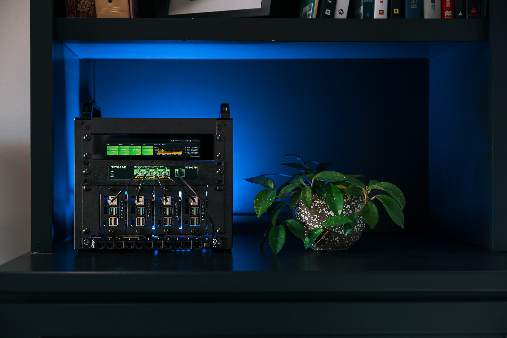

# Homelab



A 4-node Raspberry Pi 5 cluster running k3s, built around platform engineering and GitOps. The goal is to use Kubernetes as a control plane for infrastructure — not just a place to run containers.

## Platform Stack

| Layer | Technology |
|---|---|
| **Cluster** | k3s on 4× Raspberry Pi 5 (1 controller, 3 workers) |
| **Storage** | Longhorn — distributed block storage with 3× NVMe replication |
| **Ingress + TLS** | Traefik + cert-manager (local CA for `*.local.lab`, Let's Encrypt for public) |
| **GitOps** | Argo CD — cluster state driven from this repo |
| **Platform API** | Crossplane — XRDs and Compositions expose self-service infrastructure APIs |
| **Observability** | Prometheus + Grafana + Alertmanager (kube-prometheus-stack) |
| **DNS** | AdGuard Home — wildcard `*.local.lab → 192.168.10.100` for all network devices |
| **Remote Access** | Tailscale subnet router on ctrl-1 |
| **Tunnel** | Cloudflare Tunnel — zero-trust public ingress, no exposed firewall ports |

## Network Topology

```
[Fiber Internet]
      │
[UDR7 UniFi Dream Router 7]  192.168.1.1
      │
[GS305PP PoE Switch]  VLAN 10: 192.168.10.0/24
      ├── ctrl-1  192.168.10.100  k3s server
      ├── work-1  192.168.10.101  k3s agent
      ├── work-2  192.168.10.102  k3s agent
      └── work-3  192.168.10.103  k3s agent
```

## Hardware

| Item | Qty |
|---|---|
| Raspberry Pi 5 8GB | 4 |
| GeeekPi P31 M.2 NVMe PoE+ HAT (Pi 5) | 4 |
| 256GB M.2 2230 NVMe SSD | 4 |
| TP-Link GS305PP 8-Port PoE+ Switch | 1 |
| GeeekPi DeskPi RackMate T0 Plus 10" 4U Rack | 1 |
| GeeekPi 6.91" 1U Rack LCD (1424×280) | 1 |
