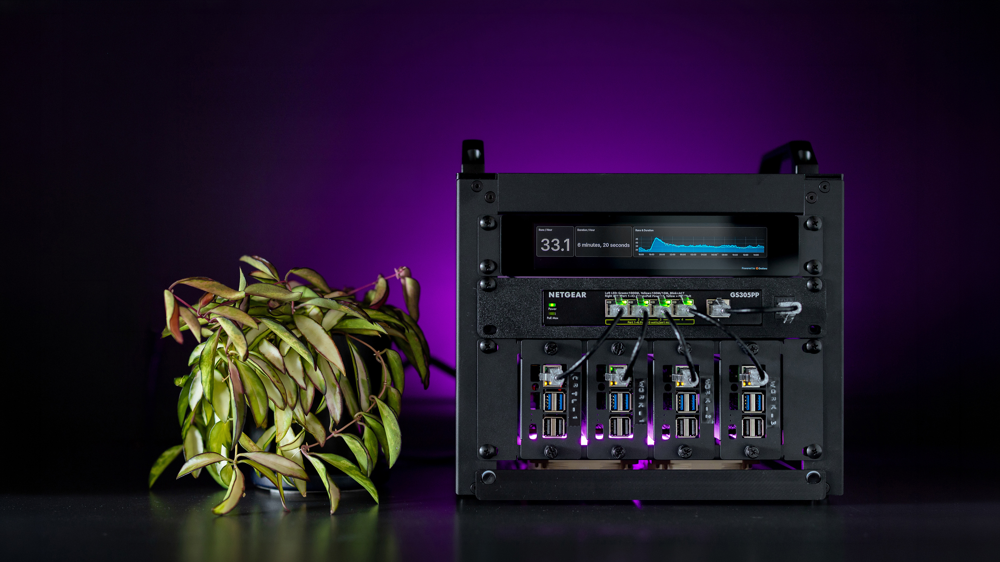

# Homelab

A 4-node Raspberry Pi 5 cluster running k3s, built around platform engineering and GitOps. The goal is to use Kubernetes as a control plane for infrastructure — not just a place to run containers.

[How it was built](https://blog.mattjarrett.dev/homelab/) - [What runs on it](https://github.com/cujarrett/homelab-workspaces) - [Blog about it](https://blog.mattjarrett.dev)

## Platform Stack

| Layer | Technology |
|---|---|
| **Cluster** | k3s on 4× Raspberry Pi 5 (1 controller, 3 workers) |
| **Storage** | Longhorn — distributed block storage with 3× NVMe replication |
| **GitOps** | Argo CD — cluster state driven from this repo |
| **Observability** | Prometheus + Grafana + Alertmanager + Loki |
| **Ingress + TLS** | Traefik + cert-manager (local CA for `*.local.lab`, Let's Encrypt for public) |
| **DNS** | AdGuard Home — wildcard `*.local.lab → 192.168.10.100` for all network devices |
| **CNI** | Cilium — eBPF pod networking, WireGuard node encryption, kube-proxy replacement, Hubble observability |
| **Service Mesh** | Istio — sidecar mesh for workload mTLS and platform-managed connection policy |
| **Tunnel** | Cloudflare Tunnel — zero-trust public ingress, no exposed firewall ports |
| **Remote Access** | Tailscale subnet router on ctrl-1 |
| **Platform API** | Crossplane — XRDs and Compositions expose self-service infrastructure APIs |

## Hardware

| Item | Qty |
|---|---|
| Raspberry Pi 5 16GB (Controller) | 1 |
| Raspberry Pi 5 8GB (Workers) | 3 |
| GeeekPi P31 M.2 NVMe PoE+ HAT (Pi 5) | 4 |
| 256GB M.2 2230 NVMe SSD | 4 |
| Netgear GS305PP 5-Port PoE+ Switch | 1 |
| GeeekPi DeskPi RackMate T0 Plus 10" 4U Rack | 1 |
| GeeekPi 6.91" 1U Rack LCD (1424×280) | 1 |

## What would this cost in AWS?

The rough equivalent: EKS with 4 Graviton nodes matching the rack's 16 vCPU and 40GB Memory, replicated block
storage, a load balancer, and DNS.

| | |
|---|---|
| Elastic Kubernetes Service control plane | ~$73/mo |
| 4× EC2 Graviton instances (16 vCPU, 40GB) | ~$437/mo |
| Elastic Block Store, Elastic Load Balancing, Route 53, egress | ~$60/mo |
| **AWS total** | **~$570/mo** |
| **This rack** | **$1,725, once** |

Break-even: about 3 months.

But the real return isn't the compute. It's having a cluster I'm allowed to break. Every deleted PVC, poisoned DNS record, and botched upgrade here costs nothing beyond my office bookshelf, and teaches something. The cloud isn't expensive. Ignorance was.
