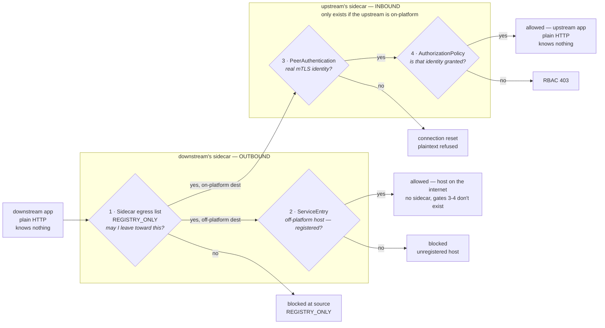
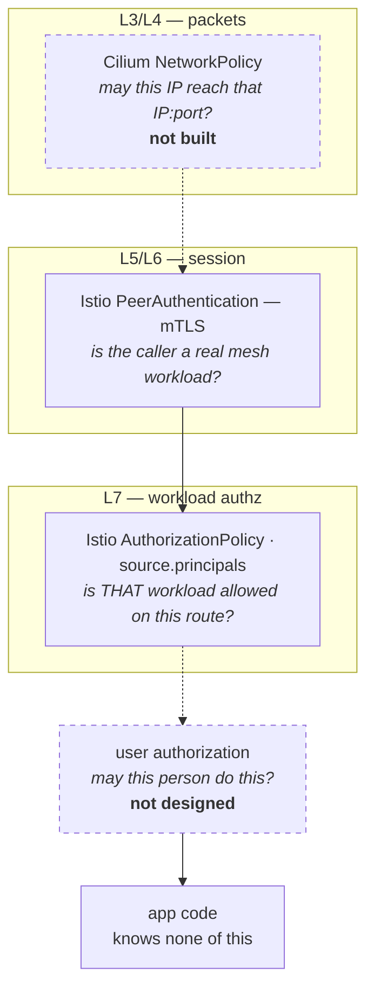

# Platform Connections

> **The one idea (grug):** Kubernetes runs the workloads. Service Mesh decides which calls get through.

Istio puts a proxy beside every pod. Nothing reaches a workload without passing that proxy, and nothing leaves without passing its own.

There is a live walkthrough at [connections.mattjarrett.dev](https://connections.mattjarrett.dev) — four real calls against this cluster, two of them refused.

By default, anything running in the cluster can call anything else. So *can this app call that app* already has an answer — yes, always — and nobody chose it.

**Why internal developer platforms do this.** A small system can keep its connections in someone's head. A few thousand services across a few hundred teams cannot, and every fix that relies on people remembering breaks at that size. A platform's job is to make the right thing the automatic thing, and three things follow from that. None of them are about Kubernetes.

- **A breach stops at one app.** Attacker gets into the weakest app. From there they reach only what that app could already reach.
- **Nobody waits on the security team.** The team writes the dependency in its own file. No ticket, no rule to approve.
- **You can prove it.** "It is on a private network" is not proof. A line in git is.

**Scope: workloads talking to workloads.** *Can Alice view Order 123* is a separate concern, not yet designed.

Platform's [`Api`](../platform/api/) and [`Spa`](../platform/spa/) compositions generate every Istio object. Nothing in a workspace file names an Istio kind, mentions Envoy, or contains a SPIFFE string.

[Fortune 100 Internal Developer Platform patterns, learned on a homelab. Nothing novel.](./nothing-novel.md)

## Design principles

**Grug:** six rules. When a new question comes up, answer it from these instead of case by case.

| # | Principle | Why |
|---|---|---|
| 1 | **Nothing is reachable without being declared** | Sitting in the same cluster, or the same namespace, grants nothing on its own |
| 2 | **Each pod's proxy is configured from its own app's definition** | Inbound rules come from the app being called, outbound from the app calling. One fact each, not one fact stored twice |
| 3 | **Read what already exists** | Where a field already states a dependency, the composition uses it rather than asking again |
| 4 | **Fail loud, never silent-permissive** | A missing entry surfaces as a refused connection or a 403 — never a quiet allow |
| 5 | **Apps never see Istio** | No Istio kinds, no SPIFFE strings, no Envoy in any workspace file |
| 6 | **The mesh is governance, not containment** | A compromised pod can step around the sidecar. Say so plainly rather than overselling |

## What you set on an app

Two fields, on the app's own definition, beside everything else it already configures.

```yaml
# my-vinyl-api.yaml — who may call me, and what I call
spec:
  parameters:
    connectionPosture: enforce
    provides:
      - name: collection
        allowedCallers:
          - { namespace: my-vinyl, app: my-vinyl }
        # methods/paths optional — omitted means the whole API.
        # Narrow only when one API has more than one trust boundary.
    consumes:
      - { host: api.discogs.com }
```

```yaml
# my-vinyl.yaml — the SPA declares nothing new
spec:
  parameters:
    connectionPosture: enforce
    apiProxies:
      - path: /api/
        upstream: my-vinyl-api.my-vinyl.svc.cluster.local
```

**The SPA needs no new field.** Principle 3 — `apiProxies` already states the dependency, so the composition reads it.

`consumes` carries every destination nothing else already states — off-platform hosts, and any other app, including one in the same namespace. Sitting next to something grants no reach toward it.

The one thing it never carries is what the app already asked the platform for. A `Cache` it creates, a bucket or table it binds — the composition provisioned those, so it renders their egress entries too. Principle 3 again: never ask for a fact the platform already holds.

**Asking for a resource is declaring the connection to it.** A cloud binding resolves to endpoints nobody should hand-write — the bucket's own hostname, and the two the credential sidecar calls to exchange this pod's identity for temporary keys. Miss that last pair and the pod starts clean and then fails every call, so the platform derives all of them from the binding rather than trusting anyone to remember.

| Declared by | Renders |
|---|---|
| `consumes` host | one `ServiceEntry` and one egress entry for that host |
| `consumes` app + namespace | one egress entry toward that app |
| `apiProxies.upstream` (`Spa`) | one egress entry toward that upstream |
| `objectStorageRefs` entry | that bucket's endpoint, plus the credential endpoints |
| `nosqlRef` | the database endpoint, plus the credential endpoints |
| `cache` (in-cluster) | that cache's Service |

The rule underneath: **you declare what you need, not where it lives.** An address the platform can derive is one it should never ask for.

**`connectionPosture` has two values.** `off` renders nothing, `enforce` renders everything below. There is no intermediate rung: Istio has a dry-run mode worth adding if a namespace ever has callers nobody can enumerate, but every namespace here has a small, knowable caller set, and a wrong guess surfaces as a loud 403 rather than an outage.

## What gets rendered

**Grug:** a call passes four checkpoints. Two on the way out of the caller, two on the way in to the callee. Miss any one and the call dies.

Four objects per workload, all derived from those two fields, all enforced by the Envoy sidecar. No app code changes, ever.



Gates 1 and 2 come from the caller's `consumes` (and, for a `Spa`, its `apiProxies`). Gates 3 and 4 come from the callee's `provides` — `AuthorizationPolicy` gets one rule per declared interface, and the first ALLOW makes that workload deny-by-default, so an unnamed caller gets 403.

**The symptom tells you the gate.** This is the fastest way to place a fault, and worth memorising before you need it.

| You see | Gate | Meaning |
|---|---|---|
| RBAC 403 | 4 | Caller reached the callee and was refused by name. Its principal is not in `allowedCallers` |
| Connection reset | 3 | Caller arrived in plaintext. It is unmeshed, or its sidecar never started |
| 502 through nginx | 1 | Destination missing from the caller's `Sidecar` egress list, so its own proxy blackholed it |
| Timeout to a public host | 2 | No `ServiceEntry`, so the host was never registered as a destination |

**A policy can only attach to a pod that exists.** That is why the two directions sit at opposite ends of the path.

Off-platform hosts therefore have no gate 3 or 4 — there is nothing out there to hold a rule. So `consumes` cannot be dropped as redundant; for those calls it is the only gate there is. The same shape covers shared in-cluster stores that run no policy of their own, such as NATS — enforced caller-side only, needing no special field.

**Two exceptions, both for unmeshed infrastructure with no identity to match on.** Prometheus scrapes the metrics port; Traefik forwards ingress to the app port. The Traefik exception applies only when a workload sets `host` — see [Known limits](#known-limits) for what it costs.

**Proxied requests must carry the upstream's name as `Host`.** Envoy routes outbound HTTP by `:authority` — effectively the `Host` header. Forward the browser's hostname instead and Envoy looks it up in the mesh registry, finds nothing, and `REGISTRY_ONLY` blackholes it — drops it with no route, so the destination never sees a connection at all. The `Spa` composition sets `Host` to the upstream service and keeps the original as `X-Forwarded-Host`.

## The identity it rests on

**Grug:** every pod gets a certificate saying who it is. It cannot be faked. That is the whole foundation.

Istio issues each meshed pod an X.509 **SVID** — ~24h lifetime, auto-rotated, carrying a SPIFFE URI SAN:

```
spiffe://cluster.local/ns/my-vinyl/sa/my-vinyl-spa
         └ trust domain   └ namespace └ service account
```

That string is the workload's **principal** — the name a rule grants access to. It is bound to a private key that never leaves the pod, so holding the name is not enough to claim it. This is the only identity here that survives an attacker already inside the cluster network; an IP or a header proves nothing.

**Hard rule: every workload gets its own ServiceAccount.** The compositions do this. The moment two apps share one they are the same identity, and every grant between them is meaningless.

## What it costs

**Grug:** a couple of fields on an app, once. In return the proxy refuses anything not listed, and the refusal is legible.

The real cost is not the fields — it is that a failed call now has several explanations instead of one. A 403, an mTLS reset and blocked egress all used to be "can it reach the IP", and telling them apart is a skill to build. That is the honest price of moving reachability out of the network and into policy, and the gate list above is the map for paying it.

**On scale.** In an organisation this shape carries a second cost — a grant becomes a cross-team wait, and someone has to own approving it. Here there is one operator and two files, so that cost does not exist. Worth naming, so the design is not mistaken for solving a coordination problem it has never faced.

## Known limits

**Grug:** the mesh sits in the middle of a stack. It does its own job. It does not do the job of the layer below it or the layer above it, and neither of those is built.

Below is packets — could a hostile pod send this at all. Above is people — may this *user* do this. Dotted boxes and dotted arrows below mean not built.



**The mesh is governance, not containment.** Istio's rules live *inside* the pod — injection writes iptables in the pod's own network namespace to push traffic through Envoy. Anything running in that pod is on the same side of the fence as the rules.

The clearest way out is UID 1337. Istio excludes it from the iptables redirect, because that is the UID Envoy itself runs as and it would otherwise redirect into itself forever. A process running as 1337 walks straight past, and Envoy never sees the packet.

Only the kernel can stop that. A Cilium `NetworkPolicy` is enforced at the pod's veth — the virtual cable's host-side end, outside the pod, where nothing inside it can reach.

**That layer is deliberately not built**, and it is not a one-way door. The policy would be generated from the same `consumes` declarations the mesh already uses, so adding it later is additive — no XRD change, no app change, nothing re-declared. Three questions decide it:

1. Is Cilium's DNS proxy enabled? `toFQDNs` silently never matches without it.
2. Would off-platform egress use FQDN rules, or CIDR? FQDN is the expensive path, and the declared-host list already bounds how many exist.
3. Is a compromised pod inside the threat model, or is the control there to prove only declared calls happen? Only the first needs it.

**An app with an Ingress is reachable from the ingress controller** regardless of its grants, because Traefik is unmeshed and presents no identity to match on. How far that reaches depends on `tlsIssuer` — `letsencrypt-prod` means the internet, `local-lab-ca-issuer` means the homelab network.

**Nothing tests that an app can actually reach its backend.** Rendering is checked; behaviour is not. A workload can serve its page, report `2/2`, sync green, and still be unable to call its own API. This gap has already caused one outage, and closing it is the most valuable work left.

**`Api` and `Spa` label pods differently** — `app.kubernetes.io/instance` versus `instance`. A selector copied between the two matches nothing and fails silently: the policy renders, ArgoCD reports Synced, enforcement never happens. Converging on one label would remove the trap.

## Status

**Enforcing:** `platform-connections-demo`, `my-vinyl` (SPA + API + cache), `js-pollock`, `mattjarrett-dev`.

**Not yet:** `sump-pump` — its cross-namespace NATS traffic would be blocked, so it waits on that decision. `launchpad` — the namespace is unmeshed because `launchpad-api` holds long-lived apiserver watch streams a proxy would sever. WordPress is out of scope; `blog` is a plain Deployment the platform does not render.

## Reference

| Concept | Layer | Doc | Watch for |
|---|---|---|---|
| Sidecar injection | — | [injection](https://istio.io/latest/docs/setup/additional-setup/sidecar-injection/) | meshed pods show 2 containers |
| SPIFFE identity | L5/L6 | [identity](https://istio.io/latest/docs/concepts/security/#istio-identity) | the principal string *is* the grant key |
| PeerAuthentication | L5/L6 | [mutual TLS](https://istio.io/latest/docs/concepts/security/#peer-authentication) | STRICT has no dry-run |
| AuthorizationPolicy | L7 | [concept](https://istio.io/latest/docs/concepts/security/#authorization) · [ref](https://istio.io/latest/docs/reference/config/security/authorization-policy/) | the first ALLOW makes that workload deny-by-default |
| ServiceEntry | L7 | [egress control](https://istio.io/latest/docs/tasks/traffic-management/egress/egress-control/) | registers a host; alone it gates nothing |
| Sidecar + `REGISTRY_ONLY` | L7 | [ref](https://istio.io/latest/docs/reference/config/networking/sidecar/) | this is what makes egress default-deny |
| Cilium NetworkPolicy | L3/L4 | [policy](https://docs.cilium.io/en/stable/security/policy/) | the containment layer the mesh cannot be |

> **Note — splitting a requirement widens it.** Istio ORs ALLOW policies and rules together, so two rules are two ways in, not two conditions. Anything that must all hold goes in one rule: `from` + `to` + `when` together. This is also what lets user authorization be added later as a `when` on the existing rule rather than a second policy that ORs around it.

## Worked example

<details>
<summary>A worked example walking the full journey using a live example</summary>

This ties it to one real example [myvinyl.mattjarrett.dev](https://myvinyl.mattjarrett.dev) made of `my-vinyl` (a `Spa`) calling `my-vinyl-api` (an `Api`), which in turn calls out to Discogs.com API — the same two files already shown in [What you set on an app](#what-you-set-on-an-app). The `Api`/`Spa` composition templates those fields into the Istio objects below; Istio's own control plane (`istiod`) then watches those objects and pushes the resulting config to each pod's Envoy sidecar, which is what actually enforces it. Below is every object one call passes through, live from the cluster, each one preceded by the XR input that produced it.

The call makes two hops. First the SPA calls the API, passing gates 1, 3 and 4. Then the API calls Discogs, passing gates 1 and 2. Gates 3 and 4 have no second appearance because Discogs has no sidecar to hold them.

### Hop 1, gate 1 — can my-vinyl's sidecar even see the destination?

Made by this field on `my-vinyl.yaml`:

```yaml
spec:
  parameters:
    apiProxies:
      - path: /api/
        upstream: my-vinyl-api.my-vinyl.svc.cluster.local
```

```yaml
apiVersion: networking.istio.io/v1
kind: Sidecar
metadata:
  name: my-vinyl
  namespace: my-vinyl
  annotations:
    crossplane.io/composition-resource-name: connection-sidecar
  ownerReferences:
    - kind: Spa
      name: my-vinyl
      controller: true
spec:
  workloadSelector:
    labels:
      instance: my-vinyl
  outboundTrafficPolicy:
    mode: REGISTRY_ONLY
  egress:
    - hosts:
        - istio-system/*
        - '*/my-vinyl-api.my-vinyl.svc.cluster.local'   # <- the one line apiProxies.upstream produced
```
`REGISTRY_ONLY` means anything not in `egress.hosts` doesn't exist as far as my-vinyl's own sidecar is concerned — this is the list that would blackhole a call to anywhere else.

### Hop 1, gate 3 — is the caller a real mesh workload?

Made by this field on both `my-vinyl.yaml` and `my-vinyl-api.yaml`:

```yaml
spec:
  parameters:
    connectionPosture: enforce
```

```yaml
apiVersion: security.istio.io/v1
kind: PeerAuthentication
metadata:
  name: my-vinyl-api
  namespace: my-vinyl
  annotations:
    crossplane.io/composition-resource-name: connection-peerauth
  ownerReferences:
    - kind: Api
      name: my-vinyl-api
      controller: true
spec:
  selector:
    matchLabels:
      app.kubernetes.io/instance: my-vinyl-api
  mtls:
    mode: STRICT              # <- enforce means STRICT, not PERMISSIVE
  portLevelMtls:
    "8080":
      mode: PERMISSIVE        # app port stays open so health checks still work
    "9090":
      mode: PERMISSIVE        # metrics port, same reason
```
`STRICT` at the top level means every port not explicitly excepted requires real mTLS — no plaintext connection can pass this gate.

### Hop 1, gate 4 — is that identity actually allowed in?

Made by this field on `my-vinyl-api.yaml`:

```yaml
spec:
  parameters:
    provides:
      - name: collection
        allowedCallers:
          - { namespace: my-vinyl, app: my-vinyl }
```

```yaml
apiVersion: security.istio.io/v1
kind: AuthorizationPolicy
metadata:
  name: my-vinyl-api
  namespace: my-vinyl
  annotations:
    crossplane.io/composition-resource-name: connection-authz
  ownerReferences:
    - kind: Api
      name: my-vinyl-api
      controller: true
spec:
  selector:
    matchLabels:
      app.kubernetes.io/instance: my-vinyl-api
  action: ALLOW
  rules:
    - to:
        - operation: { ports: ["8080"] }   # app port
    - to:
        - operation: { ports: ["9090"] }   # metrics port — the Prometheus exception
    - from:
        - source:
            principals:
              - cluster.local/ns/my-vinyl/sa/my-vinyl   # <- allowedCallers became this one line
```
This is the actual access decision. The first `ALLOW` rule makes this workload deny-by-default, so any principal not listed here gets a 403 — including a typo'd namespace or app name.

### Hop 2, gates 1 & 2 — the outbound call to Discogs

Made by this field on `my-vinyl-api.yaml`, which renders two objects:

```yaml
spec:
  parameters:
    consumes:
      - { host: api.discogs.com }
```

```yaml
apiVersion: networking.istio.io/v1
kind: Sidecar
metadata:
  name: my-vinyl-api
  namespace: my-vinyl
  annotations:
    crossplane.io/composition-resource-name: connection-sidecar
spec:
  workloadSelector:
    labels:
      app.kubernetes.io/instance: my-vinyl-api
  outboundTrafficPolicy:
    mode: REGISTRY_ONLY
  egress:
    - hosts:
        - istio-system/*
        - ./my-vinyl-api-cache-redis.my-vinyl.svc.cluster.local   # <- its own Cache, never declared
        - ./api.discogs.com   # <- consumes.host produced this line, gate 1
```

```yaml
apiVersion: networking.istio.io/v1
kind: ServiceEntry
metadata:
  name: my-vinyl-api-api-discogs-com
  namespace: my-vinyl
  annotations:
    crossplane.io/composition-resource-name: connection-se-api-discogs-com
  ownerReferences:
    - kind: Api
      name: my-vinyl-api
      controller: true
spec:
  hosts:
    - api.discogs.com
  location: MESH_EXTERNAL
  resolution: DNS
  ports:
    - number: 443
      name: tls
      protocol: TLS
  exportTo:
    - .
```
The `Sidecar` entry is gate 1 — without it, `REGISTRY_ONLY` blocks the call before it leaves the pod. The `ServiceEntry` is gate 2 — it's what makes `api.discogs.com` a *registered* destination at all, since Istio has no way to know about an off-platform host otherwise.

### Getting from a live object back to its template

Every object above carries `crossplane.io/composition-resource-name` in its annotations. That's the literal name of the block inside the [`Api`](../platform/api/)/[`Spa`](../platform/spa/) composition that rendered it — `kubectl get authorizationpolicy my-vinyl-api -n my-vinyl -o yaml` gives you the annotation, grepping the composition for `connection-authz` gives you the template that made it.

To pull the live set for this pair yourself:
```bash
kubectl get authorizationpolicy,peerauthentication,sidecar,serviceentry -n my-vinyl
```

</details>
