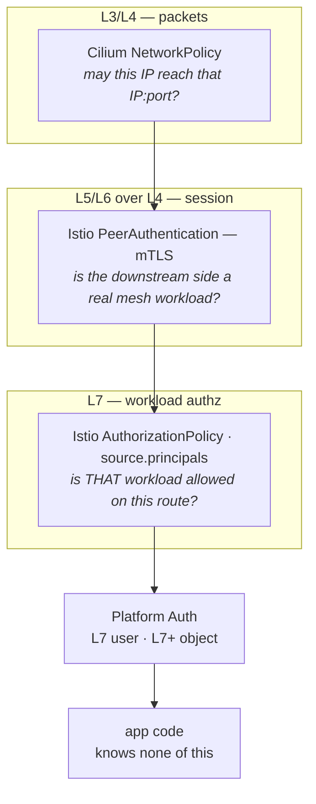
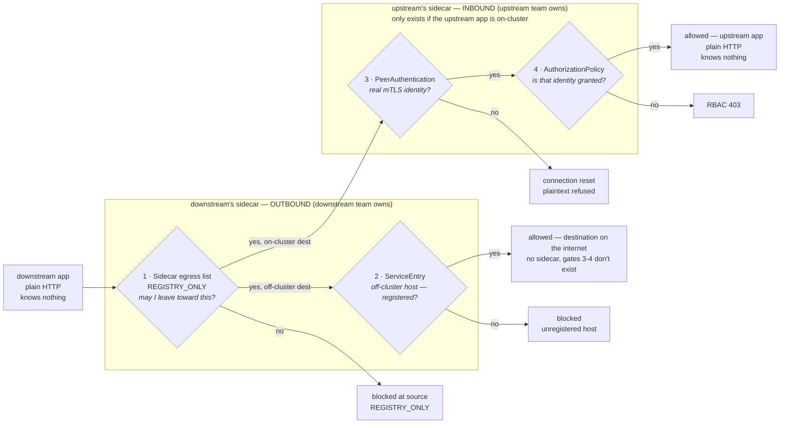

# Platform-Managed Connections — Design & Build Plan

> **The one idea (grug):** today any pod can call anything. Goal: **a call works only if both sides declared it.**

**Scope: workloads talking to workloads.** Which service may call which service. Not who the human is — that's [Platform Auth](./platform-auth.md), and it is *not* a prerequisite for anything here. A namespace can reach full enforcement with zero auth work.

Baked into [Platform](../platform/)'s [`API`](../platform/api/) and [`SPA`](../platform/spa/) compositions, which render every policy object behind the scenes. App teams never write an Istio resource, never see the word Envoy, and never learn what SPIFFE is. They declare the connection on their app's own definition, the same place they already configure everything else about it.

## Edicts

Every decision below follows from these. When a question comes up, answer it from here first.

| # | Edict | Why |
|---|---|---|
| 1 | **Deny by default, allow by declaration** | Nothing is reachable because of where it happens to sit |
| 2 | **Each app declares its own pod's behavior** | The caller declares what it calls; the callee declares who may call it. Two sides, one fact each — not one fact stored twice |
| 3 | **Derive what's already declared** | If an existing field already states the dependency, the platform reads it. Never ask twice |
| 4 | **Fail loud, never silent-permissive** | A missing declaration is a refused connection or a 403 — never a quiet allow |
| 5 | **One rule, not two policies** | Conditions that must all hold live in the same rule. Separate ALLOW policies widen access — this is what keeps user authorization addable later |
| 6 | **Apps never see Istio** | No Istio kinds, no SPIFFE strings, no Envoy in any workspace file |
| 7 | **The mesh is governance, not containment** | A compromised pod can step around the sidecar. Say so plainly rather than overselling |

## Status

Built and running on the `platform-connections-demo` canary.

| | Built | Verified on cluster |
|---|---|---|
| `connectionPosture`, `provides`, `consumes` on `Api` / `Spa` | ✅ | ✅ CRD carries all three |
| `PeerAuthentication` STRICT per workload | ✅ | ✅ three rendered |
| `AuthorizationPolicy` per `provides` interface | ✅ | ✅ three rendered |
| `Sidecar` + `REGISTRY_ONLY` | ✅ | ✅ three rendered |
| `ServiceEntry` per `consumes` host | ✅ | ✅ one, on the only workload that declares one |
| Every other workspace unaffected at `off` | ✅ | ✅ nine render byte-identical |

**Flows proven against live pods:**

| Flow | Result | Gate |
|---|---|---|
| declared caller → API | ✅ 200 | `AuthorizationPolicy` |
| undeclared caller → API | ✅ 403 | `AuthorizationPolicy` |
| declared host off-platform | ✅ 200 | `ServiceEntry` |
| unregistered host off-platform | ✅ blocked | `REGISTRY_ONLY` |
| undeclared workload → a *neighbour's* registered host | ✅ blocked | `Sidecar` egress scope |

That last row failed the first time it ran: a `ServiceEntry` is registered namespace-wide, and an egress wildcard of `./*` matches the whole namespace registry — so one workload could reach an off-platform host another had declared. The wildcard is scoped to `./*.svc.cluster.local` with declared hosts listed explicitly, which keeps cluster services free while making every external destination per-workload. Two workloads running an identical image, differing only in what they declare, now get different answers on every call.

**Not started:** every workspace other than the canary is still `off`. `sump-pump` is deferred until NATS is handled, since its cross-namespace traffic would be blocked. `launchpad` needs its namespace meshed first. WordPress is out of scope, and `blog` is a plain Deployment the platform doesn't render.

## Complexity Jusfriction

**Grug:** two extra fields per app, once. In return: nobody can call your service without your team saying yes, and you can prove it. Each cost below is paid once, at the right layer, not per request — no ticket queue, no manual firewall change, no service-mesh expert on call for the common case.

| Who pays | Cost | How often | In return |
|---|---|---|---|
| Downstream app | blocked until the upstream app approves — a cross-team wait, not a self-review | once per new cross-team edge | a downstream app is a name in git, not a mystery IP in an incident log |
| Upstream app | reviews and approves the request | once per new cross-team edge | ownership enforced by the platform, not hoping teams read a README |
| SRE / on-call | a third failure layer to diagnose — RBAC 403, mTLS reset, or blocked egress — instead of just "can it reach the IP" | ongoing, same shape every incident | the [Phase 7](#phase-7--first-real-namespace-my-vinyl-the-migration-pattern) runbook exists because this is predictable |
| Platform team | builds and maintains the plumbing: four rendered Istio objects, schema validation, an Entra app-role check, a separation-of-duties check, commit stamping, a required CI check | built once, runs automatically after | app teams never see any of it and pay nothing extra |

## Index

| Chapter | What's in it | Risk |
|---|---|---|
| [Why this is worth the friction](#why-this-is-worth-the-friction) | the cost and the payoff, honestly | — |
| [The end state](#the-end-state-in-one-page) | the gates, the SPIFFE identity it rests on, the two-sided handshake, the posture dial | — |
| [Standing rules](#standing-rules-for-every-phase) | what to run before every change, and how to break glass | — |
| [Phase 0 — Canary namespace](#phase-0--the-canary-namespace-no-cluster-risk) | build the permanent regression harness | none |
| [Phase 1 — Declared-graph report](#phase-1--declared-graph-report-no-cluster-risk) | map what already talks | none |
| [Phase 2 — Posture + baseline](#phase-2--posture-field--baseline-rendering-low-risk-reversible) | the safety dial; infra allows, still inert | low |
| [Phase 3 — `provides` → policy, dry-run](#phase-3--provides--authorizationpolicy-dry-run-the-observability-unlock) | see what enforcement *would* block | low |
| [Phase 4 — Enforce on canary](#phase-4--enforce-on-the-canary-strict--live-authz-first-real-teeth) | STRICT mTLS + live authz; the 8-row matrix | **hard gate** |
| [Phase 5 — `consumes` → egress](#phase-5--consumes--egress-sidecar--serviceentry--catalog-completes-the-handshake) | completes the handshake; off-platform catalog | low |
| [Phase 6 — Handshake CI check](#phase-6--the-handshake-ci-check-cheap-high-value-no-cluster-risk) | fail one-sided or dangling declarations | none |
| [Phase 7 — First real namespace](#phase-7--first-real-namespace-my-vinyl-the-migration-pattern) | `my-vinyl` walks the ladder | **high** |
| [Phase 8 — Steady state](#phase-8--steady-state) | reporting, exception register, routine | low |
| [Phase 9 — Launchpad self-service](#phase-9--self-service-access-requests-via-launchpad-the-ux-layer) | approval flow replaces hand-committed YAML *(optional)* | low |
| [Layer 1 containment](#layer-1-containment--undecided) | the eBPF layer we are **not** building yet, and what would decide it | — |
| [Definition of done](#definition-of-done) | how you know the programme — not just a phase — is finished | — |
| [Learn as you build](#learn-as-you-build) | one doc link per concept, in build order | — |
| TEMP [Where we are today](#where-we-are-today) | validated cluster facts — don't rediscover them | — |

Phases run in order and risk rises as you go down — never skip one. Human identity and fine-grained authorization live in [Platform Auth](./platform-auth.md) and block none of this.

---

# The end state, in one page

Everything on this page is the **finished architecture** — what every namespace looks like once built, not a status report. Build order and progress live in the phase chapters below.

## The stack of gates

**Grug:** one call passes several checks. Each check asks a different question. Each can say no on its own.

Three of those checks are this doc's job. Two more sit above them for user and object authorization — those live in [Platform Auth](./platform-auth.md).



| # | Layer | Control | Question it answers | Identity it uses |
|---|---|---|---|---|
| 1 | L3/L4 | Cilium `NetworkPolicy` | may the packet exist at all? | IP / port / label selector |
| 2 | L5/L6 riding on L4 | Istio `PeerAuthentication` (STRICT) | is the peer a cryptographically real mesh workload? | SPIFFE X.509 SVID |
| 3 | L7 | Istio `AuthorizationPolicy` (`source.principals`) | is *that workload* granted this method+path? | SPIFFE principal string |
| 4 | L7 | user identity | which human, what role? | Entra OIDC JWT — see [Platform Auth](./platform-auth.md) |
| 5 | L7+ | object authorization | on *this object*? | user + object + relationship — see [Platform Auth](./platform-auth.md) |

**Grug reading:** 1 is "can the wire carry it", 2 is "is downstream real", 3 is "is downstream allowed". Each is useless alone. Together they are defense in depth, and each is a separate audit answer.

> **TODO — Row 1, Cilium `NetworkPolicy`: not yet decided.** See [Layer 1 containment](#layer-1-containment--undecided).

Controls 2 and 3 are **enforced by the Envoy sidecar**, never by app code.

## The identity this all rests on

**Grug:** every pod gets a certificate that says who it is. Can't be faked. That's the whole foundation.

Istio issues each meshed pod an X.509 **SVID** — ~24h lifetime, auto-rotated, carrying a SPIFFE URI SAN:

```
spiffe://cluster.local/ns/my-vinyl/sa/my-vinyl-spa
             ^trust domain    ^namespace     ^service account
```

Unforgeable — bound to a private key that never leaves the pod. It is what `AuthorizationPolicy` matches on, and it is the only identity in the stack that survives an attacker already inside the cluster network. Network position proves nothing; an IP proves nothing; a header proves nothing.

**Hard rule: every workload gets its own ServiceAccount.** The composition already does this. The moment two apps share one, they are the same identity and every grant between them is meaningless.

## The core mechanism: a two-sided handshake Istio already enforces for free

This is the single most important design idea in the plan.

For an **on-cluster** call, Istio gates it **twice, on two different pods, in two different namespaces**. For an **off-platform** call there is no upstream pod to gate — the downstream app's own sidecar is the only checkpoint:



Gate 1 (`Sidecar` egress) sits in front of every outbound call, on-cluster or off — it's what makes `consumes` mean something either way. Gate 2 (`ServiceEntry`) only exists for off-cluster hosts; an in-mesh destination is already in Istio's registry and skips straight to the upstream's sidecar. Gates 3-4 only exist if the upstream app is meshed — there is no sidecar sitting on the public internet, so an off-platform call is fully decided at gate 2.

**Grug:** two locks on the way out always apply. Two locks on the way in only exist if there's an upstream pod to guard.

> **Give each side's field to the team that owns that side, and "registration" stops being a workflow you build. It becomes physics.**

| Field | Declared by | Renders | Enforced at | Means |
|---|---|---|---|---|
| `consumes` | the **downstream** team | `Sidecar` egress entry (+ `ServiceEntry` if off-platform) | downstream's outbound sidecar | "I intend to call this" |
| `provides` | the **upstream** team | `AuthorizationPolicy` | upstream's inbound sidecar | "I accept calls from this" |

A connection is live **only when both exist** — neither team can create an edge alone, or be surprised by one.

That is the enterprise requirement — upstream consent *and* downstream intent, with a git trail on each — and it falls out of two independently-rendered Istio objects. No approval engine or state machine is required to get it.

**Off-platform and shared in-cluster stores are the same shape.** Neither has an upstream sidecar to gate — off-platform because there's no pod on the public internet, NATS (this cluster's `nats` namespace) because it runs no policy — so the platform plays the upstream side in both: a central `ExternalService` catalog entry (owner, data classification, approval) is the consent, and the app's `consumes` entry is the intent. One side is always the platform team; NATS needs no special field, it's a `consumes` entry like anything else.

## What the app team writes

The entire developer-facing surface, both directions:

```yaml
# my-vinyl-api.yaml — who may call me, and what I call
spec:
  parameters:
    connectionPosture: enforce
    provides:
      - name: collection                     # a named group of routes
        allowedCallers:
          - { namespace: my-vinyl, app: my-vinyl }
        # methods/paths optional — omitted means "all of it".
        # Narrow only if this API has more than one trust boundary:
        # methods: [GET]
        # paths: ["/api/v1/collection/*"]
    consumes:
      - { host: api.discogs.com }            # off-platform, so it must be registered
```

```yaml
# my-vinyl.yaml — the SPA declares nothing new
spec:
  parameters:
    connectionPosture: enforce
    apiProxy:
      enabled: true
      upstream: my-vinyl-api.my-vinyl.svc.cluster.local   # already the declaration
```

No SPIFFE strings, no Istio kinds. **Edict 3 at work:** the SPA's dependency is already stated by `apiProxy`, so the platform reads it rather than asking for it twice. `consumes` carries only what no existing field states — off-platform hosts, and apps in another namespace.

**What needs no declaration:** same-namespace destinations, and anything the XR creates itself (its own `Cache`). Those are reachable on the way out — but still gated on the way in by the callee's own `provides`, so nothing works undeclared.

**Why named interfaces, not a flat caller list:** one API's `/public/*` and `/admin/*` must not share a grant, and "who calls `collection`?" is the question to answer before deprecating anything.

**`methods`/`paths` default to everything — narrow only when you have to.** Most APIs here have exactly one trust boundary, and for those a wildcard grants the same effective permission as enumerating every route — with nothing to keep in sync, because whatever the app serves, the wildcard already covers. Narrowing is for the case named interfaces exist to solve: `/public/*` and `/admin/*` must not share a grant. Real cost, paid only by teams with a boundary worth protecting. See [platform-local-test.md's open question 5](./platform-local-test.md#open-questions--undecided) for the caveats once you do narrow.

## Posture

One field, `connectionPosture`. Two values.

| Value | What it renders |
|---|---|
| `off` *(default)* | nothing at all |
| `enforce` | the four objects below — calls in are denied unless granted, calls out are blocked unless registered |

There is no intermediate rung. A dry-run tier exists in Istio (`istio.io/dry-run`) and is worth adding if a namespace ever has callers nobody can enumerate — but every namespace here has a knowable, small caller set, and a wrong guess surfaces as a loud 403, not an outage.

## What `enforce` renders

Four objects per workload, all derived from the two fields above.

| Object | Layer | Does |
|---|---|---|
| `PeerAuthentication` | L5/6 | STRICT — the caller must present a real mesh identity. Port-level `PERMISSIVE` for the metrics port, and for the app port when `host` is set |
| `AuthorizationPolicy` | L7 in | One rule per `provides` interface. The first ALLOW policy makes the workload default-deny, so an undeclared caller gets 403 |
| `Sidecar` | L7 out | `REGISTRY_ONLY` — own namespace, `istio-system`, and declared destinations only |
| `ServiceEntry` | L7 out | One per `consumes` host. Unregistered host → refused at the caller's own sidecar |

**Two exceptions, both for unmeshed infrastructure that has no identity to match on.** Prometheus scrapes the metrics port; Traefik forwards ingress to the app port. Neither is in the mesh, so neither can be restricted by identity.

The Traefik exception applies only when the workload sets `host`, and it means **an app with an Ingress stays reachable from the ingress controller regardless of `provides`.** How far that reaches depends on `tlsIssuer`:

| `tlsIssuer` | Reachable from |
|---|---|
| `letsencrypt-prod` | the internet, via Cloudflare Tunnel — the open port grants nothing the hostname didn't already |
| `local-lab-ca-issuer` | the homelab network and any pod in the cluster — narrower, but wider than `provides` alone would allow |

Either way it's a real limit, not a footnote: `my-vinyl-api` is internal-only (`my-vinyl-api.local.lab`) and still inherits it. Closing it means dropping the Ingress — an internal API reached only through its SPA's `apiProxies` doesn't need one — or meshing Traefik.

**Grug rule:** never enforce until the dry-run says nothing breaks. `observe` is the work; `enforce` is a non-event.

**The ladder is walked once per namespace, not once per grant.** A namespace climbs `off → enforce` a single time, when it first opts in — that's the only moment `observe` matters, because that's the only moment enforcement could silently cut off traffic nobody declared yet. Once a namespace is `enforce`, a *new* `provides`/`consumes` pair doesn't repeat the ladder: it can only add an allow, never remove one, so there's no forgotten-caller risk to observe for. Deny-until-registered already covers it — merge the PR, it's allowed; don't, it's denied. Worst case on a bad declaration is a caller getting a 403 it can file a bug about, not an outage.

## The three views

The platform continuously maintains and diffs:

- **Observed** — what actually talked (mesh telemetry).
- **Declared** — what the XRs say should talk.
- **Effective** — what is currently allowed on the cluster.

And reports the four diffs that matter: **observed-but-undeclared** (missing declaration or rogue call), **declared-but-unused** (dead grant, revoke it), **declared-one-sided** (handshake incomplete), **would-be enforcement failures** (dry-run denials).

Loop: `observed traffic → suggested declaration → human review → Git → ArgoCD → new declared state`. Humans dispose, the platform proposes. **Never auto-apply observed traffic as declaration** — the diff would converge to zero and stop telling you anything, which is how a security control quietly becomes a rubber stamp.

---

# Where we are today

Facts validated on this cluster. Don't rediscover them.

| Fact | Consequence for the plan |
|---|---|
| Istio 1.30.3, sidecar mode, istiod + istio-cni only. **No ingress gateway.** | north-south enters via unmeshed Traefik. Its plaintext needs a `PeerAuthentication` port-level `PERMISSIVE` exception before Phase 4's STRICT flip, or a public site goes dark. Also the prerequisite for user identity in [Platform Auth](./platform-auth.md) |
| Istio-over-Cilium works on k3s/ARM64 with `cni.exclusive: false` + `socketLB.hostNamespaceOnly: true` | no CNI work needed |
| Meshed namespaces: `js-pollock`, `mattjarrett-dev`, `my-vinyl`, `sump-pump` | the only Phase-1..7 candidates |
| **Zero** `PeerAuthentication` / `AuthorizationPolicy` / `ServiceEntry` / `Sidecar` objects exist | greenfield policy, no legacy to unpick |
| Crossplane RBAC for `security.istio.io` + `networking.istio.io` already granted, unused | compositions can emit policy with no RBAC change |
| `Api` composition = 684 lines, single `function-go-templating` step, shared by every API | **shared blast radius** — `/render-check` on every change, no exceptions |
| SPIRE running, unused (Cilium mutual auth disabled) | **leave it alone.** istiod's built-in CA is sufficient; swapping mesh CAs is outage-capable. Its future value is SPIFFE federation into Entra workload identity / IAM Roles Anywhere — not this plan |
| `Wordpress`, `blog`, `launchpad`, `kentjarrett-com`, `mattjarrett-com`, `nats` unmeshed | out of scope; must appear on an explicit exception register, not be silently forgotten |
| `platform-connections-demo` repo exists (`api` + `downstream`), not deployed | the acceptance harness needs building before it can gate anything |
| **An ALLOW `AuthorizationPolicy` is default-deny for its selected workload the instant it lands** | caused a real outage here once. Never render one into a namespace that isn't baselined and STRICT |

---

# Standing rules for every phase

Every phase has a **checkpoint**. A checkpoint is a stop, not a formality.

> - `Api`/`Spa` compositions are shared → `/render-check` every workspace, every change. Workspaces with no new fields must render **byte-identical**. That diff is the proof of non-breakage.
> - After any XRD/composition change: `argocd app sync platform-definitions --grpc-web`
> - Run `/pre-commit-review` before every commit.
> - Break-glass always: set `connectionPosture: off`, push, Argo prunes. Practise it in Phase 2 so you trust it in Phase 7.
> - **Hard stop when tired:** Phases 0, 1 and 6 touch no cluster and are safe any time. Everything else is outage-capable — start it with a fresh head, not at the end of a long session.

---

# Phase 0 — The canary namespace *(no cluster risk)*

**Layer:** none. Scaffolding.

The permanent regression harness. Every later composition change proves itself here before touching a real app.

**Do:**
1. Finish `platform-connections-demo`: `api` (upstream) plus `downstream` deployed twice as `authorized-api` and `unauthorized-api` under **different ServiceAccounts, identical image**. The identity pair is the essential part.
2. New workspace `platform-connections-demo/` in `homelab-workspaces`, namespace labelled `istio-injection: enabled`.
3. Deploy with existing `Api` XRs. No new fields yet.

**Verify:** all pods `2/2` (app + sidecar). Both callers reach `upstream-api` and both reach the public API — nothing is enforced yet. Confirming the *permissive* baseline is the point.

**Checkpoint 0:** the 8-row matrix exists as a runnable script and reports **8 allows**. You cannot detect a regression you can't run.

---

# Phase 1 — Declared-graph report *(no cluster risk)*

**Layer:** none. Reading YAML. `scripts/connection-graph.py` already exists — finish it.

**Do:** emit the current declared graph from existing XR fields (`Spa.apiProxy.upstream`, `Api.cache.enabled`, `topicRef`, `subscriptionRef`, `sqlRef`, `nosqlRef`, `objectStorageRefs`) as a table + mermaid. Surface `secretRef` as *candidates* for undeclared off-platform calls.

**Why:** it proves how much of the graph the platform already knows for free. If it's mostly derivable, the new fields are a small delta and migration is cheap. You learn that now instead of in Phase 5.

> **Why this is Python, and when it stops being Python.** Phase 1 is discovery — the data shape isn't settled, and dicts beat typed structs for exploring. It ports to Go at **Phase 6**, when `provides`/`consumes` are fixed and the same validation logic is needed in two places: the CI check *and* launchpad-api (Phase 9). Two implementations of "is this handshake valid" will drift, and the failure mode is ugly — Launchpad approves a request that CI then rejects. One Go package, a thin CLI on the front. It only has to be committed once CI runs it; local `go run` needs nothing pushed.

**Checkpoint 1:** the graph prints, and you can name every edge and both its owners out loud. Discogs (`my-vinyl-api`) should be the only real off-platform candidate.

---

# Phase 2 — Posture field + baseline rendering *(low risk, reversible)*

**Layer:** 2 and 3, rendered **inert**.

**Do:**
1. Add `connectionPosture: [off|baseline|observe|enforce]` to the `Api` and `Spa` XRDs, **default `off`**.
2. Posture `off` renders **nothing** new.
3. Posture `baseline`+ renders what a future default-deny would otherwise kill — two different mechanisms for two different problems:
   - `AuthorizationPolicy` allows for workload→kube-dns egress and same-namespace traffic — real authz gaps, closed the normal way.
   - A `PeerAuthentication` **port-level `PERMISSIVE`** override on the app's ingress port, so unmeshed Traefik's plaintext survives Phase 4's STRICT flip. An `AuthorizationPolicy` allow cannot rescue a connection that mTLS itself refuses — this needs the mTLS-layer exception, not an authz one.
   - Kubelet probes and Prometheus's merged-metrics scrape need **no allow at all**: sidecar injection routes both to the istio-agent's status port (`15020`), which is excluded from mTLS interception by default. Verify that exclusion is intact rather than adding a redundant rule for it.

Still permissive mTLS at this posture — none of this is enforced yet.

**Layer note:** at `baseline` you are writing the policy objects that will matter once STRICT lands, but as **additive allows in a permissive mesh** — nothing is gated. Deliberately the least dangerous way to get policy onto the cluster and see it render correctly.

> **The one real hazard here.** An ALLOW `AuthorizationPolicy` is default-deny for the workload it selects, instantly. Baseline policies must either not select an app workload at all, or select it *and* be complete. Get this wrong on `my-vinyl` and the site goes down. This is the trap that already bit this cluster.

**Verify:** `/render-check` — every existing workspace byte-identical. Then set the canary to `baseline`. Matrix still 8 allows.

**Checkpoint 2:** canary at `baseline`, matrix green, **and you have flipped it back to `off` and watched Argo prune the objects.** Break-glass is now tested, not theoretical.

---

# Phase 3 — `provides` → `AuthorizationPolicy`, dry-run *(the observability unlock)*

**Layer:** 3 (L7 workload authz).

**Do:**
1. Add `provides: [{name, methods?, paths?, allowedDownstream[]}]` and `owningRole` to the `Api` XRD — `methods`/`paths` are optional, defaulting to full access when omitted. `owningRole` is inert until [Phase 9](#phase-9--self-service-access-requests-via-launchpad-the-ux-layer) — it's schema now, used later.
2. Composition renders one `AuthorizationPolicy` rule per interface, principals built as `cluster.local/ns/<ns>/sa/<sa>`. When `methods`/`paths` are unset, the rule's `to` block is omitted entirely — Istio treats a rule with only `from` as matching every operation, so the grant covers the whole API.
3. At posture `observe`, render with `istio.io/dry-run: "true"`. At `enforce`, render the same policy without it.

```yaml
apiVersion: security.istio.io/v1
kind: AuthorizationPolicy
metadata:
  name: my-vinyl-api
  namespace: my-vinyl
  annotations:
    istio.io/dry-run: "true"          # posture: observe
spec:
  selector:
    matchLabels: { app.kubernetes.io/instance: my-vinyl-api }
  action: ALLOW
  rules:
    - from:
        - source:
            principals: [cluster.local/ns/my-vinyl/sa/my-vinyl-spa]
      to:
        - operation: { methods: [GET], paths: ["/api/v1/collection/*"] }
```

**Why dry-run is the whole plan:** Envoy fully evaluates the policy and records the result, but **enforces nothing**. Traffic is untouched. You get the enforcement answer without the enforcement risk. This is the only rung that lets you find the caller you forgot before it becomes an incident.

**Where the answer shows up** — exact strings:

```bash
kubectl exec -n platform-connections-demo deploy/upstream-api -c istio-proxy \
  -- pilot-agent request GET stats | grep rbac.*shadow
#   http.inbound_0.0.0.0_8080.rbac.shadow_allowed
#   http.inbound_0.0.0.0_8080.rbac.shadow_denied     <-- must reach 0

kubectl logs -n <ns> deploy/<app> -c istio-proxy | grep shadow
```

**Verify:** canary at `observe`, `authorized-api` granted, `unauthorized-api` not. **Both still succeed**, and `shadow_denied` increments only for `unauthorized-api`. That divergence is the proof.

**Checkpoint 3:** dry-run predicts the future correctly — shadow counters say exactly what enforce would do, and traffic is unaffected. Do not proceed until you have seen this yourself.

---

# Phase 4 — `enforce` on the canary: STRICT + live authz *(first real teeth)*

**Layer:** 2 (mTLS) + 3 (L7 authz).

**Do:** flip the canary to `enforce`. The composition now renders `PeerAuthentication` `mtls.mode: STRICT` for the namespace, and the same `AuthorizationPolicy` objects **without** the dry-run annotation.

**The cliff:** STRICT has **no dry-run**. There is no shadow mode for "refuse plaintext". Anything talking to this namespace without a sidecar is reset immediately — including Traefik, which has no sidecar. That is why `baseline` must already have rendered the port-level `PERMISSIVE` exception for Traefik's ingress port before this phase runs. Kubelet probes and Prometheus's merged-metrics scrape need no exception — they never enter the mTLS-enforcing listener in the first place. Verify the Traefik exception here; do not assume it.

**Sync-wave ordering is mandatory.** Render with ArgoCD sync-waves so the order is: baseline allows → grants → `ServiceEntry` → STRICT + `REGISTRY_ONLY` last. Land STRICT before the allows and you brick the namespace between two syncs.

**Verify — the 8-row matrix, now with real answers:**

| # | Test | Gate | Layer | Expected |
|---|---|---|---|---|
| 1 | `authorized-api` → `upstream-api` | AuthorizationPolicy | L7 | 200 |
| 2 | `unauthorized-api` → `upstream-api` | AuthorizationPolicy | L7 | 403 RBAC |
| 3 | plaintext curl from an unmeshed pod | PeerAuthentication | L5/L6 | connection reset |
| 4 | `authorized-api` → registered public API | ServiceEntry | L7 | 200 |
| 5 | `unauthorized-api` → same public API | REGISTRY_ONLY | L7 | blocked at its own sidecar |
| 6 | Prometheus scrape of all three | baseline | L7 | metrics present |
| 7 | DNS inside the namespace | baseline | L7 | resolves |
| 8 | kubelet readiness probes | baseline | L7 | pods stay Ready |

Row 5 is the interesting one: the public API checks no identity itself, yet the mesh still controls *which workload may reach it* — blocked at the downstream app's own sidecar before the packet leaves the pod.

**Checkpoint 4 — the hard gate.** All 8 rows correct. **No real workload is touched until this passes.** Re-run this matrix on every composition change, forever.

---

# Phase 5 — `consumes` → egress: `Sidecar` + `ServiceEntry` + catalog *(completes the handshake)*

**Layer:** 3 (L7 egress control).

**Do:**
1. Central catalog `platform/external-services/` — one entry per approved destination:

```yaml
# platform/external-services/discogs.yaml
key: discogs
host: api.discogs.com
port: 443
owner: my-vinyl
dataClassification: public
approvedBy: platform-team
```

2. Add `consumes: [{platform, interface} | {external}]` to the `Api`/`Spa` XRDs.
3. Composition renders per `Api`: a namespace-scoped `ServiceEntry` (`exportTo: ["."]`) per `external` entry, and at `enforce` a `Sidecar` with an explicit `egress.hosts` list plus `outboundTrafficPolicy.mode: REGISTRY_ONLY`.

```yaml
apiVersion: networking.istio.io/v1
kind: ServiceEntry
metadata: { name: <api>-<key>, namespace: <ns> }
spec:
  hosts: [api.discogs.com]
  location: MESH_EXTERNAL
  resolution: DNS
  exportTo: ["."]
  ports:
    - { number: 443, name: https, protocol: TLS }   # TLS passthrough
```

> **`protocol: TLS`, not `HTTP`.** Mislabel this and Envoy tries to terminate the app's own TLS. The failure is silent from the mesh's side and total from the app's. This is the highest-probability way to break `my-vinyl` in the whole plan.

**Why this is safe to land early:** at `off`/`baseline`/`observe`, egress is still `ALLOW_ANY`, so a `ServiceEntry` **gates nothing** — it only registers the host for governance, telemetry and the graph. It becomes a gate only when `REGISTRY_ONLY` appears at `enforce`. Schema, catalog and rendering can all land and be reviewed long before they can deny anything.

4. Teach `connection-graph.py` to read `provides`/`consumes` and report the four diffs — including `declared-one-sided`, the handshake check.

**Verify:** canary rows 4 and 5 pass at `enforce`. `/render-check` clean. Graph shows Discogs as a real edge.

**Checkpoint 5:** the handshake is real — on the canary, deleting *either* side's declaration breaks the call, and the report names which side is missing.

---

# Phase 6 — The handshake CI check *(cheap, high value, no cluster risk)*

**Layer:** none. This is the guard that keeps declarations honest.

A required GitHub status check on `homelab-workspaces` that fails a change when:

- `consumes` names a `platform`/`interface` pair that no `provides` declares — **dangling reference**
- only one side of an edge changed — **one-sided handshake**
- `consumes` names an `external` key with no catalog entry
- the resulting graph would contain an edge with no owner on either end

**Do it now even though there is no UI.** It catches your own hand-written mistakes immediately, and it turns a class of 2am 403s into a red check on a PR. It is also the enforcement point that later makes automated writes trustworthy (see Phase 9).

**Checkpoint 6:** deliberately push a one-sided declaration and watch the check go red.

---

# Phase 7 — First real namespace: `my-vinyl` *(the migration pattern)*

**Layer:** 1, 2, 3.

`my-vinyl` exercises the complete model: `Spa` → `Api` (internal, two-sided), `Api` → `Cache` (same-namespace, baseline), `Api` → Discogs (off-platform egress). What works here works everywhere.

**One rung at a time, with a pause between each:**

1. `connectionPosture: baseline` → nothing changes. Watch 24h.
2. Add `provides` on `my-vinyl-api` and `consumes` on both. Posture `observe`.
3. **Watch `shadow_denied` until it is zero for 7 consecutive days**, covering a full weekly cycle so cron and batch callers appear. Every non-zero is a missing declaration — add it, don't waive it.
4. Only then, `enforce`.

> **`my-vinyl` is the first *public* namespace in this plan.** Confirm the Traefik port-level `PERMISSIVE` exception from Phase 2 actually rendered and is correct before flipping to `enforce` — missing it takes the live site down the instant STRICT lands, with no dry-run to catch it first.

**Layer 1 is deliberately not in this phase.** See [Layer 1 containment — undecided](#layer-1-containment--undecided). `my-vinyl` reaches `enforce` on layers 2–3 only, which is governance-grade: every call declared, auditable, revocable in one place — but bypassable by a compromised pod.

**Operational deliverables, not optional:**
- Prometheus alert on any non-zero *real* RBAC denial in an `enforce` namespace.
- A runbook: symptom → which of the 3 layers → which command → break-glass.

**Checkpoint 7:** `my-vinyl` in `enforce`. Site works. Discogs loads. Zero denials for 7 days. Break-glass tested on a real namespace in a quiet hour. **Then roll to `js-pollock`, `mattjarrett-dev`, `sump-pump` — one at a time, same ladder.**

---

# Phase 8 — Steady state

- Graph report on a schedule; the four diffs land in a Grafana dashboard beside the existing platform dashboards.
- Every namespace, meshed or not, appears in a posture report. Unmeshed ones (`mattjarrett-com`, `kentjarrett-com`, `blog`, `launchpad`, `nats`) are **named exceptions with an owner and a reason**, never omissions.
- New `Api`s default to `off`; moving to `enforce` is the routine ladder, not a project.

---

# Phase 9 — Self-service access requests via Launchpad *(the UX layer)*

**Grug:** everything above works with hand-committed YAML. This phase only changes *who types it*.

An access request is one change touching **two files with two different owners** — the downstream app's `consumes` and the upstream app's `provides[].allowedDownstream`. That pair *is* the request.

```
downstream app requests in Launchpad → launchpad-api checks Entra: does the approver
hold the upstream app's owningRole? → approver clicks yes → launchpad-api writes both
files, opens PR, auto-merges → CI check gates it
```

Because Launchpad hides the PR, **GitHub is not the approver — Launchpad is.** That's a real trade, and it is what makes Phase 6's CI check load-bearing rather than nice-to-have: launchpad-api can open a PR, but it cannot merge a red one.

Design, controls, and the Entra↔GitHub identity constraints: [Platform Auth → Approval flow](./platform-auth.md#approval-flow-where-the-decision-actually-lives).

Launchpad's value is everything *except* the decision — **discovery** (browse the `provides` catalog; nobody can answer "what interfaces exist?" from a git tree today), **authoring** (generate both sides correctly), **visibility** (PR → sync → XR Ready → denial count in one place; you already have the SSE half), **hygiene** ("this grant is 90 days unused").

Keep the guest-sandbox path as-is: direct commit, no approval, ephemeral, capped, no cross-namespace grants. Different trust model — unifying them weakens both.

**Checkpoint 9:** a Launchpad approval produces a merged commit whose stamp verifies against Entra sign-in logs; a forged or one-sided commit is rejected by the CI check.

---

# Layer 1 containment — undecided

**Grug:** the mesh says who *should* talk. It can't stop a hacked pod talking anyway. Only the kernel can. Whether we add that is not decided.

Istio's egress lock lives in the sidecar, so code running inside a pod can step around it — run as UID 1337 (Istio excludes its own UID from iptables redirect), or dial an IP directly so there's no SNI for `REGISTRY_ONLY` to match. Envoy never sees the packet. A Cilium `NetworkPolicy` is enforced in the kernel at the pod's veth, where nothing inside the pod can avoid it.

So: **mesh = governance** (who declared what, auditable, revocable). **eBPF = containment** (what is physically possible). Layers 2–3 give the first; only layer 1 gives the second.

**Why it's deferred, not dropped.** Performance at scale is the open question. Worth separating two claims:

- iptables-based policy (Calico legacy mode, kube-router) evaluates rules linearly per packet and does degrade at high policy counts. Most "NetworkPolicy is slow" folklore comes from here and **does not transfer to Cilium**, which compiles policy into per-endpoint hash-map lookups.
- What genuinely costs on Cilium is `toFQDNs` — it routes DNS through a userspace proxy and tracks IP mappings per endpoint — and **identity explosion**, where thousands of distinct label combinations bloat the identity space. Neither scales with rule count.

**It is not a one-way door.** The policy would be generated from the same `consumes` declaration the mesh already consumes, so running Phases 5–7 collects exactly the input it needs. Adding it later is additive: no XRD change, no app change, nothing re-declared. The only cost of waiting is carrying governance-grade egress in the meantime.

**To decide it, answer these:**
1. Is Cilium's DNS proxy enabled? `toFQDNs` silently never matches without it — verify, don't assume.
2. Would off-platform egress use FQDN rules, or CIDR / an egress gateway? FQDN is the expensive path and the `ExternalService` catalog already bounds how many exist.
3. Is a compromised pod inside the threat model, or is the control there to answer "prove only declared calls happen"? Only the first needs layer 1.

Until then, layer 1 is listed in [The end state](#the-end-state-in-one-page) as designed-not-built, and every namespace at `enforce` is explicitly governance-grade.

---

# Definition of done

The per-phase checkpoints tell you a phase is finished. These tell you the *programme* is.

- Every in-scope namespace at `enforce`, every edge two-sided-declared, zero real denials.
- Break-glass tested on a real namespace, not just documented.
- Layers 2–3 live. Layer 1 explicitly decided — built, or recorded as accepted risk. Layers 4–5 tracked in [Platform Auth](./platform-auth.md).

Phase 9 is **not** required for done — it changes who types the YAML, not what the YAML controls.

---

# Learn as you build

| Concept | Layer | Doc | Phase | Watch for |
|---|---|---|---|---|
| Sidecar injection | — | [injection](https://istio.io/latest/docs/setup/additional-setup/sidecar-injection/) | 0 | your pods already have 2 containers |
| SPIFFE identity | L5/L6 | [identity](https://istio.io/latest/docs/concepts/security/#istio-identity) | 3 | the principal string *is* the grant key |
| AuthorizationPolicy | L7 | [concept](https://istio.io/latest/docs/concepts/security/#authorization) · [ref](https://istio.io/latest/docs/reference/config/security/authorization-policy/) | 3 | **first ALLOW = default-deny for that workload** |
| Dry-run | L7 | [task](https://istio.io/latest/docs/tasks/security/authorization/authz-dry-run/) | 3 | this *is* the `observe` rung |
| PeerAuthentication / mTLS | L5/L6 | [mutual TLS](https://istio.io/latest/docs/concepts/security/#peer-authentication) | 4 | STRICT has **no dry-run** — the cliff |
| ServiceEntry | L7 | [egress control](https://istio.io/latest/docs/tasks/traffic-management/egress/egress-control/) | 5 | alone it gates nothing until… |
| Sidecar + `REGISTRY_ONLY` | L7 | [ref](https://istio.io/latest/docs/reference/config/networking/sidecar/) | 5 | …this flips egress to default-deny |
| Cilium NetworkPolicy | L3/L4 | [policy](https://docs.cilium.io/en/stable/security/policy/) | 7 | the containment layer the mesh can't be |
