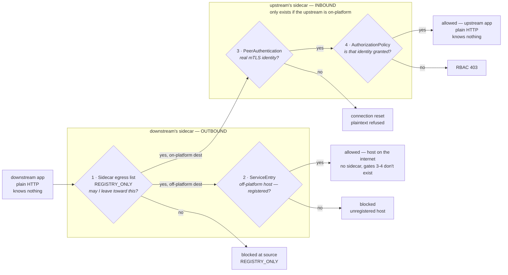
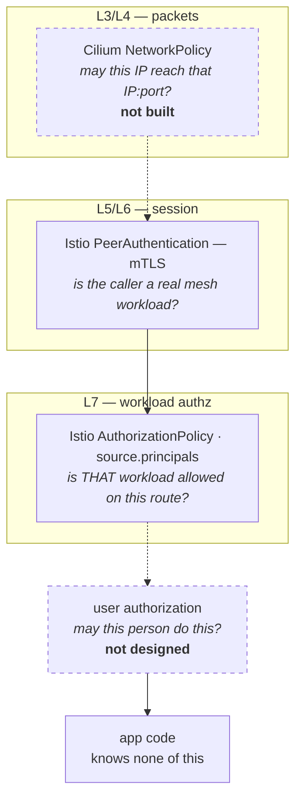

# Platform Engineering: Connections

> **The one idea (grug):** Kubernetes runs the workloads. Service Mesh decides which calls get through.

Istio puts a proxy beside every pod. Nothing reaches a workload without passing that proxy, and nothing leaves without passing its own.

There is a live walkthrough at [connections.mattjarrett.dev](https://connections.mattjarrett.dev) — four real calls against this cluster, two of them refused.

**Scope: workloads talking to workloads.** *Can this workload call that workload* is answered here. *Can Alice view Order 123* is a separate concern, not yet designed, and nothing here depends on it — principle 5 is what keeps that door open.

[Platform](../platform/)'s [`Api`](../platform/api/) and [`Spa`](../platform/spa/) compositions generate every Istio object. Nothing in a workspace file names an Istio kind, mentions Envoy, or contains a SPIFFE string.

## Index

| Chapter | What's in it |
|---|---|
| [Design principles](#design-principles) | what to reason from when a new question comes up |
| [What you set on an app](#what-you-set-on-an-app) | the entire developer-facing surface |
| [What gets rendered](#what-gets-rendered) | the four gates, and which one refused your call |
| [The identity it rests on](#the-identity-it-rests-on) | why a name in a header would not be enough |
| [What it costs](#what-it-costs) | honestly |
| [Known limits](#known-limits) | the holes, named |
| [Status](#status) | what is enforcing |
| [Reference](#reference) | one link per concept |

## Design principles

| # | Principle | Why |
|---|---|---|
| 1 | **Nothing is reachable by position** | Sitting in the same cluster, or the same namespace, grants nothing on its own |
| 2 | **Each pod's proxy is configured from its own app's definition** | Inbound rules come from the app being called, outbound from the app calling. One fact each, not one fact stored twice |
| 3 | **Read what already exists** | Where a field already states a dependency, the composition uses it rather than asking again |
| 4 | **Fail loud, never silent-permissive** | A missing entry surfaces as a refused connection or a 403 — never a quiet allow |
| 5 | **One rule, not two policies** | Istio ORs separate ALLOW policies together, which widens access. Conditions that must all hold belong in the same rule — this is what keeps user authorization addable later |
| 6 | **Apps never see Istio** | No Istio kinds, no SPIFFE strings, no Envoy in any workspace file |
| 7 | **The mesh is governance, not containment** | A compromised pod can step around the sidecar. Say so plainly rather than overselling |

## What you set on an app

Two fields, on the app's own definition, beside everything else it already configures.

```yaml
# my-vinyl-api.yaml — who may call me, and what I call
spec:
  parameters:
    connectionPosture: enforce
    provides:
      - name: collection
        allowedCallers:
          - { namespace: my-vinyl, app: my-vinyl }
        # methods/paths optional — omitted means the whole API.
        # Narrow only when one API has more than one trust boundary.
    consumes:
      - { host: api.discogs.com }
```

```yaml
# my-vinyl.yaml — the SPA declares nothing new
spec:
  parameters:
    connectionPosture: enforce
    apiProxies:
      - path: /api/
        upstream: my-vinyl-api.my-vinyl.svc.cluster.local
```

**The SPA needs no new field.** Principle 3 — `apiProxies` already states the dependency, so the composition reads it. `consumes` carries only what nothing else states: off-platform hosts, and apps in another namespace. Same-namespace destinations, and anything an app creates itself such as its own `Cache`, are reachable outbound and still gated inbound by the callee's `provides` — so nothing works undeclared.

**`connectionPosture` has two values.** `off` renders nothing, `enforce` renders everything below. There is no intermediate rung: Istio has a dry-run mode worth adding if a namespace ever has callers nobody can enumerate, but every namespace here has a small, knowable caller set, and a wrong guess surfaces as a loud 403 rather than an outage.

## What gets rendered

Four objects per workload, all derived from those two fields, all enforced by the Envoy sidecar. No app code changes, ever. Two gates on the way out, two on the way in — and a call has to pass every gate on its path.



Gates 1 and 2 come from the caller's `consumes` (and, for a `Spa`, its `apiProxies`). Gates 3 and 4 come from the callee's `provides` — `AuthorizationPolicy` gets one rule per declared interface, and the first ALLOW makes that workload deny-by-default, so an unnamed caller gets 403.

**Which gate refused a call is the fastest way to place a fault.** A 403 is gate 4, a connection reset is gate 3, and a 502 through nginx usually means gate 1 blackholed the destination.

**The two directions sit at opposite ends because a policy can only attach to a pod that exists.** Off-platform therefore has no gate 3 or 4 — there is nothing out there to hold a rule — which is why `consumes` cannot be dropped as redundant. The same shape covers shared in-cluster stores that run no policy of their own, such as NATS: enforced caller-side only, needing no special field.

**Two exceptions, both for unmeshed infrastructure with no identity to match on.** Prometheus scrapes the metrics port; Traefik forwards ingress to the app port. The Traefik exception applies only when a workload sets `host`, which means **an app with an Ingress stays reachable from the ingress controller regardless of its grants**. How far that reaches depends on `tlsIssuer` — `letsencrypt-prod` means the internet, `local-lab-ca-issuer` means the homelab network.

**Proxied requests must carry the upstream's name as `Host`.** Envoy routes outbound HTTP by `:authority`, so forwarding the browser's hostname makes it look up a name absent from the mesh registry, which `REGISTRY_ONLY` blackholes. The `Spa` composition sets `Host` to the upstream service and keeps the original as `X-Forwarded-Host`.

## The identity it rests on

**Grug:** every pod gets a certificate saying who it is. It cannot be faked. That is the whole foundation.

Istio issues each meshed pod an X.509 **SVID** — ~24h lifetime, auto-rotated, carrying a SPIFFE URI SAN:

```
spiffe://cluster.local/ns/my-vinyl/sa/my-vinyl-spa
             ^trust domain    ^namespace     ^service account
```

Bound to a private key that never leaves the pod. It is what `AuthorizationPolicy` matches on, and the only identity here that survives an attacker already inside the cluster network — an IP or a header proves nothing.

**Hard rule: every workload gets its own ServiceAccount.** The compositions do this. The moment two apps share one they are the same identity, and every grant between them is meaningless.

## What it costs

**Grug:** a couple of fields on an app, once. In return the proxy refuses anything not listed, and the refusal is legible.

The real cost is not the fields — it is that a failed call now has several explanations instead of one. A 403, an mTLS reset and blocked egress all used to be "can it reach the IP", and telling them apart is a skill to build. That is the honest price of moving reachability out of the network and into policy, and the gate list above is the map for paying it.

**On scale.** In an organisation this shape carries a second cost — a grant becomes a cross-team wait, and someone has to own approving it. Here there is one operator and two files, so that cost does not exist. Worth naming, so the design is not mistaken for solving a coordination problem it has never faced.

## Known limits

Two of these are the same shape — a layer that is not built. One sits below what the mesh enforces, one above it.



**The mesh is governance, not containment.** Istio's egress lock lives in the sidecar, so code inside a pod can step around it — run as UID 1337, which Istio excludes from iptables redirect, or dial an IP directly so there is no SNI for `REGISTRY_ONLY` to match. Envoy never sees the packet.

Only the kernel can stop that. A Cilium `NetworkPolicy` is enforced at the pod's veth, where nothing inside the pod can avoid it. **That layer is deliberately not built**, and it is not a one-way door: the policy would be generated from the same `consumes` declarations the mesh already uses, so adding it later is additive — no XRD change, no app change, nothing re-declared. Three questions decide it:

1. Is Cilium's DNS proxy enabled? `toFQDNs` silently never matches without it.
2. Would off-platform egress use FQDN rules, or CIDR? FQDN is the expensive path, and the declared-host list already bounds how many exist.
3. Is a compromised pod inside the threat model, or is the control there to prove only declared calls happen? Only the first needs it.

**An app with an Ingress is reachable from the ingress controller** regardless of its grants, because Traefik is unmeshed and presents no identity.

**Nothing tests that an app can actually reach its backend.** Rendering is checked; behaviour is not. A workload can serve its page, report `2/2`, sync green, and still be unable to call its own API. This gap has already caused one outage, and closing it is the most valuable work left.

**`Api` and `Spa` label pods differently** — `app.kubernetes.io/instance` versus `instance`. A selector copied between the two matches nothing and fails silently: the policy renders, ArgoCD reports Synced, enforcement never happens. Converging on one label would remove the trap.

## Status

**Enforcing:** `platform-connections-demo`, `my-vinyl` (SPA + API + cache), `js-pollock`, `mattjarrett-dev`.

**Not yet:** `sump-pump` — its cross-namespace NATS traffic would be blocked, so it waits on that decision. `launchpad` — the namespace is unmeshed because `launchpad-api` holds long-lived apiserver watch streams a proxy would sever. WordPress is out of scope; `blog` is a plain Deployment the platform does not render.

## Reference

| Concept | Layer | Doc | Watch for |
|---|---|---|---|
| Sidecar injection | — | [injection](https://istio.io/latest/docs/setup/additional-setup/sidecar-injection/) | meshed pods show 2 containers |
| SPIFFE identity | L5/L6 | [identity](https://istio.io/latest/docs/concepts/security/#istio-identity) | the principal string *is* the grant key |
| PeerAuthentication | L5/L6 | [mutual TLS](https://istio.io/latest/docs/concepts/security/#peer-authentication) | STRICT has no dry-run |
| AuthorizationPolicy | L7 | [concept](https://istio.io/latest/docs/concepts/security/#authorization) · [ref](https://istio.io/latest/docs/reference/config/security/authorization-policy/) | the first ALLOW makes that workload deny-by-default |
| ServiceEntry | L7 | [egress control](https://istio.io/latest/docs/tasks/traffic-management/egress/egress-control/) | registers a host; alone it gates nothing |
| Sidecar + `REGISTRY_ONLY` | L7 | [ref](https://istio.io/latest/docs/reference/config/networking/sidecar/) | this is what makes egress default-deny |
| Cilium NetworkPolicy | L3/L4 | [policy](https://docs.cilium.io/en/stable/security/policy/) | the containment layer the mesh cannot be |
