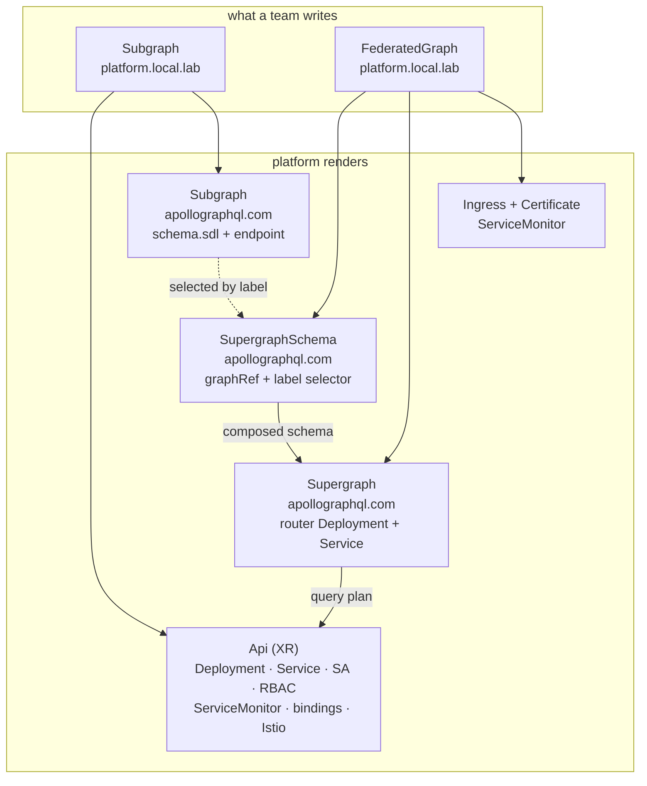

# Platform Engineering: Graph

> **The one idea (grug):** every team ships its own small GraphQL API. The platform glues them into one big one that clients see as a single schema.

A client asks one endpoint one question. Behind it, the question is split across several independently deployed services, each owning the part of the schema it knows about. Nobody writes the glue by hand — a router computes it from the schemas.

This is a plan. Nothing here exists in the cluster.

## Index

| Chapter | What's in it |
|---|---|
| [Federation in five minutes](#federation-in-five-minutes) | the whole concept, no prior GraphQL needed |
| [Design principles](#design-principles) | what to reason from when a new question comes up |
| [The two offerings](#the-two-offerings) | the entire developer-facing surface |
| [Where the schema lives](#where-the-schema-lives) | the schema management UX, and why it is not its own Kind |
| [Developing a subgraph](#developing-a-subgraph) | the inner loop, and what the cluster lends you |
| [Promotion](#promotion) | moving a subgraph from one graph to the next |
| [What gets rendered](#what-gets-rendered) | platform Kinds mapped onto Apollo's Kinds |
| [Crossplane or kubebuilder](#crossplane-or-kubebuilder) | why one is a controller and the other is a composition |
| [Foundations to install](#foundations-to-install) | everything that has to exist before offering one |
| [What Apollo costs](#what-apollo-costs) | honestly, including the plan that gates all of this |
| [GitHub workflows](#github-workflows) | what CI does on a subgraph repo |
| [TypeScript conventions](#typescript-conventions) | the first non-Go apps in this homelab |
| [How it meets Connections](#how-it-meets-connections) | the router is a caller like any other |
| [Monitoring](#monitoring) | what a graph emits and where it lands |
| [The demo](#the-demo) | a new monorepo, and what the walkthrough shows |
| [Known limits](#known-limits) | the deviations and the holes, named |
| [Open questions](#open-questions) | decide these before building |
| [Phases](#phases) | build order |
| [Reference](#reference) | one link per concept |

## Federation in five minutes

A GraphQL API publishes a **schema** — a typed description of everything it can answer. One team, one service, one schema is the easy case.

Federation is the case where several teams each own part of one product's schema, and clients should not have to know that. Three moving parts:

- **Subgraph** — one team's service and its schema. Owns some types outright, and can add fields to types another subgraph owns.
- **Composition** — the step that merges every subgraph schema into one **supergraph schema**. It fails loudly if two subgraphs disagree, which is the entire safety property.
- **Router** — the single endpoint clients hit. It reads the composed schema, splits an incoming query into a **query plan**, calls the subgraphs it needs, and stitches one response back.

The link between subgraphs is an **entity** — a type with a `@key`, meaning "here is how to identify one of these". Any subgraph can then attach fields to it.

```graphql
# records subgraph — owns the type
type Record @key(fields: "id") {
  id: ID!
  title: String!
  artist: String!
}

# reviews subgraph — never heard of title or artist, adds a field anyway
type Record @key(fields: "id") {
  id: ID!
  reviews: [Review!]!
}
```

A client asks for `title` and `reviews` together. The router fetches `title` from `records`, hands the `id` to `reviews`, and merges. Neither team wrote that.

**What the platform has to solve:** where a schema lives, how it gets composed, how a bad schema gets stopped before it ships, and how a subgraph moves between environments. Everything below is one of those four.

## Design principles

| Principle | Why |
|---|---|
| **A subgraph is an API that happens to publish a schema** | Reuse [`Api`](../platform/api/). Bindings, sizing, mesh, metrics and TLS already work |
| **The schema is a build artifact, not a hand-edited resource** | It ships from the commit whose resolvers satisfy it |
| **Composition failure is a CI failure** | A schema that cannot compose never reaches the cluster |
| **A graph is a boundary, not an environment name** | Dev and prod are two instances, not two modes of one |
| **Read what already exists** | A subgraph names its graph; membership and mesh grants follow from that |
| **Hide the operations, not the concepts** | A subgraph author writes `@key`, reads composition errors and debugs query plans — federation is their job. Keys, Studio refs, `apollographql.com` Kinds and router config are not |
| **Promotion is a pull request** | Not a button. What runs in prod is a line in git with a reviewer on it |

## The two offerings

Two new Kinds. That is the whole surface.

| Kind | Who creates it | What it means |
|---|---|---|
| [`Subgraph`](../platform/subgraph/) | a product team | "here is my service and the slice of the graph it owns" |
| [`FederatedGraph`](../platform/federated-graph/) | the platform team | "here is the endpoint clients call, and which subgraphs are in it" |

### `Subgraph` — what a builder writes

```yaml
apiVersion: platform.local.lab/v1alpha1
kind: Subgraph
metadata:
  name: records
spec:
  parameters:
    namespace: graph-dev
    graphRef: storefront          # the FederatedGraph this joins
    image: ghcr.io/cujarrett/platform-graph-demo-records:sha-abc123
    size: sm
    sqlRef:
      name: records-db
    schema: |                     # written by CI from records/schema.graphql
      type Record @key(fields: "id") {
        id: ID!
        title: String!
        artist: String!
      }
```

`image` and `schema` are written together by CI from one commit. Everything above them is the [`Api`](../platform/api/) surface unchanged — a subgraph gets databases, caches and topics on exactly the terms every other API does, because it *is* an `Api` underneath.

There is no `host`, so no Ingress and no certificate are created. A subgraph is not directly reachable; the router is the only thing that calls it. `Api` requires only `image` and `namespace`, so nothing has to be invented to fill the rest of the spec.

### `FederatedGraph` — what the platform team writes

```yaml
apiVersion: platform.local.lab/v1alpha1
kind: FederatedGraph
metadata:
  name: storefront
spec:
  parameters:
    namespace: graph-dev
    host: graph-dev.local.lab
    tlsIssuer: local-lab-ca-issuer
    variant: dev                  # which registry variant to compose against
    replicas: 1
    size: sm
```

Prod is the same file with four values changed — `graph-prod`, `graph.mattjarrett.dev`, `letsencrypt-prod` and `variant: prod`.

No list of subgraphs. Membership comes from the `Subgraph` instances that named this graph — one fact, stated once, by the team that owns it. A team joins the graph by merging its own file, not by editing the platform team's.

**Both Kinds are namespaced, and the namespace is the boundary.** A `FederatedGraph` composes only the subgraphs in its own namespace, so `graph-dev` and `graph-prod` are two complete, isolated graphs with no shared state — the same feature-branch story the rest of the platform already tells.

## Where the schema lives

**Grug: the schema is a file in the repo next to the resolvers, and CI copies it into the workspace file.**

The question "what is the UX to manage schema" has a tempting wrong answer — a `Schema` Kind, hand-edited, applied to the cluster. It is wrong because it lets the schema say one thing while the running code does another. A schema is only true if the resolvers behind it are deployed.

So the schema moves with the image, from one commit:

```
repo                         built by CI                       lands in
────                         ───────────                       ────────
records/src/*.ts        ──►  container image :sha-abc123  ──►  Subgraph.spec.parameters.image
records/schema.graphql  ──►  copied verbatim              ──►  Subgraph.spec.parameters.schema
```

One commit, one workspace file, one pull request. The developer never publishes a schema as a separate act, and the two can never disagree.

### Why the schema is in the resource and not in the registry

There are two ways to run federation, and picking the operator picked one of them.

| | Registry is the source of truth | Cluster is the source of truth |
|---|---|---|
| How a schema arrives | CI runs `rover subgraph publish` | the schema is in the `Subgraph` resource, and the operator publishes it |
| Router tracks | launches in Studio, via `Supergraph.spec.schema.studio` | the composed schema, via `Supergraph.spec.schema.resource` |
| Membership lives in | Studio | git |
| Apollo Kinds used | `Supergraph` only | `Subgraph` + `SupergraphSchema` + `Supergraph` |

The right-hand column is the one the operator exists for, and the one that makes membership reviewable. `rover subgraph publish` therefore has no place in the deploy path — **`rover subgraph check` still runs in CI**, which is the part that matters.

That leaves how the SDL gets into the resource. Apollo's `Subgraph` CRD offers inline SDL, an OCI artifact, or a path inside an OCI image. **Inline.** It is one CI step, one registry and one set of pull secrets fewer, and the schema diff is readable in the pull request — the most valuable property a schema change has. OCI would buy immutability, but the commit already provides that, and CI generating the block from the repo is what prevents drift. A large subgraph schema is a few hundred lines of YAML; not a scale problem worth an artifact pipeline.

### The four verbs

All local or in CI. None of them touch the cluster directly.

| Verb | Command | When |
|---|---|---|
| Write | edit `schema.graphql` | any change |
| Check | `just check` — composes against the current graph, reports breaking changes | before pushing, and on every PR |
| Ship | automatic on merge to main — CI writes image and schema into the dev workspace file | never run by hand |
| Promote | `just promote` — opens a PR moving the dev image and schema into prod | when dev has been good for a while |

## Developing a subgraph

**Grug: the router runs on your laptop. The cluster lends you the subgraphs you are not editing.**

`rover dev` starts a local router and composes subgraphs on the fly, hot-reloading when a schema file changes. It composes offline and needs no GraphOS, so the inner loop costs nothing and works on a plane.

Three loops, cheapest first.

| Loop | What runs where | Use it when |
|---|---|---|
| Local | every subgraph from source, `rover dev` composes them | changing one schema and the resolvers behind it |
| Borrowed | your subgraph from source, the rest port-forwarded from the dev graph | your change touches an entity another team owns |
| Deployed | everything in the cluster, query the dev router directly | confirming it works with real bindings and the real mesh |

The borrowed loop is the one worth building for. A subgraph sets no `host` and grants only the router, so nothing on the LAN can reach it — but `kubectl port-forward` is an apiserver path, not a mesh path, so it works without weakening anything. `just dev` wraps the port-forwards and writes the `rover dev` config, the same shape [`platform-connections-demo`](https://github.com/cujarrett/platform-connections-demo) already uses.

**The cluster's standing dev graph is a `FederatedGraph` like any other**, in `graph-dev`, tracking main, published at `graph-dev.local.lab` with `local-lab-ca-issuer` — internal, so reachable over Tailscale and nowhere else. Point Apollo Sandbox at it to explore the composed schema without installing anything.

## Promotion

**Grug: promotion moves a SHA from one directory to another, and a human approves it.**

```
homelab-workspaces/
  graph-dev/
    records.yaml          image + schema  sha-abc123   ← CI writes this on merge to main
    reviews.yaml
    storefront.yaml       FederatedGraph, variant dev
  graph-prod/
    records.yaml          image + schema  sha-999888   ← a promotion PR writes this
    reviews.yaml
    storefront.yaml       FederatedGraph, variant prod
```

`just promote` reads the image and schema currently live in dev, opens a PR against the prod directory, and the PR's own CI runs a schema check against the **prod** variant — because a change that composes cleanly against dev can still break prod, when prod has an older version of a sibling subgraph.

That check is what makes the PR meaningful. It answers "is this safe against what is actually running in prod right now", which is a question no amount of local testing can answer.

**Why not a `Promotion` Kind, or a promote button.** Both hide the diff. A pull request already gives review, history, revert and CI on the exact change — the platform would be rebuilding all four, worse. The `FederatedGraph` is the boundary, git is the pipeline.

## What gets rendered

Two platform Kinds become one Crossplane XR and four Apollo resources.



The Apollo operator does the parts that need an external system: it publishes each `Subgraph` schema to the registry, asks for a composition, waits for the result, and rolls the router onto the new supergraph. The platform's job is to make sure nothing in a workspace file ever names any of it.

`Supergraph.spec.schema.resource` points at the `SupergraphSchema` by name — that is the operator's own wiring, and the reason `FederatedGraph` needs no subgraph list of its own.

## Crossplane or kubebuilder

Both are on the table and the answer differs per Kind.

| | Crossplane composition | kubebuilder controller |
|---|---|---|
| Good at | rendering a fixed set of objects from a spec | sequencing, waiting, reading something before deciding |
| Bad at | anything conditional on an external result | everything Crossplane makes free — you write it all |
| Already used here | eight offerings | none |

**`FederatedGraph` is a Crossplane composition.** It renders a fixed set of objects — `SupergraphSchema`, `Supergraph`, Ingress, Certificate, ServiceMonitor — with no decision that depends on anything outside its own spec. A controller here would buy nothing and cost a repo.

**`Subgraph` is a kubebuilder controller.** It has two jobs a composition genuinely cannot do:

- **Gate on composition.** When the graph refuses a schema, the `Subgraph` must go `Ready=False` carrying the composition error, rather than silently leaving a healthy pod serving a schema nobody composed. That means reading `SupergraphSchema` status and correlating it back.
- **Derive the mesh grant.** The router's ServiceAccount has to appear in the subgraph's `provides` — computed from `graphRef`, which means looking up the `FederatedGraph` that name refers to.

Both are read-then-decide loops. Crossplane's model is render-then-apply.

**What the controller does not do:** render a Deployment. It creates a Crossplane `Api` XR and lets the existing composition do the workload. The controller stays small — reconcile an `Api`, an Apollo `Subgraph`, and a status.

## Foundations to install

Everything that must exist before a single `Subgraph` can be created.

| Foundation | Where it lands | Notes |
|---|---|---|
| GraphOS account, graph, and `dev` + `prod` variants | apollographql.com | Gates everything — see [What Apollo costs](#what-apollo-costs) |
| `apollo-graphos` namespace | `cluster/argocd/apollo-operator.yaml` | Created by ArgoCD `CreateNamespace=true` |
| `apollo-api-key` Secret, key `APOLLO_KEY` | pre-created by hand in the cluster | Never in git, matching every other secret here |
| Apollo GraphOS operator, chart `1.4.0` | `cluster/argocd/apollo-operator.yaml`, project `cluster` | OCI Helm chart — `oci://registry-1.docker.io/apollograph/operator-chart` |
| That chart URL in the `cluster` AppProject `sourceRepos` | `cluster/argocd/projects.yaml` | Sync fails without it |
| Router image | — | `ghcr.io/apollographql/router` — verified `linux/arm64` at `v2.17.0` |
| `platform-controllers` repo, kubebuilder scaffold | new GitHub repo | Ships the `Subgraph` CRD and controller image |
| Controller Deployment + CRD + cluster RBAC | `cluster/argocd/platform-controllers.yaml` | Plain manifests, no chart |
| `FederatedGraph` XRD + composition | `platform/federated-graph/` | Standard Crossplane offering |
| `graph.mattjarrett.dev` on the Cloudflare tunnel | tunnel config, `noTLSVerify: true` first | Must precede the `letsencrypt-prod` cert or HTTP-01 fails |
| Standing dev graph at `graph-dev.local.lab` | `homelab-workspaces/graph-dev/` | Internal only — `local-lab-ca-issuer`, no tunnel entry |
| Rover on the laptop and in CI | subgraph repo workflows | `rover dev` locally; GitHub runners are amd64, so the Pi never runs Rover |

**Both images are ARM64.** `apollograph/operator:1.4.0` and `ghcr.io/apollographql/router:v2.17.0` both publish `linux/arm64` manifests — confirmed against the registries, not assumed.

**Operator scope.** The chart defaults every controller to cluster-scoped (`config.controllers.*.namespaces: []`). Leave it there; the alternative is re-listing namespaces on every new workspace.

## What Apollo costs

**The short answer to "is it free on my homelab": the router is, the operator is not.**

| Thing | License / plan | Cost here |
|---|---|---|
| Apollo Router | Elastic License v2, self-hosted | Free |
| GraphOS Free plan | free forever, no card | Self-hosted router **rate limited to 60 requests/minute**, 1-day data retention, and the **operator is not included** |
| GraphOS Developer plan | $5 per million requests, $50 signup credit | A homelab does thousands of requests, not millions. Effectively free against the credit — but it wants a card on file |
| GraphOS Operator | listed as Developer, Standard and Enterprise | Not on Free |

So the plan is **GraphOS Developer**. It removes the 60 rpm cap, includes the operator, and at this traffic the bill rounds to nothing. Verify the plan eligibility at signup — it comes from Apollo's docs and pricing page rather than from anything testable, and it is the one fact that could change the whole shape.

**If that turns out wrong, the escape hatch is real and small.** The operator's `APOLLO_KEY` is `optional: true` in the chart, so it starts without a key, and `Supergraph.spec.schema` accepts `oci` and `sdl` as well as `resource`. Composition moves to CI — `rover supergraph compose` is free and offline — and CI publishes the composed supergraph as an OCI artifact the router pulls. What is lost is the hosted registry, `rover subgraph check` against a live variant, Studio's explorer and launch history. That is a real loss for the check-before-promote story, which is why it is the fallback and not the plan.

## GitHub workflows

Per subgraph, in the demo monorepo, following the existing per-app workflow split.

| Workflow | Trigger | Steps |
|---|---|---|
| `records.yml` | push touching `records/**` | `just ci` → **`rover subgraph check` against the dev variant** → build ARM64 image → on main, write image tag and `records/schema.graphql` into `homelab-workspaces/graph-dev/records.yaml` |
| `promote-records.yml` | manual dispatch | read the image and schema live in dev → open a PR updating `graph-prod/records.yaml` → PR CI runs `rover subgraph check` against the **prod** variant |

One thing differs from the Go repos' `ci.yml`: **a schema check gates the merge.** A subgraph that would break the graph fails the PR, and the router never sees it. Test still gates build, as everywhere else, and the check runs against the schema file in the working tree, so nothing is published to prove a change is safe.

The image-tag-bump-back-to-`homelab-workspaces` step is the pattern [`wire-deploy-automation`](../.claude/skills/wire-deploy-automation.md) already installs; this extends it to write the schema block alongside the tag.

## TypeScript conventions

These would be the first non-Go apps in the homelab, so the conventions need writing down rather than inheriting. Mirror the Go rules wherever the shape allows.

| Rule | Go today | TypeScript subgraph |
|---|---|---|
| Build tool | `just` | `just` — same recipe names |
| `just ci` | lint → test → build | lint → test → build |
| `just lint` | `go mod tidy -diff` + golangci-lint | `tsc --noEmit` + eslint + prettier check |
| `just test` | `go test -race ./...` | `vitest run` |
| `just build` | `go build -o <repo-name>` | `tsc` to `dist/` |
| Health route | `/healthz` required | `/healthz` as a plain GET **outside** the GraphQL handler |
| Metrics | `/metrics` on the metrics port | `/metrics` on the metrics port, **always** |
| Shutdown | `signal.NotifyContext` | `SIGTERM` handler that drains in-flight requests |
| Base image | distroless ARM64 | `node:22-slim`, ARM64, non-root |
| Framework | stdlib only | `@apollo/server` + `@apollo/subgraph` only — no Nest, no Express beyond what Apollo needs |

The two bolded rows are obligations `Api` imposes by behaving exactly as it already does. Its ServiceMonitor is rendered unconditionally, so a subgraph serving no Prometheus metrics is a permanently-down scrape target. Its readiness probe is a GET, and Apollo Server answers `POST /graphql` and nothing else, so a `/healthz` inside the GraphQL handler means the pod never goes ready.

`buildSubgraphSchema` from `@apollo/subgraph` is what makes a plain Apollo Server federation-capable. One function call, and the only federation-specific line in an app.

The stdlib-only spirit survives as **"one framework, no framework stack"** — `@apollo/server` earns its place because hand-rolling federation `_entities` resolution does not. `vitest` is the one Go rule not copied literally: Node ships a built-in runner, but vitest is what a TypeScript codebase is expected to use, and matching the ecosystem beats matching the rule word for word.

## How it meets Connections

The router is an ordinary caller. Everything in [Platform Engineering: Connections](./platform-engineering-connections.md) applies unchanged, and the graph adds no new mechanism.

- The `FederatedGraph` sets `host`, so it takes the ingress exception — reachable from Traefik, which is the point.
- Each `Subgraph` sets `connectionPosture: enforce` and grants exactly one caller: the router's ServiceAccount. Nothing else in the cluster can call a subgraph directly.
- **That grant is derived, not written.** The controller reads `graphRef`, finds the `FederatedGraph`, and emits the `provides` entry for its router. A team never types a ServiceAccount name.
- The router's own `consumes` is likewise derived — every `Subgraph` naming this graph.

The net effect is a graph that is deny-by-default from the outside and fully connected on the inside, from two `graphRef` strings.

**One new thing to think about:** the router talks to subgraphs over HTTP with a JSON body, so Istio's L7 gates see one path (`/graphql`) and one method (`POST`) for every operation. `provides[].paths` cannot distinguish "read a record" from "delete a record" here. **Authorization inside the graph is a GraphQL concern, not a mesh concern** — the mesh proves it is the router calling, and nothing more.

## Monitoring

`Supergraph.spec.networking.metricsPort` turns on Prometheus export from the router. Set it, and the `FederatedGraph` composition renders a ServiceMonitor beside it.

A new dashboard, `homelab-graph`, following the existing dashboard rules:

| Panel | Question it answers |
|---|---|
| Requests / errors by operation name | which query is failing |
| p50 / p95 latency, router total vs per-subgraph | is the router slow or is one subgraph slow |
| Subgraph fetch count per request | is a query fanning out more than it should |
| Composition status per `FederatedGraph` | is the supergraph currently the one we think it is |
| Schema publish timeline | what changed just before things got worse |

The first three come free from the router's own scrape. **The last two are not metrics anywhere** — they are fields in a `SupergraphSchema` status, and something has to turn resource status into a time series before Grafana can draw them. [`platform-exporter`](../cluster/argocd/platform-exporter.yaml) already does that job for other platform state, so it is an addition there rather than a new component.

## The demo

A new monorepo, `platform-graph-demo`, in the shape of [`platform-connections-demo`](https://github.com/cujarrett/platform-connections-demo) — several small apps and one SPA that makes the invisible part visible.

```
platform-graph-demo/
  records/      TypeScript subgraph — owns Record
  reviews/      TypeScript subgraph — adds reviews to Record
  spa/          Angular walkthrough
  .github/workflows/{records,reviews,spa,promote-*}.yml
```

**Two subgraphs, not three.** Two is the minimum that demonstrates an entity being extended across a service boundary, which is the whole idea. A third adds a row to every diagram and teaches nothing new.

The connections demo's trick was that two apps ran a byte-identical image and differed only in what they declared. The graph demo's equivalent: **neither subgraph imports, references, or knows about the other**, and the SPA proves a single query reached both.

The walkthrough, four live panes:

- **Two schemas, side by side.** `records` and `reviews`. `Record` appears in both. Neither file mentions the other service.
- **The composed supergraph.** Fetched from the running router. Nobody wrote this file.
- **One query, the query plan, the response.** Ask for `title` and `reviews` together. Show the plan the router computed — fetch, flatten, fetch, merge — with the two subgraph calls highlighted as they happen.
- **A breaking change, refused.** A prepared schema that renames a field another subgraph depends on, run through composition live, showing the exact error and the router still serving the last good supergraph.

The last pane is the one that makes the case. It is the difference between "we glued some APIs together" and "we have a platform that will not let you break the graph".

Served at `graph.mattjarrett.dev` through the Cloudflare tunnel, and locally with `just dev` port-forwarding the router, matching how the connections demo runs.

## Known limits

The first two are deliberate departures from how federation is normally run. The rest are holes.

- **A kubebuilder controller creates a Crossplane XR.** Unusual, and the price of reusing `Api` rather than reimplementing a Deployment, Service, RBAC, bindings and mesh config in Go. Dropping it costs far more than it saves.
- **Two frameworks in one platform.** Crossplane for `FederatedGraph`, kubebuilder for `Subgraph`. The alternative is either a controller that does nothing a composition would not, or a `Subgraph` that cannot report a composition failure.
- **The Kind name `Subgraph` collides with Apollo's.** `subgraphs.platform.local.lab` and `subgraphs.apollographql.com` can coexist — different API groups — but `kubectl get subgraph` becomes ambiguous and picks one. Either always fully-qualify it, or rename the platform Kind. Decide before shipping; renaming a Kind after instances exist is a migration.
- **Composition is not instant.** A schema publish, a composition and a router rollout are three hops through an external service. Expect tens of seconds between merging and serving, not the sub-second reconcile Crossplane's realtime compositions give elsewhere.
- **The registry is a hard dependency for changes.** GraphOS being unreachable does not take the router down — it serves its last good schema — but nothing can be published or promoted until it comes back.
- **One router per graph per namespace.** No shared router across namespaces, and no partial supergraph. `SupergraphSchema.spec.partial` exists for subgraphs managed outside the cluster; deliberately unused, because here the cluster is the only source of truth.
- **Authorization inside the graph is not designed.** Same boundary as Connections: workload-to-workload is answered, user-to-field is not.

## Open questions

Settle these before writing code.

- **Confirm the operator is unavailable on the GraphOS Free plan.** The single fact the whole plan rests on, and it comes from Apollo's docs and pricing page rather than anything testable offline. If Free does include it, drop the card entirely.
- **`Subgraph` name collision** — keep it, or pick something without the clash.
- **Where does the `Subgraph` CRD YAML live** — hand-copied into `platform/subgraph/` from the controller repo, or vendored from a release artifact? Hand-copy is simpler and drifts; vendoring is correct and is a build step nothing else here has.
- **Does the demo need a database?** `records` with a `Sql` binding proves a subgraph is a first-class platform citizen. It also doubles the demo's moving parts. Probably yes, on one subgraph only.
- **Router replicas and size on a Pi.** The router is Rust and modest, but it is one more always-on workload. Start at 1 replica `sm` and measure before promising 2.

## Phases

Ordered so each phase is provable on its own, and the cluster is untouched until phase 2.

| Phase | What | Touches the cluster |
|---|---|---|
| 0 | Settle the [open questions](#open-questions). Sign up for GraphOS, create the graph and both variants | no |
| 1 | Write the two subgraph schemas and resolvers locally. Compose them with `rover` on the laptop. Prove federation works before any Kubernetes is involved | no |
| 2 | Apollo operator via ArgoCD. Hand-write an Apollo `Subgraph`, `SupergraphSchema` and `Supergraph` in one namespace. Prove a router serves a composed schema on the Pi | yes |
| 3 | `platform-graph-demo` repo — the two TypeScript subgraphs, images, CI | yes |
| 4 | `FederatedGraph` XRD + composition + README. Stand up the dev graph at `graph-dev.local.lab`, replacing the hand-written `SupergraphSchema` and `Supergraph` | yes |
| 5 | `platform-controllers` repo — kubebuilder scaffold, `Subgraph` CRD and controller. Replace the hand-written Apollo `Subgraph` | yes |
| 6 | Promotion — the prod namespace, the promote workflow, the check-against-prod gate | yes |
| 7 | The SPA walkthrough, the tunnel hostname, the `homelab-graph` dashboard | yes |

Phases 4 and 5 can swap. Doing `FederatedGraph` first means the unfamiliar kubebuilder work happens against a graph that already runs.

## Reference

| Concept | Link |
|---|---|
| Apollo GraphOS Operator | [apollographql.com/docs/apollo-operator](https://www.apollographql.com/docs/apollo-operator) |
| Operator Helm chart | `oci://registry-1.docker.io/apollograph/operator-chart` |
| Router self-hosting | [apollographql.com/docs/graphos/routing/self-hosted](https://www.apollographql.com/docs/graphos/routing/self-hosted) |
| Router license | [apollographql.com/docs/graphos/routing/license](https://www.apollographql.com/docs/graphos/routing/license) |
| GraphOS pricing | [apollographql.com/pricing](https://www.apollographql.com/pricing) |
| Federation entities and `@key` | [apollographql.com/docs/federation/entities](https://www.apollographql.com/docs/federation/entities) |
| kubebuilder | [book.kubebuilder.io](https://book.kubebuilder.io) |
| Existing platform offerings | [platform/](../platform/) |
| Mesh design this builds on | [Platform Engineering: Connections](./platform-engineering-connections.md) |
| Demo repo pattern | [platform-connections-demo](https://github.com/cujarrett/platform-connections-demo) |
