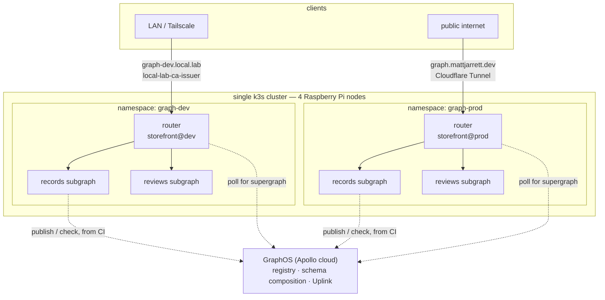
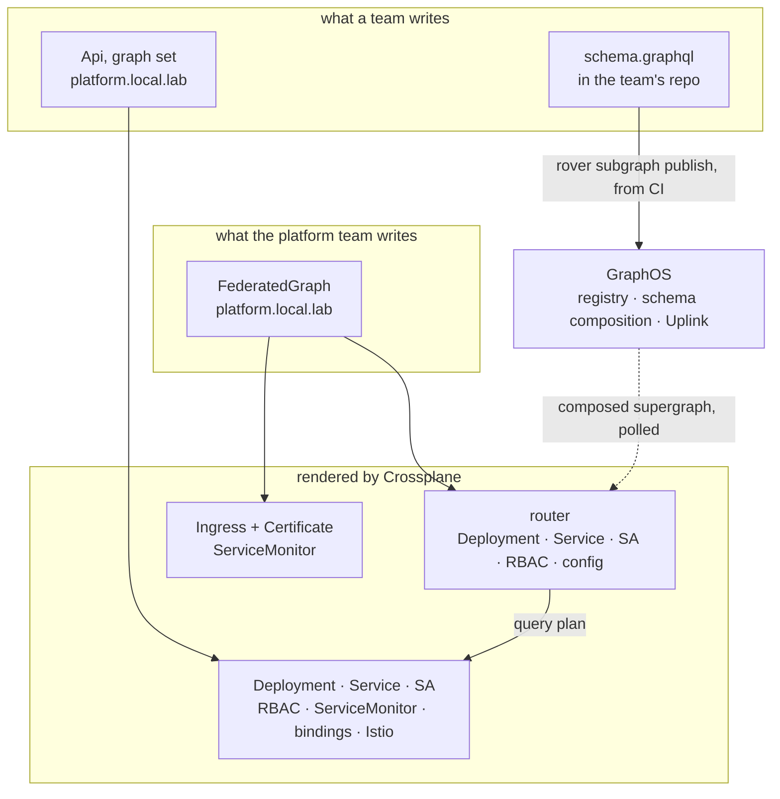

# Platform Graph

> **The one idea (grug):** every team ships its own small GraphQL API. A router glues them into one big one that clients see as a single schema.

[Fortune 100 Internal Developer Platform patterns, learned on a homelab. Nothing novel.](./nothing-novel.md)

## Index

| Chapter | What's in it |
|---|---|
| [Federation in five minutes](#federation-in-five-minutes) | the whole concept, no prior GraphQL needed |
| [Words that already mean something else](#words-that-already-mean-something-else) | four collisions between GraphQL's vocabulary and this platform's |
| [Topology](#topology) | where everything runs, on one cluster |
| [Who does what](#who-does-what) | the split between Apollo, the platform, and a team |
| [Design principles](#design-principles) | what to reason from when a new question comes up |
| [The offerings](#the-offerings) | the entire developer-facing surface, offering by offering |
| [What a team writes](#what-a-team-writes) | one workload, one file, five fields |
| [Where the schema lives](#where-the-schema-lives) | the schema management UX, and why it is not hand-edited |
| [The lifecycle](#the-lifecycle) | one commit from a schema edit to a serving supergraph |
| [Developing a subgraph](#developing-a-subgraph) | the inner loop, command by command |
| [Promotion](#promotion) | moving a subgraph from one graph to the next |
| [Why one offering, not two](#why-one-offering-not-two) | why `graph` is an `Api` parameter and not a wrapping Kind |
| [What gets rendered](#what-gets-rendered) | the Kinds mapped onto the objects they become |
| [The router is a policy surface](#the-router-is-a-policy-surface) | the six things a router does that a proxy does not |
| [Contracts — one graph, two audiences](#contracts--one-graph-two-audiences) | publishing a filtered public schema from the same subgraphs |
| [Governance](#governance) | linting, ownership, and reviewing a schema change as a schema change |
| [What GraphOS costs and caps](#what-graphos-costs-and-caps) | the free tier, and the two limits that bite |
| [The operator, and why a composition instead](#the-operator-and-why-a-composition-instead) | what Apollo's Kubernetes operator does, and when it wins |
| [Foundations to install](#foundations-to-install) | everything that has to exist before the first subgraph |
| [GitHub workflows](#github-workflows) | what CI does on a subgraph repo |
| [TypeScript conventions](#typescript-conventions) | the first non-Go apps in this homelab |
| [How it meets Connections](#how-it-meets-connections) | the router is a caller like any other |
| [Monitoring](#monitoring) | what a graph emits and where it lands |
| [When there is more than one cluster](#when-there-is-more-than-one-cluster) | what changes, and the one string that breaks |
| [The demo](#the-demo) | a new monorepo, and what the walkthrough shows |
| [Known limits](#known-limits) | the deviations and the holes, named |
| [Open questions](#open-questions) | decide these before building |
| [Phases](#phases) | build order, and what each phase ships |
| [Reference](#reference) | one link per concept |

## Federation in five minutes

A GraphQL API publishes a **schema** — a typed description of everything it can answer. One team, one service, one schema is the easy case.

Federation is the case where several teams each own part of one product's schema, and clients should not have to know that. Three moving parts:

- **Subgraph** — one team's service and its schema. Owns some types outright, and can add fields to types another subgraph owns.
- **Schema composition** — the step that merges every subgraph schema into one **supergraph schema**. It fails loudly if two subgraphs disagree, which is the entire safety property.
- **Router** — the single endpoint clients hit. It reads the composed schema, splits an incoming query into a **query plan**, calls the subgraphs it needs, and stitches one response back.

The link between subgraphs is an **entity** — a type that exists once in the product but is split across services, the way one row can be split across two tables owned by two teams that share nothing but a join key.

Say a storefront has a `records` team and a `reviews` team. `records` owns the `Record` type outright — `id`, `title`, `artist` all live in its database. `reviews` never touches any of that; it only knows which reviews belong to which record `id`. Neither schema below is the whole picture on its own — each is one team's honest description of the part it owns:

```graphql
# records subgraph — owns the type
type Record @key(fields: "id") {
  id: ID!
  title: String!
  artist: String!
}

# reviews subgraph — never heard of title or artist, adds a field anyway
type Record @key(fields: "id") {
  id: ID!
  reviews: [Review!]!
}
```

`@key(fields: "id")` is what tells the router these two blocks are the same entity rather than a name collision — "join these on `id`". Without it, two subgraphs declaring `type Record` would just be a schema conflict.

A client asks for `title` and `reviews` together. The router fetches `title` from `records`, hands that record's `id` to `reviews`, and merges the two results into one `Record` before the client ever sees a response. Neither team wrote that merge, and neither team's code ever calls the other's.

Two more words that appear everywhere once a registry is involved:

- **Variant** — one named copy of a graph, like `storefront@dev` and `storefront@prod`. Each holds its own set of subgraph schemas and composes independently. A variant is the environment boundary.
- **Launch** — one attempt to publish a schema, compose it, and roll the result out. It either produces a new supergraph or fails with a schema composition error, and it is the unit shown in Studio's history.

## Words that already mean something else

**Grug: GraphQL brings four words this platform already spent. Pick which meaning wins, once, and never write the bare word again.**

This is not pedantry. Every one of these has a live object behind it in this cluster, so an ambiguous sentence in a README turns into someone applying the wrong Kind.

| Word | What it already means here | What GraphQL means by it | The rule |
|---|---|---|---|
| **composition** | the Crossplane template behind [`Api`](../platform/api/) and `FederatedGraph` | merging subgraph schemas into a supergraph | Bare "composition" is always the Crossplane one. The GraphQL one is always written **schema composition**, in prose, headings and commit messages alike |
| **`Subscription`** | a platform Kind — a durable consumer cursor on a [`Topic`](../platform/topic/), backed by a message stream | a GraphQL root type, alongside `Query` and `Mutation`, for a long-lived server-push stream | The Kind wins, because it exists. The GraphQL one is written **GraphQL subscription**, lowercase and never backticked, and is out of scope — see below |
| **graph** | nothing yet | both a registry object and, loosely, "the whole federated API" | `graph` is the `Api` parameter and the registry graph, which are the same thing on purpose. The endpoint clients call is **the supergraph** |
| **schema** | an XRD's OpenAPI schema, which is how a platform Kind's parameters are validated | a GraphQL type system document | Bare "schema" in a graph context is the GraphQL one. The XRD sense is always written **XRD schema** |

**GraphQL subscriptions are out of scope, and the collision is the smaller reason.** The real ones: a self-hosted router needs a callback or WebSocket transport configured per subgraph, subscriptions hold a connection open for as long as a client cares, and a router that must hold thousands of open sockets is a different sizing problem than one that answers and forgets. Nothing in this design needs server push. If it ever does, the platform `Subscription` Kind and a GraphQL subscription remain unrelated mechanisms that happen to share a noun — a `Topic` feeding a GraphQL subscription would be a subgraph reading its own binding, not a platform feature.

## Topology

**Grug: one cluster, two namespaces, one cloud dependency.** Everything below runs on my Kubernetes homelab.



Two subgraphs, two namespaces, one router per namespace — the same shape as every other variant pair in this design ([The lifecycle](#the-lifecycle), [Promotion](#promotion)). The only thing that ever leaves the cluster is the dotted line to GraphOS; every solid line is intra-cluster traffic the mesh already governs, per [How it meets Connections](#how-it-meets-connections).

## Who does what

**Grug: Apollo stores and merges schemas. The platform runs the router and the workloads. A team writes one file.**

Getting this split clear up front is most of understanding federation, because almost every confusing question turns out to be "whose job was that".

| Job | Owner | How |
|---|---|---|
| Store every subgraph schema, with history | Apollo GraphOS | the registry, one variant per environment |
| Merge every subgraph schema into a supergraph, or refuse if two subgraphs conflict with each other | Apollo GraphOS | schema composition, on every publish |
| Refuse a schema that would break a query a real client is currently sending | Apollo GraphOS | `rover subgraph check`, run from CI |
| Hand the composed supergraph to routers | Apollo GraphOS | Uplink, which routers poll |
| Run the router, terminate TLS, expose it | the platform | the [`FederatedGraph`](#the-offerings) offering |
| Run a subgraph, bind its database, fence it in the mesh | the platform | the `graph` parameter on [`Api`](../platform/api/) |
| Publish the schema and the image on merge | CI | one workflow per subgraph |
| Write a schema, resolvers, and one YAML file | the team | [What a team writes](#what-a-team-writes) |

The three rows Apollo owns are the ones this homelab does not build. That is deliberate — it is what the free tier gives away, and it is what a fortune 100 company would be running.

## Design principles

These are the rules to reason from when a question comes up that this doc does not answer.

| Principle | Why |
|---|---|
| **A subgraph is an `Api`, not a new Kind** | Setting `graph` on an [`Api`](../platform/api/) is what makes it one. Bindings, sizing, mesh, metrics and TLS already work, because nothing is wrapped |
| **The schema is a build artifact, not a hand-edited resource** | It ships from the commit whose resolvers satisfy it |
| **The registry owns schemas, git owns everything else** | Two sources of truth is one too many, so each is unambiguous about what it holds |
| **Schema composition failure is a CI failure** | A schema that cannot compose never reaches the cluster |
| **A bad publish changes nothing** | The router keeps serving the last supergraph that composed. Failure is loud and inert |
| **A graph is a boundary, not an environment name** | Dev and prod are two variants and two namespaces, not two modes of one |
| **Wrap only what pays for itself** | A platform Kind earns its place by rendering many objects from few fields, or by carrying a convention nothing else knows. One thin resource renamed is not an offering |
| **Hide the operations, not the concepts** | A subgraph author writes `@key`, reads schema composition errors and debugs query plans — federation is their job. Router config, Uplink wiring and TLS are not |
| **Promotion is a pull request** | Not a button. What runs in prod is a line in git with a reviewer on it |

## The offerings

**Grug: six things a developer experiences. One of them is a new Kind. That is the point.**

An offering is a capability a developer gets, not a CRD they apply. Listing them as capabilities first is what stops a platform from growing a Kind per noun. Here is the entire developer-facing surface, and the mechanism behind each:

| Offering | What the developer does | Mechanism | Why not a Kind |
|---|---|---|---|
| **Subgraph** | sets `graph: storefront` on the [`Api`](../platform/api/) they already own | one optional parameter, plus a conditional branch in `Api`'s composition | A wrapper would re-declare all twenty-odd `Api` parameters forever. See [Why one offering, not two](#why-one-offering-not-two) |
| **Federated supergraph** | consumes one endpoint, and never learns a subgraph name | **`FederatedGraph`** — the one new Kind, one per variant | It *is* a Kind. It renders nine objects from seven fields and carries five conventions, so it pays for itself |
| **Schema** | edits `schema.graphql` beside the resolvers; CI publishes it | `rover subgraph publish` from the merge commit | A hand-applied `Schema` resource can claim a field the deployed resolvers do not serve. See [Where the schema lives](#where-the-schema-lives) |
| **Routing** | nothing at all | the router reads subgraph URLs out of the supergraph the registry composed | Nobody writes a route, so there is nothing to model. Routing is a consequence of publishing |
| **Promotion** | runs `just promote records`, reviews the PR it opens | a schema check against the prod variant, then an image-tag PR | A `Promotion` resource hides the diff that review, revert and history all key off. See [Promotion](#promotion) |
| **Contract** | adds `@tag` to a type or field | a contract variant, which filters the supergraph and gets its own router | A contract is one filter rule on a variant, not a workload. See [Contracts](#contracts--one-graph-two-audiences) |

Only the second row is a CRD:

| Kind | Who creates it | What it means |
|---|---|---|
| `FederatedGraph` (`platform.local.lab`) | the platform team | "here is the endpoint clients call, and the router that serves it" |

The platform team creates one `FederatedGraph` per variant — two, for a dev graph and a prod graph. A team joins a graph by setting `graph: storefront` on an `Api` — no second resource, no second file.

```yaml
apiVersion: platform.local.lab/v1alpha1
kind: FederatedGraph
metadata:
  name: storefront
spec:
  parameters:
    namespace: graph-dev
    graphRef: storefront@dev        # which variant this router serves
    host: graph-dev.local.lab
    tlsIssuer: local-lab-ca-issuer
    replicas: 1
    size: sm
```

Prod is the same file with four values changed — `graph-prod`, `storefront@prod`, `graph.mattjarrett.dev` and `letsencrypt-prod`.

**No list of subgraphs.** The router asks Uplink for whatever `storefront@dev` currently composes to, so the graph's membership is a consequence of what has been published, and the `FederatedGraph` never learns a single subgraph name. A team joins the graph by merging its own file, not by editing the platform team's.

`FederatedGraph` is cluster-scoped with a `namespace` parameter, like the other platform Kinds.

## What a team writes

**Grug: the `Api` you already write, plus one field.**

```yaml
# graph-dev/records.yaml
apiVersion: platform.local.lab/v1alpha1
kind: Api
metadata:
  name: records
spec:
  parameters:
    namespace: graph-dev
    graph: storefront
    image: ghcr.io/cujarrett/platform-graph-demo-records:sha-abc123   # written by CI
    size: sm
    sqlRef:
      name: records-db
```

The schema is not here. It is in `records/schema.graphql` in the team's own repo, and CI publishes it — see [Where the schema lives](#where-the-schema-lives).

Setting `graph` is what turns an ordinary `Api` into a subgraph. Nothing else changes and nothing is passed through, because nothing is wrapped — `sqlRef`, `nosqlRef`, `objectStorageRef`, `cacheRef`, `consumes`, every other `Api` parameter, all still there, all unchanged, because it is the same Kind.

What `graph` being set does change is four conventions, rendered by the `Api` composition's own conditional branch, and all consequences of one fact: **a subgraph is only ever called by its router.**

| Convention, when `graph` is set | Value | Why it is not a field |
|---|---|---|
| Ingress | never created | A subgraph is not directly reachable *from the LAN*. The router is the front door. A maintainer still hits their own subgraph directly during local dev — `rover dev` and the [borrowed loop](#developing-a-subgraph) both bypass Ingress entirely, over `kubectl port-forward` or plain localhost, never through Traefik |
| Connection posture | forced to `enforce` | A subgraph that anything could call is not a subgraph, it is a public API |
| Allowed caller | `<graph>-router`, same namespace | The router's ServiceAccount name is rendered by the `FederatedGraph`, so both sides derive it from `graph` |
| Readiness path | `/healthz` | Fixed by the [TypeScript conventions](#typescript-conventions), so a team never chooses wrong |
| Routing URL | `http://<name>.<namespace>.svc.cluster.local/graphql` | The Service `Api` already created. CI publishes this exact string, derived the same way |

See [Why one offering, not two](#why-one-offering-not-two) for why this is a parameter on `Api` and not a separate Kind wrapping it.

## Where the schema lives

**Grug: the schema is a file in the repo next to the resolvers, and CI publishes it to the registry on merge.**

The question "what is the UX to manage schema" has a tempting wrong answer — a `Schema` Kind, hand-edited, applied to the cluster. It is wrong because it lets the schema say one thing while the running code does another. A schema is only true if the resolvers behind it are deployed.

So the schema and the image leave the same commit, by two paths:

```
repo                         built by CI                        lands in
────                         ───────────                        ────────
records/src/*.ts        ──►  container image :sha-abc123   ──►  Api.spec.parameters.image
records/schema.graphql  ──►  rover subgraph publish        ──►  the storefront@dev variant
```

The developer never publishes a schema as a separate act. One merge does both, and the resolvers cannot outrun the schema or lag behind it.

**Why the schema is not also in the XR.** It could be — a `schema:` block would make the graph's shape readable with `git log -p`, which is genuinely nice. It is still wrong, because the router reads its supergraph from Uplink and would never look at that block. A field that looks authoritative and is decorative is worse than no field: the first time someone edits it to fix production and nothing happens, the platform has lied to them. The registry holds schemas; the XR holds the workload.

**What the registry gives that a directory of files cannot** is the reason to accept a second source of truth at all:

- Every publish is a **launch** with a timestamp, a diff, and the schema composition result. That is schema history with more structure than a commit log.
- `rover subgraph check` compares a proposed schema against **the operations clients actually sent**, not just against the other schemas. A field removal that would break a live query fails the check.
- Schema composition runs in one place, so a laptop, CI and the cluster cannot disagree about what a schema composes to.

The first and third are conveniences. The second is the one that cannot be rebuilt from files, and it is the reason this design keeps a registry in it.

## The lifecycle

**Grug: edit a file, CI checks it, merge publishes it, the router picks it up.**

One schema edit, end to end. Every step is either local, in CI, or a service reacting — nobody applies anything to the cluster by hand.

```
 1  edit records/schema.graphql and the resolvers behind it
 2  just check          rover subgraph check against storefront@dev — schema composition and real operations
 3  open a PR           CI runs just ci, then the same check — a break fails the PR
 4  merge               CI builds the ARM64 image, publishes the schema, writes the tag into graph-dev/records.yaml
 5  GraphOS             composes the variant, records a launch, publishes the supergraph to Uplink
 6  ArgoCD syncs        the Api XR updates, Crossplane rolls it onto the new image
 7  the router          polls Uplink, sees the new supergraph, hot-reloads onto it
 8  just promote        publishes the same schema to storefront@prod, opens a PR moving the image
 9  PR CI               rover subgraph check, this time against storefront@prod
```

Steps 1 to 4 are the developer's. Steps 5 to 7 happen without anyone watching, in tens of seconds. Steps 8 and 9 are a human deciding dev has been good for long enough.

**Steps 5 and 6 race, and that is fine.** The schema publish and the image rollout are independent, so for a few seconds the router may know about a field the old pods do not serve. Expand-then-contract makes this harmless: a change that only adds is safe in either order, and a change that removes is a [promotion](#promotion) problem, not a race.

**The gate is step 3, not step 5.** By the time GraphOS composes, CI has already asked it the same question against the same variant and refused the merge if the answer was no. Step 5 failing means something moved underneath — a sibling subgraph published between the check and the merge — and the router keeps serving the last good supergraph while it does.

## Developing a subgraph

**Grug: the router runs on your laptop. The cluster lends you the subgraphs you are not editing.**

`rover dev` starts a local router and composes subgraphs on the fly, hot-reloading when a schema file changes. It composes **offline and locally**, with no account and no network, so the inner loop costs nothing and works on a plane. The registry is for shipping, not for iterating.

Day one on a new subgraph, command by command:

```bash
# 1. Scaffold — schema.graphql, resolvers, Dockerfile, justfile recipes, a workflow
just new-subgraph reviews

# 2. Write the schema and the resolvers behind it, then run the whole graph locally.
#    Every subgraph from source, one local router in front of them, composed offline.
just dev

# 3. Ask the question a PR will ask — does this compose against the dev variant,
#    and does it break an operation a client actually sent?
just check

# 4. Ship it. CI does the rest.
git add reviews/ && git commit -m "reviews: add rating field" && git push
```

Step 3 is the one worth understanding, because it is the whole safety story:

```bash
rover subgraph check storefront@dev --name reviews --schema reviews/schema.graphql
```

It uploads nothing permanent. GraphOS composes the proposed schema against the other subgraphs currently in the variant, then replays recent operations against the result. It reports two verdicts — does it compose, and does it break anyone — and exits non-zero on either.

Three loops, cheapest first.

| Loop | What runs where | Use it when |
|---|---|---|
| Local | every subgraph from source, `rover dev` composes them offline | changing one schema and the resolvers behind it |
| Borrowed | your subgraph from source, the rest port-forwarded from the dev graph | your change touches an entity another team owns, or needs their real data |
| Deployed | everything in the cluster, query the dev router directly | confirming it works with real bindings and the real mesh |

The borrowed loop is the one worth building for. A subgraph sets no host and grants only the router, so nothing on the LAN can reach it — but `kubectl port-forward` is an apiserver path, not a mesh path, so it works without weakening anything. `just dev --borrow records` wraps the port-forwards and writes the `rover dev` config, the same shape [`platform-connections-demo`](https://github.com/cujarrett/platform-connections-demo) already uses.

**The cluster's standing dev graph is a `FederatedGraph` like any other**, in `graph-dev`, serving `storefront@dev` at `graph-dev.local.lab` with `local-lab-ca-issuer` — internal, so reachable over Tailscale and nowhere else. Point Apollo Sandbox at it to explore the composed schema without installing anything.

## Promotion

**Grug: promotion publishes a schema to the prod variant and moves an image tag in git, and a human approves it.**

```
homelab-workspaces/
  graph-dev/
    records.yaml          Api (graph: storefront), sha-abc123    ← CI writes this on merge to main
    reviews.yaml
    storefront.yaml       FederatedGraph, storefront@dev, graph-dev.local.lab
  graph-prod/
    records.yaml          Api (graph: storefront), sha-999888    ← a promotion PR writes this
    reviews.yaml
    storefront.yaml       FederatedGraph, storefront@prod, graph.mattjarrett.dev
```

`just promote records` does two things, in this order:

1. Runs `rover subgraph check storefront@prod` with the schema currently live in dev. **A failure stops here** — a change that composes cleanly against dev can still break prod, when prod has an older version of a sibling subgraph.
2. Opens a PR bumping the image tag in `graph-prod/records.yaml`. Merging it publishes the schema to `storefront@prod` and lets ArgoCD roll the pods.

That check is what makes the PR meaningful. It answers "is this safe against what is actually running in prod right now", which is a question no amount of local testing can answer.

**Promotion spans two systems, so rollback is forward-only.** Reverting the git PR rolls the image back; it does not un-publish the schema. The fix is to re-publish the previous schema from the previous commit — `rover subgraph publish` is idempotent and the registry keeps every version, so this is one command, not a recovery procedure. It is also exactly what a workplace does, and worth internalising before it matters.

**Changes that span two subgraphs promote as two PRs**, and prod is mid-change between them. The federation answer is expand-then-contract rather than atomicity: add the new field and promote, move the consumer and promote, mark the old field `@deprecated`, then remove it and promote. Each step composes on its own, and the operation check is what makes the final removal evidence-based rather than hopeful. This is what makes large graphs shippable — at any real size, lockstep deploys across teams are not available, so the discipline is to make coordination unnecessary rather than to coordinate.

**Why not a `Promotion` Kind, or a promote button.** Both hide the diff. A pull request already gives review, history, revert and CI on the exact change — the platform would be rebuilding all four, worse. The `FederatedGraph` is the boundary, git is the pipeline.

## Why one offering, not two

**Grug: `FederatedGraph` earns its place. A second Kind for subgraphs would not have.**

**A platform Kind pays for itself two ways: it renders many objects from few fields, or it carries a convention nothing else in the cluster knows.** `FederatedGraph` clears both:

| | `FederatedGraph` |
|---|---|
| Fields a team writes | seven |
| Objects rendered | nine — router Deployment, Service, ServiceAccount, Role, RoleBinding and config ConfigMap, plus Ingress, Certificate and ServiceMonitor |
| Conventions carried | Traefik entrypoint annotations, the `tlsIssuer` choice, `release: monitoring` on the ServiceMonitor, router sizing, the Uplink credentials wiring |
| What a team stops typing | a router image, an API key mount, a cert issuer, four annotations |

A `Subgraph` Kind — wrapping `Api` the way `FederatedGraph` wraps a router — was the first design, and it does not clear the same bar. It renders nothing an `Api` doesn't already render on its own; a `Subgraph` composing an `Api` produces exactly the objects an `Api` produces. What it would add is four conventions — no Ingress, `connectionPosture: enforce`, one allowed caller, a fixed routing URL — real, but small enough to be a parameter, not a Kind.

**The case against wrapping: a wrapper re-declares its wrapped resource's fields forever.** `Api` has twenty-odd parameters — `sqlRef`, `nosqlRef`, `objectStorageRef`, `cacheRef`, `consumes`, `secretRef`, and more. A `Subgraph` Kind either mirrors all of them, at which point it is a near-clone maintained twice, or mirrors a moving subset, at which point the day a subgraph needs `nosqlRef` the answer is "the platform team adds a field" — exactly the ticket queue an IDP exists to delete. That cost does not go away, and it grows every time `Api` grows.

**The fix: extend `Api`, don't wrap it.** `graph` is an optional `Api` parameter. When it is set, the `Api` composition adds one conditional branch — suppress Ingress, force `connectionPosture: enforce`, compute the allowed caller, fix the routing URL — the same go-templating technique `Spa` already uses for its nginx.conf. Every other `Api` parameter needs no mirroring, because there is nothing to mirror: it is the same schema. The conventions that are not optional (a subgraph that sets `host` is a security bug; one that omits `provides` under `enforce` simply never works) are still made unrepresentable — just inside `Api`'s own composition, not a second Kind's.

**Nothing here needs a Crossplane controller.** Both `Api`'s conditional branch and `FederatedGraph`'s composition are pure templating — every value is derived from fields already on the XR, or fixed by convention. There is no read-then-decide loop anywhere in the design, which is the only thing a controller buys over a composition.

## What gets rendered

One team resource — an ordinary `Api`, with `graph` set — becomes a workload. One platform resource becomes a router and a front door. The schema takes a different road entirely.



The only two couplings are dotted, and neither side was told a name it had to look up. The router finds its supergraph from a graph ref; it discovers subgraph URLs inside the supergraph GraphOS composed.

## What GraphOS costs and caps

**Grug: free forever, no card. Two limits, and one of them decides how you run prod.**

| Plan | Cost | What it gives, and what it costs |
|---|---|---|
| GraphOS Free | $0, no card | Registry, Studio Explorer, launches, and schema checks including against real operations. **A self-hosted router is capped at 60 requests per minute and returns HTTP 503 above it.** 1-day insight retention, 3 seats, no Kubernetes operator |
| GraphOS Developer | $5 per million requests, $50 signup credit | Removes the rate cap. 7-day retention, 10 seats |
| GraphOS Standard / Enterprise | talk to sales | Adds the Kubernetes operator, 90-day and 18-month retention |

Schema checks are free on every plan, which is the single most important fact here — the safety property this whole design rests on costs nothing.

**The 60 requests per minute cap is the one to design around.** It is one request per second, and excess requests get a 503 rather than a queue. A dev graph will never notice. A public demo at `graph.mattjarrett.dev` will not notice either under human traffic, and Cloudflare will not save it — GraphQL rides on `POST`, which is not cached at the edge. Treat it as a known ceiling, not a surprise, and let the SPA use one query per pane rather than one per widget.

**One-day retention means the operation check has almost nothing to check against here.** On a graph with no real users, "does this break a live query" will keep answering "no live queries". The mechanism is real and worth learning; the protection it provides is proportional to traffic, and this graph has none. Do not mistake a green check on this cluster for the same signal it carries at work.

**The Kubernetes operator is not on Free**, so the `FederatedGraph` composition renders the router itself. That is not a workaround — a router is a Deployment, a Service and some env vars, and rendering it directly is both less machinery and more Crossplane practice than installing a controller to do it.

**Which tier carries the operator is worth confirming if it ever matters** — the install docs read Developer and up, the pricing grid reads Standard and up. It changes nothing here, since neither is Free.

## Foundations to install

Everything that must exist before the first subgraph.

| Foundation | Where it lands | Notes |
|---|---|---|
| GraphOS Free account and the `storefront` graph | apollographql.com | No card. Confirm the Free plan permits two variants before relying on the split |
| `storefront@dev` and `storefront@prod` variants | apollographql.com | Created by hand — the one piece of this platform a team cannot self-serve |
| `apollo-graph-key` Secret, key `APOLLO_KEY` | pre-created by hand in `graph-dev` and `graph-prod` | Never in git, matching every other secret here. A graph API key, not a personal one |
| `APOLLO_KEY` as a GitHub Actions secret | the demo repo | Used by `rover subgraph publish` and `rover subgraph check` |
| Router image | — | `ghcr.io/apollographql/router`, multi-arch — confirm the `linux/arm64` manifest for the exact tag before pinning |
| `graph` parameter on `Api` | `platform/api/` | Optional field. When set, the composition's own conditional branch suppresses Ingress, forces `connectionPosture: enforce`, computes the allowed caller and derives the routing-URL convention |
| `FederatedGraph` XRD + composition | `platform/federated-graph/` | Cluster-scoped with a `namespace` parameter |
| Crossplane RBAC | [rbac.yaml](../cluster/crossplane/rbac.yaml) | Nothing to add — ConfigMaps, Deployments, Services, ServiceAccounts, Roles, Ingresses and ServiceMonitors are all already granted |
| Standing dev graph at `graph-dev.local.lab` | `homelab-workspaces/graph-dev/` | Internal only — `local-lab-ca-issuer`, no tunnel entry |
| `graph.mattjarrett.dev` on the Cloudflare tunnel | tunnel config, `noTLSVerify: true` first | Must precede the `letsencrypt-prod` cert or the HTTP-01 challenge fails |
| Prod graph at `graph.mattjarrett.dev` | `homelab-workspaces/graph-prod/` | `letsencrypt-prod` |
| Rover on the laptop and in CI | subgraph repo workflows | GitHub runners are amd64, so no Pi ever runs Rover |

**The router image must be ARM64.** Every node here is a Raspberry Pi 5, so confirm the `linux/arm64` manifest before pinning the tag.

## GitHub workflows

Per subgraph, in the demo monorepo, following the existing per-app workflow split.

| Workflow | Trigger | Steps |
|---|---|---|
| `records.yml` | push touching `records/**` | `just ci` → **`rover subgraph check` against `storefront@dev`** → build ARM64 image → on main, `rover subgraph publish` to `storefront@dev` and write the image tag into `homelab-workspaces/graph-dev/records.yaml` |
| `promote-records.yml` | manual dispatch | `rover subgraph check` against `storefront@prod` → open a PR bumping the image tag in `graph-prod/records.yaml` → on merge, `rover subgraph publish` to `storefront@prod` |

One thing differs from the Go repos' `ci.yml`: **a schema check gates the merge.** A subgraph that would break the graph fails the PR, and the router never sees it. Test still gates build, as everywhere else, and the check publishes nothing — a proposed schema is evaluated and discarded.

The publish step needs the routing URL, and it must match the Service the `Api` composition created:

```bash
rover subgraph publish storefront@dev \
  --name records \
  --schema records/schema.graphql \
  --routing-url http://records.graph-dev.svc.cluster.local/graphql
```

That string is `http://<subgraph>.<namespace>.svc.cluster.local/graphql`, derived from two variables the workflow already has. Getting it wrong produces a schema composition that succeeds and a graph that 502s at runtime, which is the least obvious failure in this design — see [Known limits](#known-limits).

The image-tag-bump-back-to-`homelab-workspaces` step is the pattern [`wire-deploy-automation`](../.claude/commands/wire-deploy-automation.md) already installs, unchanged.

## TypeScript conventions

These would be the first non-Go apps in the homelab, so the conventions need writing down rather than inheriting. Mirror the Go rules wherever the shape allows.

| Rule | Go today | TypeScript here |
|---|---|---|
| Build tool | `just` | `just` — same recipe names |
| `just ci` | lint → test → build | lint → test → build |
| `just lint` | `go mod tidy -diff` + golangci-lint | `tsc --noEmit` + eslint + prettier check |
| `just test` | `go test -race ./...` | `vitest run` |
| `just build` | `go build -o <repo-name>` | `tsc` to `dist/` |
| Health route | `/healthz` required | `/healthz` as a plain GET **outside** the GraphQL handler |
| Metrics | `/metrics` on the metrics port | `/metrics` on the metrics port, **always** |
| Shutdown | `signal.NotifyContext` | `SIGTERM` handler that drains in-flight requests |
| Base image | distroless ARM64 | `node:22-slim`, ARM64, non-root |
| Framework | stdlib only | `@apollo/server` + `@apollo/subgraph` only — no Nest, no Express beyond what Apollo needs |

The health route and metrics rules are obligations `Api` imposes by behaving exactly as it already does. Its ServiceMonitor is rendered unconditionally, so a subgraph serving no Prometheus metrics is a permanently-down scrape target. Its readiness probe is a GET, and Apollo Server answers `POST /graphql` and nothing else, so a `/healthz` inside the GraphQL handler means the pod never goes ready.

`buildSubgraphSchema` from `@apollo/subgraph` is what makes a plain Apollo Server federation-capable. One function call, and the only federation-specific line in an app.

The stdlib-only spirit survives as **"one framework, no framework stack"** — `@apollo/server` earns its place because hand-rolling federation `_entities` resolution does not. `vitest` is the one Go rule not copied literally: Node ships a built-in runner, but vitest is what a TypeScript codebase is expected to use, and matching the ecosystem beats matching the rule word for word.

## How it meets Connections

The router is an ordinary caller. Everything in [Platform Connections](./platform-connections.md) applies unchanged, and the graph adds no new mechanism.

- The `FederatedGraph` sets `host`, so its router takes the ingress exception — reachable from Traefik, which is the point.
- Every `Api` with `graph` set forces `connectionPosture: enforce` and grants exactly one caller: the router's ServiceAccount, `<graph>-router`. Nothing else in the cluster can call a subgraph directly.
- The router's own outbound reach is the namespace it lives in, which is where its subgraphs are — so it declares nothing extra for them.
- **The router does need one off-platform destination:** Apollo's Uplink, over HTTPS. That is a `consumes` entry, and it is the only hole punched outward in the whole design.

The net effect is a graph that is deny-by-default from the outside and fully connected on the inside, from conventions no developer types.

**One new thing to think about:** the router talks to subgraphs over HTTP with a JSON body, so Istio's L7 gates see one path (`/graphql`) and one method (`POST`) for every operation. `provides[].paths` cannot distinguish "read a record" from "delete a record" here. **Authorization inside the graph is a GraphQL concern, not a mesh concern** — the mesh proves it is the router calling, and nothing more.

## Monitoring

The router exposes Prometheus metrics, and the `FederatedGraph` renders a ServiceMonitor for it. Everything on the dashboard comes from that one scrape.

A new dashboard, `homelab-graph`, following the existing dashboard rules:

| Panel | Question it answers |
|---|---|
| Requests and errors by operation name | which query is failing |
| p50 / p95 latency, router total against per-subgraph | is the router slow or is one subgraph slow |
| Subgraph fetch count per request | is a query fanning out more than it should |
| Uplink fetch success and schema age | is the router serving the supergraph we think it is |
| HTTP 503 rate | are we hitting the 60-requests-per-minute cap |

The last two are the ones specific to this design. **Uplink is a dependency the router hides well** — if it becomes unreachable, the router keeps serving its last good supergraph and nothing degrades except the ability to ship, so a stale schema is silent by construction. Alert on Uplink fetch failures persisting past an hour, or the first anyone learns of it is a developer wondering why their merge did nothing.

**Schema composition history lives in Studio, not Prometheus.** Launches, diffs and schema composition errors are Apollo's UI, and pulling them into Grafana would mean polling their API to rebuild a view that already exists. Link to it from the dashboard instead.

## The demo

A new monorepo, `platform-graph-demo`, in the shape of [`platform-connections-demo`](https://github.com/cujarrett/platform-connections-demo) — several small apps and one SPA that makes the invisible part visible.

```
platform-graph-demo/
  records/      TypeScript subgraph — owns Record, backed by a Sql binding
  reviews/      TypeScript subgraph — adds reviews to Record, no database
  spa/          Angular walkthrough
  .github/workflows/{records,reviews,spa,promote-records,promote-reviews}.yml
```

**Two subgraphs, not three.** Two is the minimum that demonstrates an entity being extended across a service boundary, which is the whole idea. A third adds a row to every diagram and teaches nothing new.

**One of them has a database and the other does not.** `records` takes a `sqlRef` to prove a subgraph is a first-class platform citizen with the same bindings as any other `Api`; `reviews` stays in memory so the demo has exactly one stateful moving part.

The connections demo's trick was that two apps ran a byte-identical image and differed only in what they declared. The graph demo's equivalent: **neither subgraph imports, references, or knows about the other**, and the SPA proves a single query reached both.

The walkthrough, four live panes:

- **Two schemas, side by side.** `records` and `reviews`. `Record` appears in both. Neither file mentions the other service.
- **The composed supergraph.** Fetched from the running router. Nobody wrote this file.
- **One query, the query plan, the response.** Ask for `title` and `reviews` together. Show the plan the router computed — fetch, flatten, fetch, merge — with the two subgraph calls highlighted as they happen.
- **A breaking change, refused.** A prepared schema that renames a field the other subgraph depends on, run through `rover subgraph check` live, showing the exact error and the router still serving the last good supergraph.

The last pane is the one that makes the case. It is the difference between "we glued some APIs together" and "we have a platform that will not let you break the graph".

Served at `graph.mattjarrett.dev` through the Cloudflare tunnel, and locally with `just dev`, matching how the connections demo runs. Keep it to one query per pane — see [the 60-requests-per-minute cap](#what-graphos-costs-and-caps).

## Known limits

The first two are deliberate. The rest are holes.

- **Schemas live in a vendor's registry, not in git.** That is the price of traffic-aware checks, and it means the graph's shape is answered by Studio or `rover subgraph fetch`, not by reading the repo.
- **`Api`'s composition carries a conditional branch that only ever matters for subgraphs.** Anyone reading or changing the `Api` composition now has to hold "is `graph` set" as a case, even when working on an ordinary API that will never touch federation. That is the cost of folding this into `Api` instead of a separate Kind — see [Why one offering, not two](#why-one-offering-not-two) for why it is still the better trade.
- **The routing URL is published by CI, not derived by the Crossplane composition.** If it drifts from the Service `Api` created, schema composition still succeeds and the router 502s at runtime. This is the least obvious failure mode in the design; the mitigation is that both sides derive the string from the same two variables by convention.
- **The 60-requests-per-minute cap is a hard 503.** Fine for a homelab, fatal for anything real, and the upgrade is a card.
- **One-day retention makes the operation check nearly vacuous here.** With no live traffic there are no live queries to break, so a green check proves less than the same command proves at work.
- **Rollback is forward-only.** Reverting a promotion PR rolls the image back but not the published schema; re-publishing the previous schema is the fix.
- **Coordinated changes across subgraphs are not atomic.** Two subgraphs changing together are two promotion PRs, and prod is mid-change between them. Expand-then-contract is the answer.
- **Two long-lived graphs, and no more.** A graph needs a variant, and a variant is created by hand. Per-branch graphs are the `rover dev` loop on a laptop, not a namespace in the cluster.
- **Uplink is a hard dependency for changes.** Apollo being unreachable does not take the router down — it serves its last good supergraph — but nothing publishes or promotes until it comes back.
- **Authorization inside the graph is not designed.** Same boundary as Connections: workload-to-workload is answered, user-to-field is not.

## Open questions

Settle these before writing code. Each is cheap to answer and expensive to guess wrong.

- **Does GraphOS Free allow two variants of one graph?** The whole dev-and-prod split assumes it, and no published limit says otherwise — but no published limit confirms it either. Create both variants in phase 0, before anything depends on the split.
- **Is the 60-requests-per-minute cap per router process, per variant, or per organisation?** It decides whether a prod graph can run two replicas without halving its own budget, and it is not documented. Measure it.
- **Does the router need a graph API key or a personal one, and what scope?** Graph keys are the right answer for a workload; confirm the scope needed for Uplink alone, and keep publish rights out of the cluster.
- **Router replicas and size on a Pi.** The router is Rust and modest, but it is one more always-on workload, and the dev graph and prod graph each want one. Start at 1 replica `sm` and measure before promising 2.

## Phases

Ordered so each phase is provable on its own, and each ends somewhere it is safe to stop. Phase 0 touches nothing but a laptop and a signup form.

| Phase | What it builds | Done when | Touches the cluster |
|---|---|---|---|
| 0 | Sign up for GraphOS Free, create the graph and both variants. Write the two subgraph schemas and resolvers locally, compose them with `rover dev` | one local router answers a query that reached both subgraphs, and both variants exist | no |
| 1 | Publish both schemas to `storefront@dev` by hand. Hand-write a router Deployment and two subgraph Deployments in one namespace | the router serves the composed schema on the Pi, and a `rover subgraph publish` changes what it serves | yes |
| 2 | `platform-graph-demo` — the two TypeScript subgraphs, images, CI, `just check` | a merge to main publishes a schema and an image with nobody editing YAML, and a breaking change fails the PR | yes |
| 3 | `FederatedGraph` XRD, composition and README. The dev graph at `graph-dev.local.lab` | the hand-written router from phase 1 is deleted and nothing changes | yes |
| 4 | The `graph` parameter on `Api`'s XRD and composition | both demo subgraphs are an ordinary `Api` file with one extra field, and a subgraph is unreachable except through the router | yes |
| 5 | Promotion — `storefront@prod`, `graph-prod`, the tunnel hostname, the promote workflow, the check-against-prod gate | a promotion PR fails when it should | yes |
| 6 | The SPA walkthrough and the `homelab-graph` dashboard | the breaking-change pane refuses a schema live, and the Uplink alert fires when it should | yes |

**Phases 3 and 4 are the platform work, and they come after the thing they abstract exists.** Writing an XRD or a composition branch before phase 1 means guessing at the objects; writing it after means copying them. That ordering is why phase 1 is worth doing by hand and throwing away.

Phase 3 ships a README in the shape [`platform/api/README.md`](../platform/api/README.md) sets for the new `FederatedGraph` Kind — what it provisions, a parameter table with required-and-default columns, an example using `foo`, `bar` and `baz`, and an operations section of real commands — and adds its row to the offerings table and relationship diagram in [platform/README.md](../platform/README.md). Phase 4 adds `graph` to the existing parameter table in `platform/api/README.md`; `Api` is not a new offering, so nothing changes in `platform/README.md`.

## Reference

| Concept | Link |
|---|---|
| Federation entities and `@key` | [apollographql.com/docs/federation/entities](https://www.apollographql.com/docs/federation/entities) |
| Variants | [apollographql.com/docs/graphos/platform/graph-management/variants](https://www.apollographql.com/docs/graphos/platform/graph-management/variants) |
| Schema checks | [apollographql.com/docs/graphos/platform/schema-management/checks](https://www.apollographql.com/docs/graphos/platform/schema-management/checks) |
| Rover subgraph commands | [apollographql.com/docs/rover/commands/subgraphs](https://www.apollographql.com/docs/rover/commands/subgraphs) |
| Router self-hosting | [apollographql.com/docs/graphos/routing/self-hosted](https://www.apollographql.com/docs/graphos/routing/self-hosted) |
| Router image | `ghcr.io/apollographql/router` |
| Free-plan router rate limit | [apollographql.com/docs/graphos/routing/v1/about-router](https://www.apollographql.com/docs/graphos/routing/v1/about-router) |
| GraphOS pricing | [apollographql.com/pricing](https://www.apollographql.com/pricing) |
| Building a subgraph in Node | [@apollo/subgraph](https://www.apollographql.com/docs/apollo-server/using-federation/apollo-subgraph-setup) |
| Schema composition library, MIT drop-in | [the-guild-org/federation](https://github.com/the-guild-org/federation) |
| Existing platform offerings | [platform/](../platform/) |
| Mesh design this builds on | [Platform Connections](./platform-connections.md) |
| Demo repo pattern | [platform-connections-demo](https://github.com/cujarrett/platform-connections-demo) |
