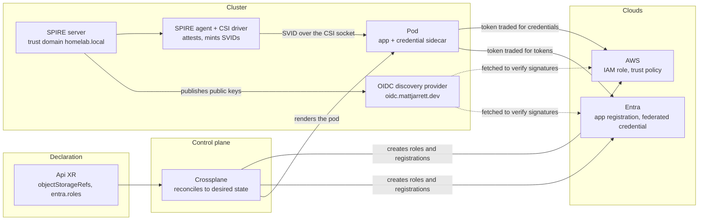
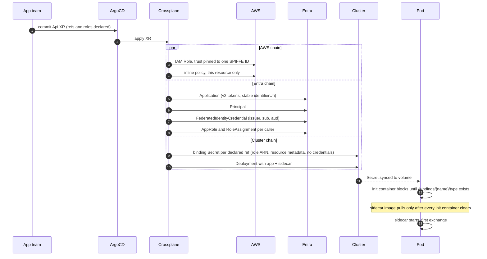
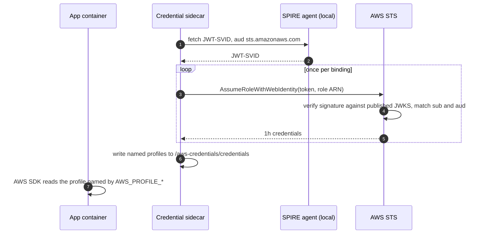
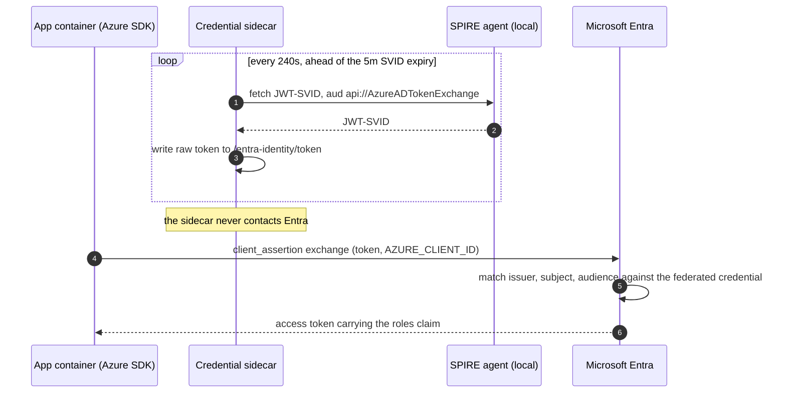

# Platform Workload Identity

A pod proves who it is with a token it did not choose and cannot forge, and trades that token for real credentials in AWS and Entra. Nothing long-lived is stored anywhere. SPIRE issues the identity, the cluster publishes the keys that verify it, each cloud is configured to trust exactly one subject per role, and Crossplane builds all of it from a single declaration in an app's manifest.

[Fortune 100 Internal Developer Platform patterns, learned on a homelab. Nothing novel.](./nothing-novel.md)

## The shape of it

Five systems, each with one job. None of them shares a secret with any other.



**SPIRE** is the identity provider. Its controller manager watches pods and issues an identity to any pod carrying `app: api`, the label the composition sets. The SPIFFE ID is `spiffe://homelab.local/ns/{namespace}/sa/{service-account}`, templated in [cluster/argocd/spire.yaml](../cluster/argocd/spire.yaml). That URI is the identity, and every downstream trust decision is a literal string match on it.

**The agent** does the attestation. It verifies with the node's own kubelet that the pod requesting a token is genuinely running with the namespace and service account it claims, before signing anything. This is why a stolen manifest is not an identity.

**The [OIDC discovery provider](./spire-oidc-federation.md)** publishes SPIRE's JWT signing keys at `oidc.mattjarrett.dev`. It accepts no input and issues nothing. Both clouds fetch from it to check a signature themselves, which is why no secret is shared with either.

**[`workload-identity-sidecar`](https://github.com/cujarrett/workload-identity-sidecar)** turns identity into credentials. It fetches SVIDs over the CSI-mounted Workload API socket and writes credential files the app reads. The app never sees a token.

**Crossplane** builds everything above that is not a running process, and keeps it built. Core runs with `--enable-realtime-compositions` so a composed resource going Ready propagates on a watch rather than the 60s poll.

---

## Who verifies what

A call from a pod to an AWS API passes four checks, run by four parties who do not consult each other. Any one of them refusing ends the call.

| Check | Who runs it | What it catches |
|---|---|---|
| Workload attestation | SPIRE agent, against the local kubelet | A process claiming a namespace and service account it is not running under |
| Signature | AWS or Entra, against the published JWKS | A token not minted by this cluster's SPIRE |
| `sub` claim - *who sent it* | AWS or Entra, literal match, no wildcards | The right cluster, the wrong pod. A renamed service account is a different identity and loses access rather than silently keeping it |
| `aud` claim - *what it's for* | AWS or Entra, literal match | A token minted for one exchange being replayed at another |

`sub` and `aud` both do exact-string matching, but on different questions. `sub` is the sender's identity - wrong `sub` means the wrong pod entirely. `aud` is which exchange this particular token was minted for - a JWT-SVID for AWS carries `sts.amazonaws.com`, one for Entra carries `api://AzureADTokenExchange`. Same pod holds both, same `sub` on both, but each is only valid at the cloud it names. Without the `aud` check, a token good at AWS could be replayed at Entra.

---

## Provisioning

One commit produces a role in AWS, a registration in Entra, a Secret in the cluster and a pod that waits for it. Nothing here waits on a value a cloud has to hand back first, so the AWS and Entra chains run in parallel.



**The role ARN is predicted, not read back.** It is derived from the naming convention, `arn:aws:iam::{account}:role/crossplane/crossplane-{ns}-{xr-name}-{suffix}`, falling back to `xp-{sha256sum[:61]}` past AWS's 64 character limit. Predicting it is what lets the Secret and the trust policy be written in the same pass rather than in two.

**The Entra GUIDs are derived too.** Entra identifies an app role by GUID and expects the same GUID every reconcile, so the composition hashes `{namespace}/{app}/{role}` into one. `uuidv4` would mint a new value on every render and thrash the role. Rename the role and the GUID changes with it, which is correct, because a renamed permission is a different permission.

**Every declared ref gets its own binding Secret**, shaped for the resource type it points at - an `objectStorageRefs` entry gets an S3-flavored one, a `nosqlRef` gets a DynamoDB-flavored one, and so on. An Api with three refs gets three of these. None of them holds credentials, only the role ARN and the metadata the app needs to find the resource - useless to anyone without a valid SVID to back it. The S3 shape:

```
type:      s3
role-arn:  arn:aws:iam::…:role/crossplane/…
bucket:    platform-{namespace}-{name}
region:    us-east-1
```

> **Read `Init:0/4` as progress, not as an error**
> The init container polls for the last key written to the binding volume, and regular container images are pulled only after every init container completes. During first provisioning a pod sits at `Init:0/4` for 60 to 90 seconds waiting on Crossplane and the clouds. A `Pending` pod would read as broken; this reads as working.

**Expect the Entra grant to sit red for around 30 seconds.** The role has to replicate from the app registration to its service principal, and the grant is checked against the service principal. It self heals, and no intervention makes it faster.

---

## Runtime: AWS

The sidecar fetches one JWT-SVID and presents it to STS once per binding, naming a different role each time. Every 50 minutes it does it again, ahead of the one hour credential expiry.



**One SVID becomes many roles.** The one role per pod limit belongs to the AWS SDK's default credential chain, not to the protocol. Any holder of a valid token may present it to several roles in turn, provided each trust policy accepts that subject. This is the single reason the platform owns a sidecar instead of using stock IRSA, and it is what lets an Api bind object storage, a table and a database at once with each reachable only by the code that asked for it.

**Failure is quiet on purpose.** If a binding's files are not readable yet, or an exchange fails on a throttle or a network blip, the sidecar leaves the previous credentials file untouched, since it is still valid for up to an hour, and retries in 30 seconds rather than crashing.

---

## Runtime: Entra

Entra needs no exchange in the sidecar at all. The sidecar's whole job is keeping one file holding a fresh unexchanged SVID, and the app's own Azure SDK does the swap on demand via `WorkloadIdentityCredential` - the credential type Azure's client SDKs ship for exactly this pattern (env vars naming a client ID and a token file, which it reads and exchanges itself). Azure Kubernetes Service sets up that same contract natively for its own workload identity feature, and this platform mimics it closely enough that an app just calls the stock SDK credential with no platform-specific code.



**Two clocks, not one.** The SVID refreshes every few minutes; the Entra access token it buys lasts about an hour. Cache the access token and refresh it early. Re-running the exchange per request works and is the wrong thing to copy anywhere real.

**The platform stops at the token.** It creates the registration, the principal, the federated credential, the role and the grant, and injects `AZURE_CLIENT_ID`, `AZURE_TENANT_ID`, `AZURE_FEDERATED_TOKEN_FILE` and one `ENTRA_SCOPE_<APP>` per declared callee. It does not check the token. The `roles` claim is read by app code, because only the app knows which of its own routes needs which role. This runs after the mesh, not instead of it - see [Platform Connections](./platform-connections.md) for where Entra's gate sits relative to the mesh's.

## What the app writes

The declaration, in the app's own [Api XR](../platform/api/README.md):

```yaml
spec:
  parameters:
    objectStorageRefs:
      - name: foo-assets
    entra:
      enabled: true
      roles:
        - name: Data.Read
          allowedCallers:
            - namespace: bar
              app: bar-api
```

The AWS consumption, using the profile whose env var name is derived from the ref name:

```go
cfg, _ := config.LoadDefaultConfig(ctx,
    config.WithSharedConfigProfile(os.Getenv("AWS_PROFILE_FOO_ASSETS")))
s3Client := s3.NewFromConfig(cfg)
```

The Entra consumption needs no platform-specific code at all, because the three injected env vars are the ones the Azure SDK already looks for:

```go
cred, _ := azidentity.NewWorkloadIdentityCredential(nil)
```

**Static frontends get none of this.** The question is only whether anything server side makes an authenticated call on its own behalf. A client rendered SPA does not, so SPIRE does not match it. Server rendered pages do, on every request. Incrementally regenerated ones (Next.js ISR and similar) still do too - a cache serves most requests, but something server side wakes up periodically to regenerate the page behind that cache, and that regeneration is a real backend call needing real credentials just the same.

---

## Operational notes

| Concern | What bites |
|---|---|
| Federated credentials | Entra caps 20 per app registration. Fine at one per workload identity; per-environment variants exhaust it fast |
| Key rotation | SPIRE publishes both old and new JWT signing keys during overlap. The failure mode is a cloud caching the JWKS past that window, so the CA TTL needs to stay comfortably longer than any consumer's cache |
| Control plane credentials | Crossplane's own Entra app registration holds a client secret with `Application.ReadWrite.OwnedBy`, hand created and hand rotated. It is the one static credential in the whole system |
| Ownership on created objects | An Entra app created through any API, CLI or Crossplane is never auto-owned. Without an explicit `owners` entry the controller can create objects it can never update or delete, which surfaces later as undeletable drift |
| Token version | Entra mints v1 tokens by default, issued by `sts.windows.net`. An API validating the v2 issuer rejects every one of them and the token looks fine otherwise. Set `requestedAccessTokenVersion: 2` at creation |

---

## Choices

> **One role per binding, not a shared role**
> A shared role means any workload reaching it reaches everything. Per binding roles mean the object storage role cannot touch DynamoDB, and a compromised pod's blast radius is one resource.

> **Api creates the role, not ObjectStorage or NoSql**
> The trust policy needs the Api's service account name and namespace. ObjectStorage and NoSql don't know who will consume them, since any Api can reference them.
>
> **Exception: Sql creates its own IAM roles.** Its binding Secret needs RDS connection details only known after provisioning completes, and Api has no way to read another XR's status. Consuming Apis declare themselves in `consumerServiceAccounts`, and each gets its own role scoped to that service account's exact SPIFFE ID.

---

## One-way doors

| Decision | Why it is sticky |
|---|---|
| SPIRE trust domain `homelab.local` | Carried in every SVID and every cloud side trust policy. Changing it means rewriting every policy in one window |
| The issuer URL `https://oidc.mattjarrett.dev` | Carried in the `iss` claim and registered in both clouds. Changing it requires re-registering the provider and updating every trust policy and federated credential simultaneously |
| Publishing signing keys on the public internet | Once a cloud trusts this issuer, credential refresh depends on that endpoint being reachable |
| One sidecar per Api, many bindings per sidecar | A sidecar shared across Apis would have to merge IAM permissions across workloads, which ends least privilege |
| Derived Entra role GUIDs | The GUID is a hash of namespace, app and role name. Changing the derivation renames every role in the tenant at once |

---

## Where the detail lives

| Doc | What it adds |
|---|---|
| [SPIRE OIDC Federation](./spire-oidc-federation.md) | The discovery endpoint, the Cloudflare `/.well-known` rewrite, and registering a cloud |
| [Platform Connections](./platform-connections.md) | The mesh gates a call passes before any token is read |
| [Entra](./learning/entra.md) | What the claims mean, and what the error codes are actually telling you |
| [AzureAD Permissions](../cluster/crossplane/azuread-permissions.md) | Bootstrapping Crossplane's own Entra registration |
