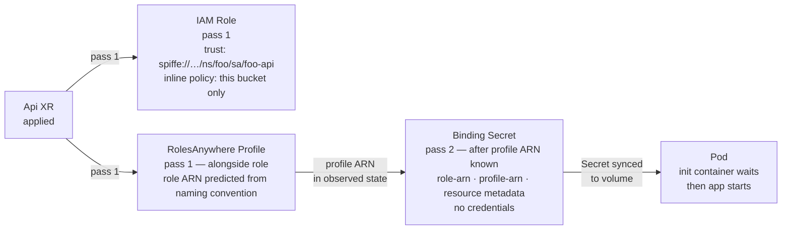
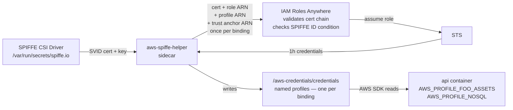

# Platform Workload Identity

[Fortune 100 Internal Developer Platform patterns, learned on a homelab. Nothing novel.](./nothing-novel.md)

Every pod that needs AWS access gets its own short-lived identity — no static keys, no shared credentials, no Secrets containing anything sensitive. This is done by combining SPIRE (a certificate authority that knows which pod is which), IAM Roles Anywhere (AWS's bridge from certificates to IAM), and [`aws-spiffe-helper`](https://github.com/cujarrett/aws-spiffe-helper) (a sidecar that exchanges the certificate for STS credentials and keeps them fresh). Crossplane compositions wire it all together so application teams declare what they need and get a credentials file — nothing else to configure.

## The problem

IAM Roles for Service Accounts (IRSA) breaks down when you need multiple scoped IAM roles per pod and no public JWKS endpoint. The alternative is static keys in a Secret: they never expire and share blast radius across all workloads.

The goal: every pod gets its own short-lived AWS identity, scoped to exactly the resources it needs, with no credential stored in git or a Secret.

---

## The pieces

Three systems work together.

**[SPIRE](https://spiffe.io/docs/latest/spire-about/spire-concepts/)** is the certificate authority. It's configured to issue certificates only to Api and Spa pods (identified by `app: api` or `app: spa` labels set by their compositions — see [`cluster/argocd/spire.yaml`](../cluster/argocd/spire.yaml) `identities.clusterSPIFFEIDs.homelab-workloads`). For these registered pods, SPIRE checks with the kubelet to verify they're actually running, then issues a short-lived X.509 certificate whose URI SAN is the pod's SPIFFE ID — `spiffe://homelab.local/ns/{namespace}/sa/{service-account}`. That URI is the identity.

**[IAM Roles Anywhere](https://aws.amazon.com/iam/roles-anywhere/)** is AWS's bridge between certificate-based identity and IAM. You register a trust anchor (the SPIRE CA cert). AWS validates the cert chain and reads the URI SAN as a principal tag. IAM trust policies can then condition on that tag — locking a role to one exact pod identity.

**[`aws-spiffe-helper`](https://github.com/cujarrett/aws-spiffe-helper)** (the custom sidecar) is the glue between SPIRE and Roles Anywhere. It fetches the pod's single SVID from the SPIRE agent via the Workload API socket, then exchanges that one SVID for multiple AWS roles by calling [`aws_signing_helper`](https://docs.aws.amazon.com/rolesanywhere/latest/userguide/credential-helper.html) (an AWS-provided binary) once per binding: each call uses a different role ARN and profile ARN. It writes the resulting STS credentials as named profiles in a shared credentials file. Every 50 minutes it repeats the cycle. The workload app reads credentials from that file; it never touches a certificate or calls AWS for credentials itself.

---

## Why Roles Anywhere instead of OIDC or IRSA

IRSA can't express multiple scoped roles per pod and requires a public JWKS endpoint. Roles Anywhere sidesteps both constraints: it's certificate-based (no public endpoint needed), and one SVID can be exchanged for multiple roles (one per binding).

**What you give up.**

- **SPIRE is another system to operate.** Server deployment, per-node agent DaemonSet, trust bundle rotation, registration entry management. If SPIRE is unhealthy, pods can't renew SVIDs, and credential refresh silently fails until the sidecar's retry budget is exhausted.
- **`aws_signing_helper` is not an AWS SDK primitive.** It's a standalone binary AWS ships separately. If AWS changes the signing protocol or stops maintaining the binary, every pod breaks. The AWS SDKs have no native Roles Anywhere support — the sidecar is load-bearing scaffolding, not a first-class feature.
- **More moving parts on the pod.** IRSA on ROSA / EKS requires zero sidecars and zero init containers. This setup requires a credential sidecar, an init container, a SPIFFE CSI volume, and a shared in-memory credentials volume. More things that can be misconfigured.
- **The provider bug.** The nil UUID workaround works, but it's brittle — it depends on specific provider behavior that could change between `provider-aws-rolesanywhere` releases.

This platform needs multiple scoped IAM roles per pod. IRSA can't do that. So the choice is Roles Anywhere or stick with static keys in Secrets. Roles Anywhere wins: short-lived credentials, least-privilege per binding, no secrets in git.

---

## Provisioning

Crossplane runs a two-pass chain per binding. No imperative scripting; Crossplane reads what exists in AWS, fills in the gaps, and repeats until done.



**Pass 1: IAM Role + RolesAnywhere Profile.** Crossplane creates both in the same reconcile pass. The IAM role ARN is computed deterministically from the naming convention (`arn:aws:iam::{account}:role/crossplane/crossplane-{ns}-{xr-name}-{suffix}`). Names exceeding AWS's 64-character limit use a sha256 hash fallback: `xp-{sha256sum[:61]}` — this applies to most guest workspace slugs. No need to wait for AWS to confirm the ARN. This predicted ARN is used immediately in the Profile's `roleArns` field, so role and profile are created together. The profile tells AWS: "When you see an SVID signed by this CA with this SPIFFE ID, exchange it for this role's credentials (valid 1 hour)." The profile ARN is written to AWS and read back.

**Pass 2: Binding Secret.** Once the profile ARN is visible in observed state, Crossplane writes a Kubernetes Secret containing the role ARN, profile ARN, and resource metadata (bucket name, table name, etc). The pod's init container waits for this Secret to sync to its volume, then the app starts.

**Per-binding chain.** This two-pass sequence repeats for every binding. An Api with three object storage refs, two nosql refs, and one cache binding gets six separate chains running in parallel — one for each resource. If one binding stalls (e.g., AWS API throttle), the others keep going.

### IAM Role

The trust policy condition is:

```json
"aws:PrincipalTag/x509SAN/URI": "spiffe://homelab.local/ns/{ns}/sa/{name}"
```

Only a certificate with that exact URI SAN — signed by the cluster's SPIRE CA — can assume this role. Wrong namespace, wrong service account, different cluster: rejected.

> **Choice: one role per binding, not a shared role**
> A shared role means any workload can reach any resource. Per-binding roles mean the object-storage role cannot touch DynamoDB. A compromised pod's blast radius is one resource.

> **Choice: Api creates the role, not ObjectStorage or NoSql**
> The trust policy needs the Api's service account name and namespace. ObjectStorage and NoSql don't know who will consume them — any Api can reference them. Api creates the role, locks it to itself, writes the ARN into the binding Secret.
>
> **Exception: Sql creates its own IAM roles.** Unlike ObjectStorage and NoSql, the Sql binding Secret must include RDS connection details (host, port, username) that are only known after RDS provisioning completes. Api has no way to read another XR's status, so Sql manages its own IAM. Consuming Apis declare themselves in `consumerServiceAccounts` — each gets its own IAM role and binding Secret scoped to its SA's exact SPIFFE ID.

### RolesAnywhere Profile

A RolesAnywhere Profile is AWS's configuration object that links an IAM role to a trust anchor (your SPIRE CA) and sets the credential session duration. It's the bridge that tells AWS "when you see a certificate signed by this CA with this SPIFFE ID, you can exchange it for this role's credentials, valid for 1 hour." Each binding gets its own profile. The profile is created in the same reconcile pass as the IAM role — the role ARN is computed deterministically from the naming convention rather than read from observed state, so both resources are created together.

> **Choice: one profile per binding, not a shared platform profile**
> A shared profile's `roleArns` list is an exact-match allowlist with no wildcards. Every new binding would need to add its role ARN to the shared profile — a coordination point that doesn't compose. Per-binding profiles let each Api manage its own identity independently.

<details>
<summary>Crossplane Provider Workaround: The nil UUID Pattern</summary>
The Crossplane provider for Roles Anywhere has a quirk. When reading a profile that doesn't exist yet, it treats the HTTP 400 ("not a UUID") as terminal instead of recoverable. This workaround handles it:

- **Wildcard in `roleArns`** — `arn:aws:iam::…:role/crossplane/*` looks reasonable. AWS stores it literally. At session-create time it does exact string matching, so the literal `crossplane/*` never matches `crossplane/crossplane-phase6-test-...`. Silently fails.
- **`managementPolicies: ["Create", "Delete"]`** — skipping Observe would sidestep the 400 entirely, but the provider rejects non-default management policies with an "not supported" error. The feature simply isn't implemented. Upgrading didn't change it.
- **Setting `crossplane.io/external-name` to a human-readable string** — makes things worse. Now Observe permanently fails with 400 because the external-name becomes the UUID lookup, and it will never be valid.

The solution: set `crossplane.io/external-name` to `"00000000-0000-0000-0000-000000000000"` on first render. It's a valid UUID that doesn't exist in AWS, so AWS returns 404 → Crossplane creates the profile → AWS assigns a real UUID → the provider writes that UUID back. On reconciles after that, the template reads the UUID from observed state, so the function never overwrites it. Not elegant, but it works.
</details>

### Binding Secret

Once both ARNs exist, the Secret is written:

```
type:         s3
role-arn:     arn:aws:iam::…:role/crossplane/…
profile-arn:  arn:aws:rolesanywhere::…:profile/…
bucket:       platform-{namespace}-{name}
region:       us-east-1
```

> **Choice: ARNs in the Secret, not credentials**
> An ARN without a valid SVID is useless. If this Secret is accidentally logged or read by another pod, nothing is compromised. The SVID is what proves identity; AWS issues credentials at runtime in exchange for it.

> **Note: `trust-anchor-arn` is not in the Secret**
> The trust anchor ARN embeds the AWS account ID and identifies the SPIRE CA cert registered in AWS. It's injected into the sidecar at runtime from a Crossplane EnvironmentConfig (configured at the platform level in the `aws-platform-config` EnvironmentConfig, loaded by the Api composition). It never appears in git or in a binding Secret visible to tenants—only the platform operator knows it.

> **Note: `platform-` bucket prefix**
> IAM cannot read S3 bucket tags at auth time — conditions must use ARNs. The `platform-{namespace}-{name}` naming convention lets inline policies scope to the exact bucket ARN without wildcards.

### Pod startup

The init container blocks on `[ -f /bindings/{name}/type ]` with a 5s retry. The `type` file is the last key written, so its presence confirms the full Secret is synced to the volume mount.

> **Smell: file polling**
> It is polling. But it's a local `stat()` on a kubelet-synced volume — not a remote API call. The practical upside: `Init:0/4 → Init:1/4` gives a clear provisioning progress signal rather than a `Pending` pod that looks like an error. The alternative (projected secret volume with `optional: false`) blocks the same way but shows worse in the Launchpad UI.

**Why the sidecar image pull is last.** Kubernetes pulls regular container images only after all init containers complete. The `aws-credentials-sidecar` is a regular container, so during initial provisioning the delay is compounded: Crossplane provisions all bindings → secrets sync to volumes → init containers clear one by one → then the sidecar image is pulled and the SVID exchange happens. A pod showing `Init:0/4` for 60–90 seconds is normal; it's waiting on Crossplane, not stuck.

---

## Runtime

Every 50 minutes, the sidecar fetches a fresh SVID from SPIRE, exchanges it for STS credentials (once per binding), and writes them as named profiles. The app reads `AWS_PROFILE_*` env vars and uses the standard AWS SDK — no special code.

> **Choice: SPIFFE CSI Driver**
>
> <details>
> <summary>Why CSI for SVID delivery, not direct socket mounting</summary>
>
> The SPIFFE CSI Driver is a DaemonSet that mounts the SPIRE agent's workload endpoint socket into each pod at `/var/run/secrets/spiffe.io`. The sidecar fetches SVIDs from that socket. Alternatives: direct socket mounting on the node (requires kubelet trust and volume source changes per node), or a pull-based model where the sidecar calls a service (adds latency, another API to secure, another failure mode). CSI is the SPIFFE standard — it's what everyone else does.
>
> </details>



The app doesn't know SPIRE exists. The composition injects `AWS_PROFILE_*` env vars and `AWS_SHARED_CREDENTIALS_FILE`. The sidecar keeps credentials fresh; the app just reads env vars and uses the AWS SDK as normal — no special code, no token exchange, no awareness of certificates or SPIRE.

Go example (for an object storage ref named `foo-assets` — the env var name is derived from the ref name):

```go
s3Cfg, _ := config.LoadDefaultConfig(ctx,
    config.WithSharedConfigProfile(os.Getenv("AWS_PROFILE_FOO_ASSETS")))
s3Client := s3.NewFromConfig(s3Cfg)

ddbCfg, _ := config.LoadDefaultConfig(ctx,
    config.WithSharedConfigProfile(os.Getenv("AWS_PROFILE_NOSQL")))
ddbClient := dynamodb.NewFromConfig(ddbCfg)
```

JS example:

```js
const s3 = new S3Client({
  credentials: fromIni({ profile: process.env.AWS_PROFILE_FOO_ASSETS }),
});
```

---

## One-way doors

These decisions are sticky: the SPIRE trust domain bakes itself into every SVID and IAM policy, and the per-binding sidecar model is load-bearing for multi-binding composition.

| Decision | Why it's sticky |
|---|---|
| SPIRE trust domain (`homelab.local`) | Baked into every SVID and every IAM trust policy condition. Changing it requires re-registering the trust anchor in AWS and updating every role trust policy. |
| One credential sidecar per Api, multiple bindings per sidecar | The sidecar manages all AWS resource bindings for a single Api (object storage, nosql, cache, sql). Each binding gets its own IAM role scoped to this Api's SPIFFE ID. A cross-Api shared sidecar would require merging IAM permissions across workloads, breaking least-privilege. |

---
