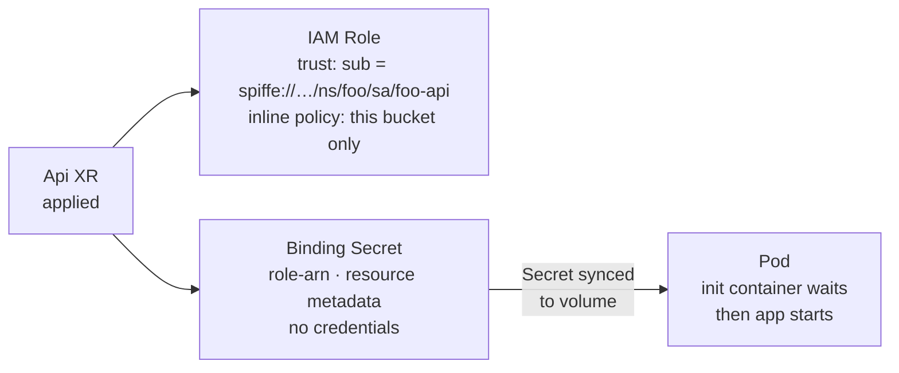
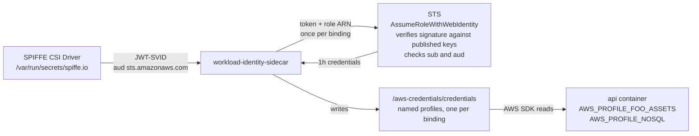

# Platform Workload Identity

Every pod that needs AWS access gets its own short-lived identity. No static keys, no shared credentials, no Secret containing anything sensitive. SPIRE proves which pod is which, AWS verifies that proof against keys the cluster publishes, and a sidecar keeps the resulting credentials fresh. Crossplane compositions wire it together, so an application team declares what it needs and gets a credentials file.

[Fortune 100 Internal Developer Platform patterns, learned on a homelab. Nothing novel.](./nothing-novel.md)

Start with [the problem](#the-problem) for why this exists, or [runtime](#runtime) for what an app actually sees.

| Chapter | What's in it |
|---|---|
| [The problem](#the-problem) | Why static keys and plain IRSA both fall short here |
| [The pieces](#the-pieces) | SPIRE, the public OIDC endpoint, and the credential sidecar |
| [Static frontends](#static-frontends) | Why Spa doesn't get one, and when a frontend would |
| [How a pod proves who it is](#how-a-pod-proves-who-it-is) | SPIFFE IDs, attestation, and the trust policy that pins a role to one pod |
| [Provisioning](#provisioning) | The Crossplane chain from XR to binding Secret |
| [Runtime](#runtime) | The credential loop, and the code an app writes |
| [One-way doors](#one-way-doors) | Decisions that are expensive to reverse |

---

## The problem

Static keys in a Secret never expire and share blast radius across every workload that can read them. One leaked key is every resource.

IAM Roles for Service Accounts is the standard alternative, but its convention is one role per pod, driven by a single `AWS_ROLE_ARN` the SDK reads automatically. This platform needs several scoped roles on the same pod, because an Api can bind object storage, a NoSQL table and a database at once, and each of those should be reachable only by the code that asked for it.

The goal: every pod gets its own short-lived AWS identity, scoped to exactly the resources it declared, with no credential in git or in a Secret.

---

## The pieces

Three systems work together.

**[SPIRE](https://spiffe.io/docs/latest/spire-about/spire-concepts/)** is the identity provider. It issues identities to Api pods, matched on the `app: api` label the composition sets, configured in [cluster/argocd/spire.yaml](../cluster/argocd/spire.yaml) under `identities.clusterSPIFFEIDs.homelab-workloads`. Before issuing anything it checks with the kubelet that the pod is genuinely running. What it issues carries the pod's SPIFFE ID, `spiffe://homelab.local/ns/{namespace}/sa/{service-account}`. That URI is the identity.

Spa pods aren't matched at all — see [Static frontends](#static-frontends) for why.

**The [OIDC discovery endpoint](./spire-oidc-federation.md)** is how AWS verifies that identity. SPIRE publishes its JWT signing keys at `oidc.mattjarrett.dev`, registered in AWS as an IAM OIDC identity provider. AWS fetches the keys, validates the token's signature itself, and reads the SPIFFE ID from the `sub` claim. Nothing is shared between the cluster and AWS except public keys.

**[`workload-identity-sidecar`](https://github.com/cujarrett/workload-identity-sidecar)** is the credential sidecar. It fetches one JWT-SVID from the SPIRE agent over the Workload API socket, then calls `sts:AssumeRoleWithWebIdentity` once per binding, each call naming a different role. It writes the resulting credentials as named profiles in a shared file and repeats the cycle every 50 minutes. The app reads that file and never touches a token.

> **Why one SVID becomes many roles**
> The one-role-per-pod limit belongs to the AWS SDK's default credential chain, not to the protocol. Any caller holding a valid token can present it to several roles in turn, provided each role's trust policy accepts that subject. Owning the sidecar is what makes this available.

---

## Static frontends

Deciding if a frontend needs workload identity is simple: does anything server-side make an authenticated call on its own behalf.

| Pattern | Server-side process at runtime? | Needs workload identity? |
|---|---|---|
| CSR — this platform's `Spa` | No, static files only | No |
| SSR — e.g. Next.js `getServerSideProps`, Nuxt SSR | Yes, every request | Yes |
| ISR — e.g. Next.js incremental regeneration | Yes, on a timer or a stale request | Yes — caching in front of it doesn't remove the need behind it |

---

## How a pod proves who it is

The trust policy on each IAM role conditions on two claims from the token:

```json
"Condition": {
  "StringEquals": {
    "oidc.mattjarrett.dev:aud": "sts.amazonaws.com",
    "oidc.mattjarrett.dev:sub": "spiffe://homelab.local/ns/{ns}/sa/{name}"
  }
}
```

Only a token signed by this cluster's SPIRE, carrying that exact subject, can assume the role. Wrong namespace, wrong service account, different cluster: rejected. Matching is literal, with no wildcards, so a renamed service account is a different identity and loses access rather than silently keeping it.

> **Choice: one role per binding, not a shared role**
> A shared role means any workload can reach any resource. Per-binding roles mean the object-storage role cannot touch DynamoDB. A compromised pod's blast radius is one resource.

> **Choice: Api creates the role, not ObjectStorage or NoSql**
> The trust policy needs the Api's service account name and namespace. ObjectStorage and NoSql don't know who will consume them, since any Api can reference them. Api creates the role, locks it to itself, and writes the ARN into the binding Secret.
>
> **Exception: Sql creates its own IAM roles.** The Sql binding Secret must include RDS connection details (host, port, username) that are only known after RDS provisioning completes, and Api has no way to read another XR's status. So Sql manages its own IAM. Consuming Apis declare themselves in `consumerServiceAccounts`, and each gets its own role and binding Secret scoped to that service account's exact SPIFFE ID.

---

## Provisioning

Crossplane creates the IAM role and the binding Secret for each binding. Nothing waits on a value AWS has to hand back first, so this is a single pass.



**IAM Role.** The role ARN is computed deterministically from the naming convention, `arn:aws:iam::{account}:role/crossplane/crossplane-{ns}-{xr-name}-{suffix}`. Names over AWS's 64-character limit fall back to a sha256 hash, `xp-{sha256sum[:61]}`, which applies to most guest workspace slugs. The inline policy scopes the role to the single resource this binding created.

**Binding Secret.** Crossplane writes a Kubernetes Secret holding the role ARN and the resource metadata the app needs:

```
type:      s3
role-arn:  arn:aws:iam::…:role/crossplane/…
bucket:    platform-{namespace}-{name}
region:    us-east-1
```

> **Choice: ARNs in the Secret, not credentials**
> A role ARN without a valid SVID is useless. If this Secret is logged or read by another pod, nothing is compromised. The SVID is what proves identity, and AWS issues credentials at runtime in exchange for it.

> **Note: `platform-` bucket prefix**
> IAM cannot read S3 bucket tags at auth time, so conditions must use ARNs. The `platform-{namespace}-{name}` convention lets inline policies scope to the exact bucket ARN without wildcards.

**Per-binding chain.** This repeats for every binding. An Api with three object storage refs, two nosql refs and one cache binding gets six chains running in parallel. If one stalls on an AWS API throttle, the others keep going.

### Pod startup

The init container blocks on `[ -f /bindings/{name}/type ]` with a 5s retry. The `type` file is the last key written, so its presence confirms the whole Secret reached the volume.

> **Smell: file polling**
> It is polling, but it is a local `stat()` on a kubelet-synced volume rather than a remote API call. The upside is a visible progress signal: `Init:0/4 → Init:1/4` reads as provisioning, where a `Pending` pod reads as an error. A projected secret volume with `optional: false` blocks the same way and shows worse in the Launchpad UI.

**Why the sidecar image pull is last.** Kubernetes pulls regular container images only after every init container completes, and the credential sidecar is a regular container. During initial provisioning that compounds: Crossplane provisions all bindings, Secrets sync to volumes, init containers clear one by one, and only then is the sidecar pulled and the exchange made. A pod sitting at `Init:0/4` for 60 to 90 seconds is waiting on Crossplane, not stuck.

---

## Runtime

Every 50 minutes the sidecar fetches a fresh JWT-SVID from SPIRE, exchanges it once per binding, and rewrites the named profiles. The app reads `AWS_PROFILE_*` env vars and uses the standard AWS SDK.



> **Choice: SPIFFE CSI Driver**
>
> <details>
> <summary>Why CSI for SVID delivery, not direct socket mounting</summary>
>
> The SPIFFE CSI Driver is a DaemonSet that mounts the SPIRE agent's workload endpoint socket into each pod at `/var/run/secrets/spiffe.io`. The sidecar fetches SVIDs from that socket. The alternatives are mounting the socket directly from the node, which needs kubelet trust and per-node volume changes, or a pull model where the sidecar calls a service, which adds latency and another API to secure. CSI is the SPIFFE standard.
>
> </details>

The app does not know SPIRE exists. The composition injects `AWS_PROFILE_*` and `AWS_SHARED_CREDENTIALS_FILE`, the sidecar keeps the file fresh, and the app uses the AWS SDK as normal. No token exchange, no awareness of SPIRE.

Go example, for an object storage ref named `foo-assets`. The env var name is derived from the ref name:

```go
s3Cfg, _ := config.LoadDefaultConfig(ctx,
    config.WithSharedConfigProfile(os.Getenv("AWS_PROFILE_FOO_ASSETS")))
s3Client := s3.NewFromConfig(s3Cfg)

ddbCfg, _ := config.LoadDefaultConfig(ctx,
    config.WithSharedConfigProfile(os.Getenv("AWS_PROFILE_NOSQL")))
ddbClient := dynamodb.NewFromConfig(ddbCfg)
```

JS example:

```js
const s3 = new S3Client({
  credentials: fromIni({ profile: process.env.AWS_PROFILE_FOO_ASSETS }),
});
```

---

## One-way doors

| Decision | Why it's sticky |
|---|---|
| SPIRE trust domain (`homelab.local`) | Baked into every SVID and every IAM trust policy condition. Changing it means updating every role trust policy at once. |
| The issuer URL `https://oidc.mattjarrett.dev` | Carried in the `iss` claim of every token and registered in AWS as the identity provider. Changing it requires re-registering the provider and updating every trust policy in the same window. |
| One credential sidecar per Api, multiple bindings per sidecar | The sidecar manages every AWS binding for a single Api, and each binding gets its own role scoped to that Api's SPIFFE ID. A sidecar shared across Apis would have to merge IAM permissions across workloads, breaking least-privilege. |

---
