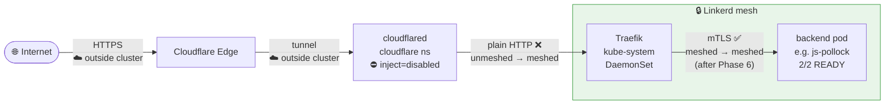

# Service Mesh

A service mesh inserts a proxy sidecar into every pod. Your app doesn't change. The proxy
intercepts all traffic, enforces mTLS between every pod pair, and emits golden metrics
(success rate, RPS, p99 latency) per route — without instrumentation code.

```
Without mesh:  Pod A ──────── TCP ────────► Pod B
With mesh:     Pod A → [proxy] ── mTLS ── [proxy] → Pod B
                             ↑                  ↑
                          metrics            metrics
```

---

## Tool Selection

| | Linkerd | Istio | Cilium |
|---|---|---|---|
| **Data plane** | Rust (`linkerd2-proxy`) | Envoy | eBPF (kernel) |
| **Memory per pod** | ~10–20 MB | ~50–100 MB | near zero |
| **ARM64** | Native | Yes | Yes |
| **mTLS** | Automatic, zero-config | Needs PeerAuthentication CRDs | Yes |
| **Reversible** | Yes | Yes, but messy | **No** — CNI swap = cluster rebuild |

**Use Linkerd.** 100 MB of Envoy per pod across 20+ Pi pods is a real problem. Cilium requires replacing the CNI — a full cluster rebuild. Linkerd's Rust proxy is small, ARM64-native, and cleanly uninstallable.

---

## Roadmap

---

### Phase 1 — Understand the Model ✅

**Mental model:**
- *Control plane* (`linkerd` namespace) — issues certs, pushes config to proxies
- *Data plane* — `linkerd-proxy` sidecar injected into every pod via iptables (`linkerd-init`)
- Injection is opt-in per namespace: `linkerd.io/inject: enabled`. No annotation = not in mesh.
- mTLS is automatic once both pods are meshed. No config needed.

**Your traffic path:**
```
Internet → Cloudflare Edge → cloudflared (cloudflare ns) → Traefik (kube-system) → backend pod
```



Before Phase 6, Traefik is unmeshed so the D→E leg is plain HTTP. After Phase 6 (Traefik meshed), it's mTLS. The cloudflared→Traefik leg stays plain HTTP — `cloudflare` namespace is explicitly excluded (tunnel-encrypted, not raw internet traffic).

| Hostname | Namespace |
|---|---|
| `mattjarrett.com` | `mattjarrett-com` |
| `mattjarrett.dev` | `mattjarrett-dev` |
| `blog.mattjarrett.dev` | `blog` |
| `myvinyl.mattjarrett.dev` | `my-vinyl` |
| `jspollock.mattjarrett.dev` | `js-pollock` |
| `launchpad.mattjarrett.dev` | `launchpad` |

---

### Phase 2 — Install Linkerd ✅

**CLI:** `brew install linkerd` (edge channel — Homebrew's formula tracks edge, not stable. Chart version format is `2025.10.7`, not `25.10.7`.)

**GitOps — four files, commit and push, ArgoCD converges automatically:**

| File | What it does |
|---|---|
| `cluster/argocd/trust-manager.yaml` | Installs trust-manager (Jetstack Helm chart) |
| `cluster/cert-manager/issuers.yaml` | self-signed Issuer + 10-year trust anchor Certificate |
| `cluster/linkerd/certificates.yaml` | Namespace label, ClusterIssuer, 48h identity issuer, trust Bundle |
| `cluster/argocd/linkerd.yaml` | Linkerd CRDs + control plane Helm (edge `2025.10.7`), wired to cert-manager |

**Why cert-manager:** default `linkerd install` generates a CA expiring in 365 days requiring manual rotation. cert-manager rotates the identity issuer automatically (~48h). Trust anchor is 10 years, private key stays in `cert-manager` namespace.

**Bootstrap (one-time, after first ArgoCD sync):**

```bash
# 1. Copy trust anchor to previous-anchor (needed for dual-source rotation bundle)
kubectl get secret -n cert-manager linkerd-trust-anchor -o yaml \
  | sed -e s/linkerd-trust-anchor/linkerd-previous-anchor/ \
  | grep -Ev '^\s*(resourceVersion|uid):' \
  | kubectl apply -f -

# 2. If pods started before the ConfigMap was ready, restart
kubectl rollout restart deployment -n linkerd
kubectl rollout status deployment -n linkerd
```

**Viz extension** (imperative for now):
```bash
linkerd viz install | kubectl apply -f -
linkerd viz check
```

---

### Phase 3 — Mesh One Namespace ✅

`js-pollock` first — just nginx, public-facing, no stateful data.

```bash
kubectl annotate namespace js-pollock linkerd.io/inject=enabled
kubectl rollout restart deployment -n js-pollock

# Confirm 2/2 READY (app + proxy)
kubectl get pods -n js-pollock

# mTLS edges — expect √ for pod-to-pod, × for Traefik→pod (Traefik not yet meshed)
linkerd viz edges deployment -n js-pollock

# Golden metrics — real numbers from Cloudflare tunnel traffic, no synthetic load needed
linkerd viz stat deployment -n js-pollock
```

**Exit criteria:**
- Pods show `2/2 READY`
- `linkerd viz stat` returns real RPS from `jspollock.mattjarrett.dev` traffic
- You understand why the Traefik→js-pollock edge shows `×`

---

### Phase 4 — Observe the Mesh ✅

```bash
# Live request stream — method, path, status, latency
linkerd viz tap deployment/js-pollock -n js-pollock

# Route-level summary
linkerd viz top deployment/js-pollock -n js-pollock

# Mesh a second namespace for comparison
kubectl annotate namespace blog linkerd.io/inject=enabled
kubectl rollout restart deployment -n blog
linkerd viz stat deployments -n blog
```

`tap` `src` field shows Traefik's pod IP (last unmeshed hop), not the original client IP. Expected until Phase 6.

**PodMonitor for existing Grafana:**
```yaml
# cluster/monitoring/linkerd-podmonitor.yaml
apiVersion: monitoring.coreos.com/v1
kind: PodMonitor
metadata:
  name: linkerd-proxy
  namespace: monitoring
  labels:
    release: kube-prometheus-stack
spec:
  # Scrapes the linkerd-proxy sidecar (port 4191) on every meshed pod.
  # linkerd.io/control-plane-ns=linkerd is injected on all meshed pods automatically.
  namespaceSelector:
    any: true
  selector:
    matchLabels:
      linkerd.io/control-plane-ns: linkerd
  podMetricsEndpoints:
    - port: linkerd-admin
      path: /metrics
      interval: 60s
```

> The viz extension has its own internal Prometheus. This PodMonitor gets proxy metrics into your main kube-prometheus-stack Prometheus instead.

**Exit criteria:**
- `linkerd viz tap` shows live traces
- Success rate drops to 0% when you scale a deployment to 0

---

### Phase 5 — Traffic Policy ✅

HTTPRoutes are **baked into the XApi and XSpa compositions** — every platform workload gets a 30s timeout automatically. No per-app YAML needed.

For non-platform workloads (e.g. `blog`, which is a raw Deployment not an XApi), create a file in `cluster/linkerd/`:

```yaml
# cluster/linkerd/httproute-blog.yaml
apiVersion: gateway.networking.k8s.io/v1
kind: HTTPRoute
metadata:
  name: blog
  namespace: blog
spec:
  parentRefs:
    - name: ghost
      kind: Service
      group: ""
      port: 80
  rules:
    - timeouts:
        request: 30s
```

**Exit criteria:** `linkerd viz stat` shows non-zero RPS for a meshed XApi. Confirm the HTTPRoute rendered by checking:
```bash
kubectl get httproute -n my-vinyl
```

---

### Phase 6 — Mesh the Whole Cluster ✅

```bash
# Application namespaces
for ns in mattjarrett-com mattjarrett-dev my-vinyl sump-pump launchpad; do
  kubectl annotate namespace $ns linkerd.io/inject=enabled
  kubectl rollout restart deployment -n $ns 2>/dev/null || true
  kubectl rollout restart statefulset -n $ns 2>/dev/null || true
done

# Traefik — pod annotation only (don't inject all of kube-system)
kubectl -n kube-system patch daemonset traefik \
  --type=json \
  -p='[{"op":"add","path":"/spec/template/metadata/annotations/linkerd.io~1inject","value":"enabled"}]'

# NATS — mark port 4222 opaque (binary protocol, not HTTP)
kubectl annotate namespace nats config.linkerd.io/opaque-ports=4222
kubectl annotate service nats -n nats config.linkerd.io/opaque-ports=4222
kubectl rollout restart statefulset -n nats

# Explicit excludes
kubectl annotate namespace longhorn-system linkerd.io/inject=disabled
kubectl annotate namespace cert-manager linkerd.io/inject=disabled
kubectl annotate namespace cloudflare linkerd.io/inject=disabled
```

**Exit criteria:**
- `linkerd viz stat deployments -A` shows all application namespaces
- `linkerd check` still green
- All public sites still responding

---

### Phase 7 — Platform Integration ✅

**Already done (in compositions):**
- `XApi` composition renders: HTTPRoute (30s timeout)
- `XSpa` composition renders: HTTPRoute (30s timeout)

**Still to do — injection escape hatch in `XApi`:**

`platform/api/composition.yaml` pod template annotations:
```yaml
{{- if and $xr.spec.parameters.mesh (eq $xr.spec.parameters.mesh.enabled false) }}
    linkerd.io/inject: disabled
{{- end }}
```

`platform/api/xrd.yaml`:
```yaml
mesh:
  type: object
  properties:
    enabled:
      type: boolean
      default: true
```

**XApi/XSpa READMEs:** document that namespace-level `linkerd.io/inject: enabled` auto-injects pods, and that timeout/retry policy is automatic — no Linkerd knowledge required.

**Exit criteria:**
- New XApi in meshed namespace: `2/2 READY`, visible in `linkerd viz stat`, HTTPRoute present
- XApi with `mesh.enabled: false`: `1/1 READY`

---

## Platform Impacts

| Component | Impact | Action |
|---|---|---|
| `XApi` Deployments | Auto-injected if namespace annotated | Add `mesh.enabled` escape hatch |
| `XApi` HTTPRoute | 30s timeout rendered by composition | None — automatic |
| `XApi` init containers | Cluster API calls, not pod-to-pod — unaffected | None |
| `XSpa` (nginx) | Auto-injected, works fine | None |
| `XSpa` HTTPRoute | 30s timeout rendered by composition | None — automatic |
| `XWordpress` | MariaDB + WordPress both injected | Test DB connections |
| NATS (`XTopic`/`XSubscription`) | Port 4222 must be opaque | Annotate namespace + service |
| `XCache` (Redis) | Port 6379 may need opaque annotation | Annotate if proxy errors appear |
| Service bindings | Volume mounts, not network — unaffected | None |
| Cloudflare Tunnel | Excluded — tunnel-encrypted, no pod-to-pod traffic | None |
| Prometheus scraping | Proxy metrics scraped automatically | Add Linkerd ServiceMonitor |

---

## One-Way Doors

**Switching CNI:** Full cluster rebuild. Flannel is fine for Linkerd.

**mTLS Strict Mode:** Meshed pods reject unmeshed clients. Hard to roll back under pressure. Stay permissive through Phase 6.

**Trust anchor rotation:** cert-manager handles cert creation; rotation still requires restarting control plane + data plane while both old/new anchors are in the bundle. Mitigated — using cert-manager from the start.

**Removing Linkerd:** Cleanly removable, but HTTPRoutes in git become orphaned CRDs. Keep HTTPRoutes in separate files from XR instances.

---

## Linkerd → Istio Translation

Same concepts, different API. Use this at work.

| Concept | Linkerd | Istio |
|---|---|---|
| Control plane | `linkerd-control-plane` | `istiod` (`istio-system`) |
| Data plane | `linkerd-proxy` (Rust) | Envoy (C++) |
| Enable injection | namespace **annotation**: `linkerd.io/inject: enabled` | namespace **label**: `istio-injection: enabled` |
| Disable on one pod | pod annotation: `linkerd.io/inject: disabled` | `sidecar.istio.io/inject: "false"` |
| Enforce mTLS | `Server` policy | `PeerAuthentication` with `mtls.mode: STRICT` |
| Timeout/retry | `HTTPRoute` (Gateway API) | `VirtualService` |
| Circuit breaking | `ServiceProfile` failure accrual | `DestinationRule` outlier detection |
| Dashboard | `linkerd viz dashboard` | Kiali |
| Live traces | `linkerd viz tap deploy/x` | `istioctl proxy-config log` + access logs |
| Health check | `linkerd check` | `istioctl analyze` — run first when something breaks |
| Mark TCP port | `config.linkerd.io/opaque-ports: "4222"` | `appProtocol: tcp` on Service port |

**Istio-only — PeerAuthentication** (Linkerd does this automatically):
```yaml
apiVersion: security.istio.io/v1
kind: PeerAuthentication
metadata:
  name: default
  namespace: my-app
spec:
  mtls:
    mode: STRICT
```

**Istio-only — DestinationRule** (connection pooling, circuit breaking, traffic splitting):
```yaml
apiVersion: networking.istio.io/v1
kind: DestinationRule
metadata:
  name: my-api
  namespace: my-app
spec:
  host: my-api
  trafficPolicy:
    outlierDetection:
      consecutive5xxErrors: 5
      interval: 10s
      baseEjectionTime: 30s
```
