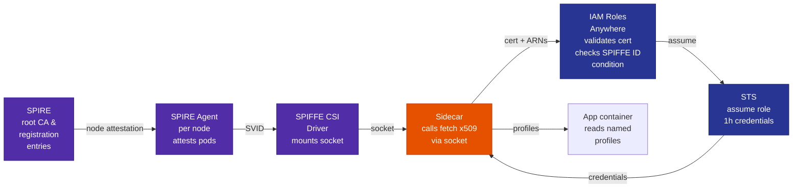

# Workload Identity

Every platform workload gets an AWS identity without static keys.

Each pod receives a short-lived X.509 SVID (SPIFFE certificate) from SPIRE. The sidecar exchanges this certificate for AWS temporary credentials via IAM Roles Anywhere. Credentials refresh every 50 minutes, so they never expire mid-request.

## How it works

### Provisioning phase (on XR apply)

When an XApi is created with AWS bindings, Crossplane:
1. Creates one IAM role per binding (scoped to that pod's SPIFFE ID)
2. Creates a RolesAnywhere profile referencing the role
3. Writes a binding Secret with the role ARN and profile ARN
4. Pod's init container waits for the Secret

### Runtime phase (while pod runs)



Steps:
1. **SPIRE attestation** — SPIRE Server and Agent exchange credentials to prove the agent runs on a real cluster node
2. **SVID issuance** — SPIRE auto-creates a registration entry for pods with specific labels; CSI driver mounts the Workload API socket
3. **Certificate fetch** — Sidecar calls `spire-agent api fetch x509` to get the pod's SVID cert+key
4. **Identity exchange** — Sidecar calls `aws_signing_helper` with SVID, role ARN, profile ARN, and trust anchor ARN
5. **Assume role** — IAM Roles Anywhere validates the SVID chain and checks `aws:PrincipalTag/x509SAN/URI` matches the pod's exact SPIFFE ID
6. **Temporary credentials** — STS returns access key + secret + session token (valid 1 hour)
7. **Write profiles** — Sidecar writes named profile sections to `/aws-credentials/credentials`; app reads via `AWS_PROFILE_<BINDING>` env vars

## Design choices

**IAM Roles Anywhere, not OIDC:**
OIDC requires AWS to reach your cluster's JWKS endpoint. For on-prem clusters, that means a public URL — unnecessary attack surface. IAM Roles Anywhere is certificate-based; the workload presents its cert directly.

**SPIFFE CSI driver, not SPIFFE helper sidecar:**
The CSI driver mounts the Workload API socket. The sidecar calls `spire-agent api fetch x509` against that socket. This is cleaner than a separate sidecar managing cert files.

**Per-workload IAM role, not shared role:**
Each binding gets its own role with a trust policy condition locked to `spiffe://homelab.local/ns/{ns}/sa/{sa}`. Only that exact pod can assume it.

**`platform-` bucket prefix, not bucket tags:**
IAM cannot read S3 bucket tags at auth time — conditions must use ARNs. The `platform-{namespace}-{name}` naming convention scopes policies to exact bucket ARNs without wildcards.

**Binding Secret carries ARNs, not credentials:**
The Secret contains `role-arn`, `profile-arn`, `bucket`, and `region` — no access keys. If accidentally logged, it's useless without a valid SVID. The sidecar handles credential exchange at runtime.

## Challenges encountered: Provider bug workaround

**The constraint:** RolesAnywhere Profile `roleArns` is an exact-match list with no wildcards. Each IAM role must be explicitly listed in the profile.

**The provider bug:** `provider-aws-rolesanywhere` uses `spec.forProvider.name` (the profile's human-readable name) as the profileId when calling `GetProfile`. ProfileIds are actually UUIDs assigned by AWS. When the profile doesn't exist yet, AWS returns HTTP 400 (validation error: "not a UUID") instead of HTTP 404 (not found). Crossplane treats 400 as a terminal error and never calls Create, so the profile never gets created.

**The solution:** Set `crossplane.io/external-name` to a valid UUID format that doesn't exist in AWS (`"00000000-0000-0000-0000-000000000000"`) on the first render. AWS returns HTTP 404 → Crossplane calls Create → AWS assigns a real UUID → the template reads it back and uses the real UUID on subsequent reconciles:

```go
{{- $profileExternalName := "00000000-0000-0000-0000-000000000000" }}
{{- if $profileObs.resource }}
  {{- $observedExternalName := index ($profileObs.resource.metadata.annotations | default dict) "crossplane.io/external-name" | default "" }}
  {{- if $observedExternalName }}{{- $profileExternalName = $observedExternalName }}{{- end }}
{{- end }}
```

This solution is implemented across all XObjectStorage, XNoSql, XSql, and XCache bindings with no provider upgrades or external steps required.

## App code examples

### Single binding

```go
cfg, _ := config.LoadDefaultConfig(ctx)
s3Client := s3.NewFromConfig(cfg)
```

### Multiple bindings

The composition injects `AWS_PROFILE_<BINDING>` env vars. The sidecar writes named profiles to the credentials file (one per binding).

```go
s3Cfg, _ := config.LoadDefaultConfig(ctx,
    config.WithSharedConfigProfile(os.Getenv("AWS_PROFILE_OBJECT_STORAGE")))
s3Client := s3.NewFromConfig(s3Cfg)

ddbCfg, _ := config.LoadDefaultConfig(ctx,
    config.WithSharedConfigProfile(os.Getenv("AWS_PROFILE_NOSQL")))
ddbClient := dynamodb.NewFromConfig(ddbCfg)
```

JavaScript (AWS SDK v3):
```js
const { S3Client } = require("@aws-sdk/client-s3");
const { fromIni } = require("@aws-sdk/credential-providers");

const s3 = new S3Client({
  credentials: fromIni({ profile: process.env.AWS_PROFILE_OBJECT_STORAGE }),
});
```

The sidecar reads binding Secret ARNs, calls `aws_signing_helper` once per binding to exchange the SVID for STS credentials, and writes each result as a named profile. The binding Secret contains no credentials—only ARNs, which are public. The SVID proves pod identity; AWS validates it.

**Purpose:** Build the mental model before touching infrastructure. You can't debug attestation you can't explain.

SPIRE has two components. Read these before touching anything.

**Read:**
1. [SPIFFE spec — what an SVID actually is](https://spiffe.io/docs/latest/spiffe-about/spiffe-concepts/) — 15 minutes
2. [SPIRE architecture](https://spiffe.io/docs/latest/spire-about/spire-concepts/) — control plane vs agent, attestation, workload API
3. [Kubernetes workload attestation](https://github.com/spiffe/spire/blob/main/doc/plugin_agent_workloadattestor_k8s.md) — how SPIRE proves a pod is who it claims

**Mental model to confirm:**

```
SPIRE Server  → root CA, registration entries, issues SVIDs on request
SPIRE Agent   → DaemonSet on every node, talks to kubelet API to verify pod identity,
                 serves Workload API socket at /run/spire/agent.sock
Workload API  → Unix socket the app calls to get its X.509 SVID (cert + private key)
Registration  → entry says "pod with serviceaccount X in namespace Y gets SPIFFE ID Z"
```

A registration entry is the binding between a Kubernetes identity (serviceaccount + namespace)
and a SPIFFE ID. Without one, a pod gets nothing from the Workload API.

**Exit criteria:** You can explain the difference between the SPIRE server, the SPIRE agent,
and the workload API to someone else without notes. Draw the diagram. Then proceed.


<details>
<summary>Answers</summary>

```
┌────────────────────────────────────────────────────────────┐
│                        SPIRE Server                        │
│  - Runs as a Deployment (one replica is fine for homelab)  │
│  - Owns the root CA; signs all SVIDs                       │
│  - Holds all registration entries (spiffeID ↔ selectors)   │
│  - Agents bootstrap against it and attest to it            │
└───────────────────────────┬────────────────────────────────┘
                            │ mTLS (agents attest on join)
          ┌─────────────────┼─────────────────┐
          ▼                 ▼                 ▼
┌──────────────────┐ ┌──────────────────┐ ┌──────────────────┐
│   SPIRE Agent    │ │   SPIRE Agent    │ │   SPIRE Agent    │
│   (work-1)       │ │   (work-2)       │ │   (work-3)       │
│                  │ │                  │ │                  │
│ - DaemonSet pod  │ │ - DaemonSet pod  │ │ - DaemonSet pod  │
│ - Talks to local │ │                  │ │                  │
│   kubelet API to │ │                  │ │                  │
│   verify pod ns/ │ │                  │ │                  │
│   serviceaccount │ │                  │ │                  │
│ - Exposes the    │ │                  │ │                  │
│   Workload API   │ │                  │ │                  │
│   Unix socket    │ │                  │ │                  │
└────────┬─────────┘ └──────────────────┘ └──────────────────┘
         │ /run/spire/agent.sock
         │ (Unix socket, host path)
         ▼
┌──────────────────────────────────────────┐
│              Workload API                │
│                                          │
│  The socket the app (or sidecar) calls.  │
│  Agent checks: does this pod's ns +      │
│  serviceaccount match a registration     │
│  entry? If yes → fetch SVID from server  │
│  and hand it back. If no → nothing.      │
└──────────────────────────────────────────┘
         │ X.509 SVID (cert + private key)
         ▼
┌──────────────────────────────────────────┐
│                  App pod                 │
│  Reads SVID. Hands it to                 │
│  aws_signing_helper → STS creds.         │
└──────────────────────────────────────────┘
```

**The key distinction:**

- **SPIRE Server** — the CA and the policy store. It knows what identities exist and signs their certs. There's one, and workloads never talk to it directly.
- **SPIRE Agent** — the node-local proxy. Runs everywhere a workload runs. It's the one that actually verifies pod identity (by asking the kubelet) and serves the socket. Workloads only ever talk to their local agent.
- **Workload API** — not a separate process. It's the interface the agent exposes. The Unix socket at `/run/spire/agent.sock`. The app calls this to get its SVID; it has no idea a server exists.
</details>

---

### Phase 2 — Install SPIRE ✅

**Purpose:** Stand up the identity provider — server plus an agent on every node — and confirm every agent attests.

**Install:**

The ArgoCD Application is at `cluster/argocd/spire.yaml`. Push to git — ArgoCD picks it up automatically.

Key values used (see `cluster/argocd/spire.yaml` for the full config):
- `trustDomain: homelab.local` — appears in every SPIFFE ID
- `storageClass: longhorn-retain` — retains the CA PVC on pod restart
- `logLevel: DEBUG` on agents — turn down to `INFO` once attestation is confirmed working
- SPIKE, CSI driver, OIDC provider, and controller manager are disabled — not needed until later phases

**What to look at after install:**

```bash
# SPIRE server and agents are running (namespace is spire-server)
k get pods -n spire-server

# SPIRE server logs — you'll see it bootstrapping its CA
k logs -n spire-server spire-server-0 | head -50

# Confirm all 4 agents have attested
k exec -n spire-server spire-server-0 -- \
  /opt/spire/bin/spire-server agent list

# The server's bundle (root CA public cert) — treat as sensitive
k exec -n spire-server spire-server-0 -- \
  /opt/spire/bin/spire-server bundle show -format pem
```

Save that CA cert. It is the root of trust for every SVID the cluster issues and is highly
sensitive. Anyone who registers it as a trust anchor in AWS can issue SVIDs that will be accepted as
valid cluster identities. You'll register it in IAM Roles Anywhere in Phase 4.

**Exit criteria:**  `spire-server-0` and all `spire-agent-*` pods are `1/1 Running`, `agent list` shows 4 attested agents, bundle command returns a PEM cert.

---

### Phase 3 — Register a workload ✅

**Purpose:** Bind a Kubernetes identity to a SPIFFE ID and prove a real pod can fetch its own SVID.

Before any app gets an SVID, you register it. This is the step that binds a Kubernetes identity
to a SPIFFE ID.

| Term | What it means |
|---|---|
| SPIFFE ID | A URI: `spiffe://trust-domain/path`. The identity. |
| SVID | The cert (or JWT) that proves the SPIFFE ID. Short-lived. |
| Trust domain | The namespace for SPIFFE IDs in your deployment. `homelab.local`. |
| Workload API | The Unix socket a workload calls to get its SVID. |
| Attestation | How SPIRE proves a workload is who it claims. For Kubernetes: checks pod namespace, service account, labels against the kubelet API. |
| Trust anchor | The CA cert you register in AWS. AWS uses it to validate SVID cert chains. |
| Profile (Roles Anywhere) | Maps a trust anchor to a set of IAM roles and sets session duration. |
| Registration entry | SPIRE's mapping from Kubernetes selectors to a SPIFFE ID. |

**Create a registration entry for `my-vinyl-api`:**

You need one entry per node — each agent's parentID is its own SPIFFE ID. Get all four from the server:

```bash
k exec -n spire-server spire-server-0 -- \
  /opt/spire/bin/spire-server agent list | grep "SPIFFE ID"
```

Create an entry for each node agent (the selectors ensure only the right pod gets the SVID regardless of which node it lands on):

```bash
# Copy the UIDs from the agent list output above, then run:
for uid in \
  "spiffe://homelab.local/spire/agent/k8s_psat/homelab/REPLACE-UID-1" \
  "spiffe://homelab.local/spire/agent/k8s_psat/homelab/REPLACE-UID-2" \
  "spiffe://homelab.local/spire/agent/k8s_psat/homelab/REPLACE-UID-3" \
  "spiffe://homelab.local/spire/agent/k8s_psat/homelab/REPLACE-UID-4"; do
  k exec -n spire-server spire-server-0 -- \
    /opt/spire/bin/spire-server entry create \
      -spiffeID spiffe://homelab.local/ns/my-vinyl/sa/my-vinyl-api \
      -parentID "$uid" \
      -selector k8s:ns:my-vinyl \
      -selector k8s:sa:my-vinyl-api
done
```

The selectors tell SPIRE: "only pods in namespace `my-vinyl` with service account `my-vinyl-api`
can claim this SPIFFE ID." Anything else gets rejected.

Note: Phase 5 (SPIRE Controller Manager) automates this — you won't create entries by hand at scale.

**Verify the workload can fetch its SVID:**

The `spire-agent` image is distroless — no shell or `sleep`. Run the fetch directly as the container command and read it from logs:

```bash
k run spire-test -n my-vinyl \
  --image=ghcr.io/spiffe/spire-agent:1.15.1 \
  --restart=Never \
  --overrides='{
    "spec": {
      "serviceAccountName": "my-vinyl-api",
      "volumes": [{"name":"spire-agent-socket","hostPath":{"path":"/run/spire/agent-sockets/spire-agent.sock","type":"Socket"}}],
      "containers":[{
        "name":"spire-test",
        "image":"ghcr.io/spiffe/spire-agent:1.15.1",
        "command":["/opt/spire/bin/spire-agent","api","fetch","x509","-socketPath","/run/spire/agent.sock"],
        "volumeMounts":[{"name":"spire-agent-socket","mountPath":"/run/spire/agent.sock"}]
      }]
    }
  }'

sleep 10 && k logs spire-test -n my-vinyl -c spire-test

k delete pod spire-test -n my-vinyl
```

You should see output like:

```
Received 1 svid after 576ms

SPIFFE ID:    spiffe://homelab.local/ns/my-vinyl/sa/my-vinyl-api
SVID Valid After:  ...
SVID Valid Until:  ...
CA #1 Valid After: ...
CA #1 Valid Until: ...
```

**Exit criteria:** SVID received, SPIFFE ID matches `spiffe://homelab.local/ns/my-vinyl/sa/my-vinyl-api`.

---

### Phase 4 — IAM Roles Anywhere: trust anchor and role ✅

**Purpose:** Manual proof-of-concept. Prove by hand — one workload, no composition — that a SPIRE SVID exchanges for AWS STS credentials end to end. This de-risks the AWS side of the trust chain before Phase 5 automates it. Everything created here except the trust anchor is throwaway (see Cleanup below).

The trust anchor is the one permanent artifact: AWS needs to trust your SPIRE CA before it will
accept SVIDs. You're registering the CA's public cert as a trust anchor. No private key leaves the
cluster.

**Register the trust anchor:**

```bash
# Get the SPIRE CA bundle
k exec -n spire-server spire-server-0 -- \
  /opt/spire/bin/spire-server bundle show -format pem > ~/Desktop/spire-ca.pem

# Register it in IAM Roles Anywhere
aws rolesanywhere create-trust-anchor \
  --name homelab-spire \
  --source "sourceType=CERTIFICATE_BUNDLE,sourceData={x509CertificateData=$(cat ~/Desktop/spire-ca.pem)}" \
  --tags key=cluster,value=homelab \
  --enabled

# Delete the local copy — it's a public cert (no private key), safe to remove.
# Re-fetch any time with the bundle show command above.
rm ~/Desktop/spire-ca.pem
```

**Create an IAM role for `my-vinyl-api` S3 access:**

The trust policy allows IAM Roles Anywhere to assume it, then locks down to the specific SPIFFE ID
via the URI SAN principal tag.

```json
{
  "Version": "2012-10-17",
  "Statement": [
    {
      "Effect": "Allow",
      "Principal": {
        "Service": "rolesanywhere.amazonaws.com"
      },
      "Action": [
        "sts:AssumeRole",
        "sts:TagSession",
        "sts:SetSourceIdentity"
      ],
      "Condition": {
        "StringEquals": {
          "aws:PrincipalTag/x509SAN/URI": "spiffe://homelab.local/ns/my-vinyl/sa/my-vinyl-api"
        }
      }
    }
  ]
}
```

The condition is the lock. Only a cert with that exact URI SAN — signed by your SPIRE CA —
can assume this role. Every workload gets its own role with its own condition.

**Create a profile:**

A profile maps the trust anchor to the roles it's allowed to assume, and sets the session duration.

```bash
TRUST_ANCHOR_ARN=$(aws rolesanywhere list-trust-anchors \
  --query 'trustAnchors[?name==`homelab-spire`].trustAnchorArn' \
  --output text)

ROLE_ARN=arn:aws:iam::<account>:role/homelab-my-vinyl-api

aws rolesanywhere create-profile \
  --name homelab-my-vinyl-api \
  --role-arns "$ROLE_ARN" \
  --duration-seconds 3600 \
  --enabled
```

**Exit criteria:** Trust anchor shows `enabled: true`. Role trust policy is saved. Profile exists.

**Cleanup — before Phase 5:** The IAM role and profile created here were manual proof-of-concept resources. Delete them — the shared `homelab-platform` profile covers all platform-managed roles going forward, and Crossplane will own the per-workload IAM roles:

```bash
# Delete the manual proof-of-concept role and profile
aws rolesanywhere delete-profile \
  --profile-id $(aws rolesanywhere list-profiles \
    --query 'profiles[?name==`homelab-my-vinyl-api`].profileId' --output text)

# The role has no attached or inline policies — delete directly
aws iam delete-role --role-name homelab-my-vinyl-api
```

The trust anchor (`homelab-spire`) is cluster-wide and permanent — do not delete it.

---

### Phase 5 — Automate registration entries ✅

**Purpose:** Kill the manual SPIRE entry step from Phase 3. Entries are created and destroyed with the XR, so a new workload gets an identity with zero manual steps.

Today you created the SPIRE registration entry by hand in Phase 3. That doesn't scale.

When `XApi` creates a Deployment with service account `foo-api` in namespace `foo`, the
platform should automatically create the corresponding SPIRE registration entry.

Two options:

| | SPIRE Controller Manager | Crossplane go-templating |
|---|---|---|
| **What** | Kubernetes controller that watches ClusterSPIFFEID/SPIFFEIDs CRDs and creates entries | go-template in the composition creates an Entry MR via SPIRE provider |
| **Complexity** | Low — install the controller, create a ClusterSPIFFEID per workload type | Medium — need a Crossplane provider for SPIRE |
| **Fits platform model** | Partially — CRDs are separate from XR | Yes — entry lifecycle tied to XR lifecycle |

**Use SPIRE Controller Manager.** It's already wired up:

- `cluster/argocd/spire.yaml` — `spire-server.controllerManager.enabled: true` runs the
  controller and installs the `ClusterSPIFFEID` CRD. The SPIFFE CSI driver is enabled in the
  same change so workloads can access the Workload API socket (Phase 6 prerequisite).
- `cluster/spire/cluster-spiffeid.yaml` — a single `ClusterSPIFFEID` selects every pod
  labelled `app in (xapi, spa)` and templates the identity
  `spiffe://homelab.local/ns/{namespace}/sa/{service-account}` — the same format the by-hand
  Phase 3 entry used. One selector covers every XApi and XSpa pod and excludes XWordpress,
  which carries neither label. XTopic and XSubscription run no pods of their own (their
  consumers are XApi), so they're covered too.
- `cluster/argocd/spire-identities.yaml` — an ArgoCD Application that syncs `cluster/spire/`,
  because the SPIRE Helm Application can't carry raw manifests.

No per-workload-type CRD and no composition change needed: pod labels do the matching, so a new
XApi or XSpa gets an identity the moment its pod schedules, and loses it when the pod is gone.

**Why label selection instead of one ClusterSPIFFEID per composition:** the labels already
exist, so a single rule covers the whole fleet. Adding a `ClusterSPIFFEID` per offering would
be three rules doing what one does, and would drift the moment a new offering forgot to add its
own. One selector, no drift.

**Verify (after push + ArgoCD sync):**

```bash
# Controller manager and CSI driver are running
kubectl get pods -n spire-server

# The ClusterSPIFFEID exists and reports how many entries it produced
kubectl get clusterspiffeid homelab-workloads -o wide

# The controller auto-created an entry per matching pod — no by-hand entry create
kubectl exec -n spire-server spire-server-0 -- \
  /opt/spire/bin/spire-server entry show | grep -E "SPIFFE ID|Selector"

# A real workload can fetch its SVID (same test as Phase 3, now backed by an auto entry)
kubectl exec -n my-vinyl deploy/my-vinyl-api -c api -- ls /run/spire 2>/dev/null || true
```

**Exit criteria:** `spire-server entry show` lists one entry per running XApi/XSpa pod with the
expected SPIFFE ID, and none for the XWordpress pod. The manual Phase 3 entry for `my-vinyl-api`
is now redundant — delete it once the auto entry is confirmed:

```bash
# Optional cleanup of the by-hand Phase 3 entries (the controller manager owns entries now)
kubectl exec -n spire-server spire-server-0 -- \
  /opt/spire/bin/spire-server entry show \
  -spiffeID spiffe://homelab.local/ns/my-vinyl/sa/my-vinyl-api
# then: spire-server entry delete -entryID <id> for each manual entry
```

---

### Phase 6 — Update XObjectStorage composition ✅

**Purpose:** Move the manual exchange from Phase 4 into the platform. The composition owns the IAM role and the credential sidecar; the app stops reading static keys.

**Implementation decisions:**

| Decision | Choice | Why |
|---|---|---|
| SVID delivery to sidecar | SPIFFE CSI driver (socket mode) | Mounts the SPIRE Workload API socket into the pod. The sidecar calls `spire-agent api fetch x509` to get the cert+key on each refresh. No separate spiffe-helper sidecar needed. |
| RolesAnywhere Profile | One per-workload Profile created by Crossplane per objectStorageRef; ARN stored in binding Secret | The provider bug (uses name as profileId → 400) is bypassed by setting crossplane.io/external-name to a nil UUID on first render. AWS returns 404 → Create called → real UUID assigned → read back from observed state on next reconcile. |
| `trust-anchor-arn` source | Env var injected from EnvironmentConfig directly into the sidecar | Cluster-wide constant. Kept out of binding Secrets to avoid leaking the AWS account ID to app tenants. Not stored in Git. |
| Credentials delivery to SDK | Named profiles in shared credentials file | One profile per binding written to `/aws-credentials/credentials` by the `aws-credentials-sidecar`; the XApi composition injects `AWS_SHARED_CREDENTIALS_FILE` and `AWS_PROFILE_<BINDING>` env vars directly into the api container. |

**The credential exchange mechanism:**

AWS provides `aws_signing_helper` ([rolesanywhere-credential-helper](https://github.com/aws/rolesanywhere-credential-helper)) accepts an SVID cert+key, calls `rolesanywhere.amazonaws.com`, and returns STS credentials. The platform runs it as a sidecar defined directly in the XApi composition.

Credentials refresh every 50 minutes (IAM Roles Anywhere sessions last 1 hour).

Previously the composition created an IAM user and writes static keys into the binding Secret.
Replace that with:

1. **Create an IAM role** (not a user) with the SPIFFE ID condition in the trust policy
2. **Write the role ARN** (not keys) into the binding Secret under the key `role-arn`
3. **Mount the SPIFFE CSI volume** in `XApi`'s pod spec — the CSI driver writes the SVID cert+key as files at `/var/run/secrets/spiffe.io/`
4. **Add the credentials sidecar** to `XApi` — it calls `aws_signing_helper` with the SVID cert+key and the role ARN, gets STS credentials back, and writes them as named profile sections to `/aws-credentials/credentials` (a shared emptyDir). The app reads via `AWS_SHARED_CREDENTIALS_FILE` + `AWS_PROFILE_<BINDING>` env vars.

The binding Secret format changes from:

```
username   → access key ID       (deleted)
password   → secret access key   (deleted)
role-arn   → arn:aws:iam::...    (new)
```

The app changes from:

```go
// Before
accessKey := os.ReadFile("/bindings/object-storage/username")
secretKey := os.ReadFile("/bindings/object-storage/password")

// After — single AWS binding
cfg, _ := config.LoadDefaultConfig(ctx)
s3Client := s3.NewFromConfig(cfg)

// After — multiple AWS bindings (e.g. objectStorageRef + nosqlRef)
// The composition injects AWS_PROFILE_<BINDING> env vars automatically.
// Each sidecar writes a named profile to the shared AWS config.
s3Cfg, _ := config.LoadDefaultConfig(ctx,
    config.WithSharedConfigProfile(os.Getenv("AWS_PROFILE_OBJECT_STORAGE")))
s3Client := s3.NewFromConfig(s3Cfg)

ddbCfg, _ := config.LoadDefaultConfig(ctx,
    config.WithSharedConfigProfile(os.Getenv("AWS_PROFILE_NOSQL")))
ddbClient := dynamodb.NewFromConfig(ddbCfg)
```

The sidecar handles the SPIRE ↔ STS exchange. The composition injects the profile env vars. The app reads an env var and passes it to the SDK — one line per AWS client, no credential details in app code.

**What was updated:**

- `platform/object-storage/composition.yaml` — ✓ replaced `IAMUser` + `AccessKey` with `IAMRole` + trust policy; binding Secret now contains `role-arn` not keys
- `platform/api/composition.yaml` — ✓ adds `aws-credentials-sidecar`, `spiffe-bundle` CSI volume, `aws-credentials` emptyDir, and `AWS_SHARED_CREDENTIALS_FILE` / `AWS_PROFILE_<BINDING>` env vars into the api container when `objectStorageRef` or `nosqlRef` is set
- EnvironmentConfig — add `trustAnchorArn` and `platformProfileArn`; remove `abacPolicyArn`. The shared `homelab-platform` RolesAnywhere Profile was pre-created manually and covers all `/crossplane/*` IAM roles — Crossplane does not create per-workload Profiles.
- AWS — delete the ABAC IAM policy (`abacPolicyArn`) once no XObjectStorage instances reference it

**Exit criteria:** Spin up throwaway XRs, verify the full chain, then delete them.

```bash
# 1. Create a throwaway namespace
kubectl create namespace phase6-test

# 2. Create a throwaway XObjectStorage instance (just the bucket; role/profile/secret created in step 4)
kubectl apply -f - <<'EOF'
apiVersion: platform.local.lab/v1alpha1
kind: XObjectStorage
metadata:
  name: phase6-test
spec:
  parameters:
    namespace: phase6-test
    dataRetention: delete
EOF

# 3. Wait for the S3 bucket to be ready
kubectl get xobjectstorage phase6-test -w

# Once SYNCED=True and READY=True, the bucket exists in AWS

# 4. Create a throwaway XApi that references the XObjectStorage
# This triggers the XApi composition to create the IAM role and binding Secret
# nginx:alpine: stays running by default (daemon), has sh, ARM64-compatible
kubectl apply -f - <<'EOF'
apiVersion: platform.local.lab/v1alpha1
kind: XApi
metadata:
  name: phase6-test
spec:
  parameters:
    namespace: phase6-test
    image: nginx:alpine
    port: 80
    readinessCheckPath: /
    objectStorageRefs:
      - name: phase6-test
EOF

# 5. Wait for the pod to be running
kubectl get pods -n phase6-test -w
```

Once the pod is up, verify the full SVID → STS chain:

```bash
# The XApi composition added the sidecar — pod should have 1 init + 2 containers
kubectl get pod -n phase6-test -o jsonpath='{.items[0].spec.initContainers[*].name} {.items[0].spec.containers[*].name}'
# expected: wait-for-object-storage-phase6-test-binding api aws-credentials-sidecar

# The CSI driver mounted the SPIFFE Workload API socket
kubectl exec -n phase6-test deploy/phase6-test -c aws-credentials-sidecar -- \
  ls /var/run/secrets/spiffe.io/
# expected: api.sock  socket  spire-agent.sock

# The sidecar wrote the credentials file with the named profile
kubectl exec -n phase6-test deploy/phase6-test -c aws-credentials-sidecar -- \
  cat /aws-credentials/credentials
# Expected: [phase6-test] section with aws_access_key_id, aws_secret_access_key, aws_session_token

# Confirm the STS exchange succeeded via sidecar logs
kubectl logs -n phase6-test deploy/phase6-test -c aws-credentials-sidecar | tail -3
# Expected last line: "credentials file updated at /aws-credentials/credentials"
```

`credentials file updated at /aws-credentials/credentials` in the sidecar logs confirms the full SVID → IAM Roles Anywhere → STS chain completed. No static key anywhere in the process.

If the binding Secret is missing: check Crossplane logs (`kubectl logs -n crossplane-system deploy/crossplane`).
If `/aws-credentials/credentials` is missing: check CSI driver logs (`kubectl logs -n spire-server -l app=spiffe-csi-driver`) and sidecar logs (`kubectl logs -n phase6-test deploy/phase6-test -c aws-credentials-sidecar`).
If `get-caller-identity` fails: check sidecar logs for STS errors (`kubectl logs -n phase6-test deploy/phase6-test -c aws-credentials-sidecar`).

**Cleanup:**

```bash
kubectl delete xapi phase6-test
kubectl delete xobjectstorage phase6-test
kubectl delete namespace phase6-test
```

---

### Phase 7 — XNoSql, XSql (RDS), and XCache (ElastiCache) ✅

**Purpose:** Extend the proven Phase 6 pattern to all remaining AWS-backed offerings so every AWS binding uses identity, not keys. Also standardizes the backend enum across all platform offerings to `private-cloud` / `public-cloud`.

**Backend enum rename:**

All XRDs (`XCache`, `XSql`, `XApi.sqlRef`) now use `private-cloud` / `public-cloud` instead of the old `cluster` / `cloud` values, consistent with the existing `XApi.cache.backend` convention.

**XNoSql — IAM Roles Anywhere (same pattern as XObjectStorage):**

The XNoSql composition now manages only the DynamoDB table. The IAM role, RolesAnywhere Profile, and binding Secret are owned by the XApi composition — the same lifecycle-coupling pattern used in Phase 6.

When an XApi references a `nosqlRef`, the composition creates:
1. **IAM Role** — trust policy condition locked to `spiffe://homelab.local/ns/{ns}/sa/{name}`. Inline policy scoped to the exact DynamoDB table ARN and its indexes.
2. **RolesAnywhere Profile** — created after the role ARN is known; nil UUID workaround identical to Phase 6.
3. **Binding Secret** — written at `{nosqlRefName}` in the app namespace once both ARNs are available. Contains `type`, `provider`, `table-name`, `region`, `role-arn`, `profile-arn`. No static credentials.

The sidecar writes a named `nosql` profile to `/aws-credentials/credentials`. The app reads via `AWS_PROFILE_NOSQL`.

**XSql (RDS) — IAM DB Auth + Roles Anywhere:**

The XSql composition (`backend: public-cloud`) now creates an IAM role with `rds-db:connect` permission and a RolesAnywhere Profile. `iamDatabaseAuthenticationEnabled: true` is set on the RDS instance. The binding Secret replaces the static password with `role-arn` and `profile-arn`.

Trust policy uses `StringLike` scoped to the XSql namespace (`spiffe://homelab.local/ns/{ns}/sa/*`) — a pragmatic trade-off since XSql cannot know which XApi service account will reference it. Namespace isolation still applies. Set `sqlRef.backend: public-cloud` in the XApi to wire the sql binding into the sidecar; the app then calls `aws rds generate-db-auth-token` using the sidecar's STS credentials.

**For in-cluster Postgres (`backend: private-cloud`):** no changes — mTLS via Linkerd is sufficient.

**XCache (ElastiCache) — IAM Roles Anywhere:**

The XCache composition (`backend: public-cloud`) now creates:
1. **IAM Role** — `elasticache:Connect` permission on the specific ReplicationGroup and User ARNs; trust policy scoped to the namespace (same pragmatic trade-off as XSql since XCache is an embedded XR).
2. **RolesAnywhere Profile** — nil UUID workaround.
3. **ElastiCache User** — IAM auth mode (`authenticationMode.type: iam`). The `userId` becomes the Redis username in the AUTH command.
4. **ElastiCache UserGroup** — associates the IAM user with the ReplicationGroup.
5. **ReplicationGroup** — `transitEncryptionEnabled: true` and `userGroupIds` pointing to the UserGroup. IAM auth on ElastiCache requires TLS.
6. **Binding Secret** — contains `host`, `port`, `user-id`, `role-arn`, `profile-arn`. No password. The app uses the sidecar's STS credentials to call `aws elasticache generate-auth-token`.

The XApi sidecar is wired for the cache binding when `cache.backend: public-cloud` — same pattern as sql.

**For in-cluster Redis (`backend: private-cloud`):** no changes.

**What was updated:**

- `platform/cache/xrd.yaml` — backend enum: `cluster`/`cloud` → `private-cloud`/`public-cloud`
- `platform/cache/composition.yaml` — `public-cloud` branch adds IAM Role + Profile + ElastiCache User + UserGroup + TLS-enabled ReplicationGroup; binding Secret adds `role-arn`/`profile-arn`/`user-id`
- `platform/sql/xrd.yaml` — backend enum: `cluster`/`cloud` → `private-cloud`/`public-cloud`
- `platform/sql/composition.yaml` — backend checks updated; IAM Role/Profile creation unchanged (already used correct values)
- `platform/api/xrd.yaml` — `sqlRef.backend` enum: `cluster`/`cloud` → `private-cloud`/`public-cloud`
- `platform/api/composition.yaml` — backend checks updated for sql; added cache sidecar wiring for `public-cloud` cache backend
- `platform/nosql/composition.yaml` — stripped to DynamoDB table only; removed IAM User, AccessKey, UserPolicyAttachment, and binding Secret

**Exit criteria:** One XApi instance exercises all three bindings simultaneously. RDS and ElastiCache take ~10–15 minutes to provision.

```bash
# 1. Create throwaway namespace
kubectl create namespace phase7-test

# 2. Create standalone XRs first (XSql and XNoSql are referenced, not embedded)
kubectl apply -f - <<'EOF'
apiVersion: platform.local.lab/v1alpha1
kind: XNoSql
metadata:
  name: phase7-nosql
spec:
  parameters:
    namespace: phase7-test
    partitionKey: id
    partitionKeyType: S
    dataRetention: delete
---
apiVersion: platform.local.lab/v1alpha1
kind: XSql
metadata:
  name: phase7-sql
spec:
  parameters:
    namespace: phase7-test
    backend: public-cloud
    size: xs
    dataRetention: delete
EOF

# 3. Wait for RDS to be ready before creating the XApi — DynamoDB is fast,
#    RDS takes ~10-15 min. XApi's init containers will block until all binding
#    Secrets are written, but it's cleaner to let AWS finish first.
kubectl get xnosql phase7-nosql -w  # READY=True in ~30s
kubectl get xsql phase7-sql -w      # READY=True in ~10-15 min

# 4. Create the XApi with all three bindings
kubectl apply -f - <<'EOF'
apiVersion: platform.local.lab/v1alpha1
kind: XApi
metadata:
  name: phase7-test
spec:
  parameters:
    namespace: phase7-test
    image: nginx:alpine
    port: 80
    readinessCheckPath: /
    nosqlRef:
      name: phase7-nosql
    sqlRef:
      name: phase7-sql
      backend: public-cloud
    cache:
      enabled: true
      backend: public-cloud
EOF

# 5. Wait for ElastiCache and the pod
kubectl get xcache -w               # READY=True in ~10-15 min
kubectl get pods -n phase7-test -w  # Running once all binding Secrets are written

# 6. Verify all three bindings are in the credentials file
kubectl exec -n phase7-test deploy/phase7-test -c aws-credentials-sidecar -- \
  cat /aws-credentials/credentials
# expected: three named profile sections — [phase7-test] (nosql), [sql], [cache]
# each with aws_access_key_id, aws_secret_access_key, aws_session_token

# 7. Confirm sidecar log shows all three refreshed
kubectl logs -n phase7-test deploy/phase7-test -c aws-credentials-sidecar | tail -5
# expected: "credentials file updated at /aws-credentials/credentials"

# 8. Spot-check each binding Secret — role-arn present, no static credentials
kubectl get secret phase7-nosql -n phase7-test -o json | jq '{type: .type, keys: (.data | keys)}'
# expected: type=servicebinding.io/dynamodb, keys include role-arn, table-name — no access-key-id

kubectl get secret phase7-sql -n phase7-test -o json | jq '{type: .type, keys: (.data | keys)}'
# expected: type=servicebinding.io/postgresql, keys include role-arn, host, username — no password

kubectl get secret phase7-test-cache -n phase7-test -o json | jq '{type: .type, keys: (.data | keys)}'
# expected: type=servicebinding.io/redis, keys include role-arn, user-id — no password

# Cleanup — RDS and ElastiCache are deleted immediately (no final snapshot)
kubectl delete xapi phase7-test
kubectl delete xnosql phase7-nosql
kubectl delete xsql phase7-sql
kubectl delete namespace phase7-test
```

---

### Phase 8 — Declared connection topology (long-term)

**Purpose:** Use the identities for more than AWS auth — enforce *who is allowed to call whom* inside the cluster, declared in the composition.

Once every workload has a SPIFFE identity and Linkerd is running, the platform can enforce
*who is allowed to call whom*.

Today there's nothing stopping service A from calling service B's internal endpoint.
With Linkerd `AuthorizationPolicy`, you declare it:

```yaml
apiVersion: policy.linkerd.io/v1alpha1
kind: AuthorizationPolicy
metadata:
  name: my-vinyl-api-only
  namespace: my-vinyl
spec:
  targetRef:
    group: policy.linkerd.io
    kind: Server
    name: my-vinyl-api
  requiredAuthenticationRefs:
    - name: my-vinyl-spa-identity
      kind: MeshTLSAuthentication
```

The platform composition creates this alongside every binding. If `XApi` `foo` declares
`sqlRef: name: foo-db`, the composition creates an `AuthorizationPolicy` that allows
`foo`'s SPIFFE identity to reach the DB — and nothing else can. The connection topology
is declared, enforced, and visible in Grafana without a line of app code.

That's "platform manages connections." The composition owns both the credential and the
network gate.

---

## Testing multi-binding workload identity

To validate that SPIFFE SVID → IAM Roles Anywhere → STS credential exchange works across simultaneous bindings, create test XRs for all three resource types.

**Create NoSQL:**
```yaml
apiVersion: platform.local.lab/v1alpha1
kind: XNoSql
metadata:
  name: test-nosql
spec:
  parameters:
    namespace: test-identity
    backend: public-cloud
    region: us-east-1
```

**Create SQL:**
```yaml
apiVersion: platform.local.lab/v1alpha1
kind: XSql
metadata:
  name: test-sql
spec:
  parameters:
    namespace: test-identity
    backend: public-cloud
    region: us-east-1
```

**Create Cache:**
```yaml
apiVersion: platform.local.lab/v1alpha1
kind: XCache
metadata:
  name: test-cache
spec:
  parameters:
    namespace: test-identity
    backend: public-cloud
    region: us-east-1
```

**Create API with all three bindings:**
```yaml
apiVersion: platform.local.lab/v1alpha1
kind: XApi
metadata:
  name: test-api
  namespace: test-identity
spec:
  parameters:
    namespace: test-identity
    image: busybox:latest  # Simple image with no external dependencies
    port: 8080
    metricsPort: 8080
    replicas: 1
    nosqlRef:
      name: test-nosql
    sqlRef:
      name: test-sql
      backend: public-cloud
    cache:
      enabled: true
      backend: public-cloud
```

**Verify binding Secrets are created:**
```bash
kubectl get secrets -n test-identity | grep test-
```

**Check sidecar generated credentials (must manually create cache binding Secret first):**
```bash
# For cache binding Secret, gather role/profile ARNs and create Secret manually:
kubectl create secret generic test-api-cache \
  --from-literal=type=redis \
  --from-literal=provider=aws \
  --from-literal=host=<cache-endpoint> \
  --from-literal=port=6379 \
  --from-literal=role-arn=<role-arn> \
  --from-literal=profile-arn=<profile-arn> \
  -n test-identity

# Then check credentials:
kubectl exec -it deployment/test-api -n test-identity -c aws-credentials-sidecar -- cat /aws-credentials/credentials
```

You should see three named profiles (`[nosql]`, `[sql]`, `[cache]`) with temporary AWS credentials (ASIA access keys + session tokens).

**Cleanup:**
```bash
kubectl delete xapi test-api -n test-identity
kubectl delete xsql test-sql
kubectl delete xnosql test-nosql
kubectl delete xcache test-cache
kubectl delete ns test-identity
```

---

## One-Way Doors

These decisions are hard to reverse. Make them deliberately.

| Decision | Why it's sticky |
|---|---|
| SPIRE trust domain (`homelab.local`) | Baked into every SVID and every IAM trust policy condition. Changing it requires re-registering trust anchors and updating all role trust policies. |
| One credential sidecar per AWS binding | Each sidecar assumes a distinct IAM role scoped to one resource. Collapsing to a shared sidecar later would require merging IAM permissions across resources, breaking least-privilege, or building role-chaining logic with no security upside. |
