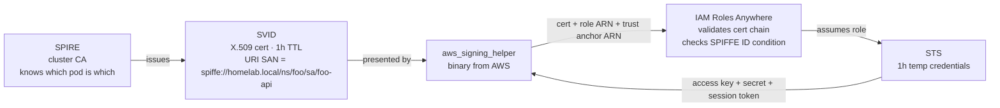
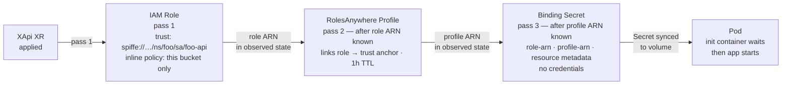
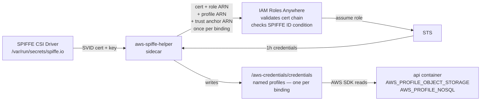

# Workload Identity

Every pod that needs AWS access gets its own short-lived identity — no static keys, no shared credentials, no Secrets containing anything sensitive. This is done by combining SPIRE (a certificate authority that knows which pod is which), IAM Roles Anywhere (AWS's bridge from certificates to IAM), and [`aws-spiffe-helper`](https://github.com/cujarrett/aws-spiffe-helper) (a sidecar that exchanges the certificate for STS credentials and keeps them fresh). Crossplane compositions wire it all together so application teams declare what they need and get a credentials file — nothing else to configure.

## The problem

The naive approach is a Secret containing static AWS keys:

```
access-key-id: REDACTED
secret-access-key: REDACTED
```

Three things are wrong with this:

- **Keys never expire.** A leaked key is a permanent breach until manually rotated.
- **All workloads share one identity.** If the key is compromised, the blast radius is everything that key can touch.
- **The Secret itself is the credential.** Anyone who can read the Secret — another pod, a log line, a bug — has full access.

The goal: every pod gets its own AWS identity, credentials are short-lived, and no credential ever touches a Secret or a config file.

---

## The pieces

Three systems do the work before any Crossplane composition is involved.



**SPIRE** is the certificate authority for the cluster. It knows which pod is running where by checking with the kubelet. When a pod has a registration entry, SPIRE issues it a short-lived X.509 certificate whose URI SAN is the pod's SPIFFE ID — `spiffe://homelab.local/ns/{namespace}/sa/{service-account}`. That URI is the identity.

**IAM Roles Anywhere** is AWS's bridge between certificate-based identity and IAM. You register a trust anchor (the SPIRE CA cert). AWS validates the cert chain and reads the URI SAN as a principal tag. IAM trust policies can then condition on that tag — locking a role to one exact pod identity.

**[`aws-spiffe-helper`](https://github.com/cujarrett/aws-spiffe-helper)** is the sidecar that glues SPIRE and Roles Anywhere together. It fetches the pod's SVID from the SPIRE agent via the Workload API socket, then calls `aws_signing_helper` (an AWS-provided binary) once per binding — each with a different role ARN and profile ARN — writing the resulting STS credentials as named profiles in a shared credentials file. Every 50 minutes it repeats the cycle. The app reads credentials from that file; it never touches a certificate or calls AWS for credentials itself.

---

## Why Roles Anywhere instead of OIDC or IRSA

IRSA (IAM Roles for Service Accounts) is the standard AWS answer to this problem. Kubernetes injects a projected OIDC token into each pod; AWS validates it against your cluster's JWKS endpoint and lets the pod assume an IAM role. On EKS it works transparently — a single annotation on the service account, no sidecars, no extra binaries.

Two things make it a poor fit here.

**The JWKS endpoint must be publicly reachable.** AWS reaches out to `{cluster-issuer}/.well-known/openid-configuration` to validate tokens. For a self-hosted on-prem cluster, that means either punching a hole through the firewall or proxying the endpoint to the public internet. That's unnecessary attack surface for a homelab with no reason to be public.

**One service account, one role.** The IRSA trust condition keys on `system:serviceaccount:{namespace}:{sa}`. A pod that needs access to both S3 and DynamoDB has two options: combine both permissions into one role (breaking least-privilege), or run two service accounts and a lot of ceremony. This cluster's composition model provisions *multiple bindings per XApi* — each with its own scoped IAM role. [`aws-spiffe-helper`](https://github.com/cujarrett/aws-spiffe-helper) calls `aws_signing_helper` once per binding, writing a distinct named profile for each. With IRSA, each binding would require its own service account, its own pod annotation, and a fundamentally different runtime model.

Roles Anywhere sidesteps both constraints. It's certificate-based — the workload presents its SVID directly to AWS with no external endpoint involved. And the sidecar can exchange one SVID for multiple roles in a single refresh cycle.

**What you give up.**

This is not a free upgrade over IRSA. Honest trade-offs:

- **SPIRE is another system to operate.** Server deployment, per-node agent DaemonSet, trust bundle rotation, registration entry management. If SPIRE is unhealthy, pods can't renew SVIDs, and credential refresh silently fails until the sidecar's retry budget is exhausted.
- **`aws_signing_helper` is not an AWS SDK primitive.** It's a standalone binary AWS ships separately. If AWS changes the signing protocol or stops maintaining the binary, every pod breaks. The AWS SDKs have no native Roles Anywhere support — the sidecar is load-bearing scaffolding, not a first-class feature.
- **More moving parts on the pod.** IRSA on EKS requires zero sidecars and zero init containers. This setup requires a credential sidecar, an init container, a SPIFFE CSI volume, and a shared in-memory credentials volume. More things that can be misconfigured.
- **The provider bug.** The nil UUID workaround works, but it's brittle — it depends on specific provider behavior that could change between `provider-aws-rolesanywhere` releases.

For an EKS cluster, IRSA is almost certainly the right choice. For on-prem with no public JWKS endpoint and a multi-binding composition model, Roles Anywhere is the better fit — but go in knowing the operational cost.

---

## Provisioning

When an XApi XR with a cloud binding is applied, Crossplane runs a deferred reconcile chain. Each step waits for the previous step's output to appear in observed state.



### IAM Role

The trust policy condition is:

```json
"aws:PrincipalTag/x509SAN/URI": "spiffe://homelab.local/ns/{ns}/sa/{name}"
```

Only a certificate with that exact URI SAN — signed by the cluster's SPIRE CA — can assume this role. Wrong namespace, wrong service account, different cluster: rejected.

> **Choice: one role per binding, not a shared role**
> A shared role means any workload can reach any resource. Per-binding roles mean the object-storage role cannot touch DynamoDB. A compromised pod's blast radius is one resource.

> **Choice: XApi creates the role, not XObjectStorage**
> The trust policy needs the XApi's service account name and namespace. XObjectStorage doesn't know who will consume it. XApi creates the role, locks it to itself, writes the ARN into the binding Secret.

### RolesAnywhere Profile

The profile links the role to the trust anchor and sets session duration. It's created on the second reconcile pass once the role ARN is available in observed state.

> **Smell: the nil UUID hack**
>
> `provider-aws-rolesanywhere` calls `GetProfile` using `spec.forProvider.name` (the human-readable name) as the profileId. Profile IDs are UUIDs assigned by AWS. When the profile doesn't exist yet, AWS returns HTTP 400 ("not a UUID") instead of HTTP 404. Crossplane treats 400 as a terminal error and never calls Create — the profile never gets made.
>
> Three things you'd try first that don't work:
>
> - **Wildcard in `roleArns`** — `arn:aws:iam::…:role/crossplane/*` looks reasonable. AWS stores it literally. At session-create time it does exact string matching, so the literal `crossplane/*` never matches `crossplane/crossplane-phase6-test-...`. Silently fails.
> - **`managementPolicies: ["Create", "Delete"]`** — skipping Observe would sidestep the 400 entirely, but `provider-aws-rolesanywhere` rejects non-default management policies with `spec.managementPolicies is set to a value([Create Delete]) which is not supported`. The provider simply hasn't implemented that capability. Upgrading to v2.6.1 didn't change it.
> - **Setting `crossplane.io/external-name` to a human-readable string** — makes things worse. Now every Observe call permanently fails with 400 because the external-name is the value used as the UUID, and it will never be valid.
>
> The fix: set `crossplane.io/external-name` to `"00000000-0000-0000-0000-000000000000"` on first render. It's a valid UUID format that doesn't exist in AWS, so AWS returns 404 → Crossplane calls Create → AWS creates the profile and assigns a real UUID → the provider writes that UUID back as `crossplane.io/external-name` on the object. On subsequent reconciles, the template reads the UUID from observed state and uses it in the desired state so the function pipeline never overwrites it. It works. It's not pretty.

> **Choice: one profile per binding, not a shared platform profile**
> A shared profile's `roleArns` list is an exact-match allowlist with no wildcards. Every new binding would need to add its role ARN to the shared profile — a coordination point that doesn't compose. Per-binding profiles let each XApi manage its own identity independently.

### Binding Secret

Once both ARNs exist, the Secret is written:

```
type:         s3
role-arn:     arn:aws:iam::…:role/crossplane/…
profile-arn:  arn:aws:rolesanywhere::…:profile/…
bucket:       platform-{namespace}-{name}
region:       us-east-1
```

> **Choice: ARNs in the Secret, not credentials**
> An ARN without a valid SVID is useless. If this Secret is accidentally logged or read by another pod, nothing is compromised. The SVID is what proves identity; AWS issues credentials at runtime in exchange for it.

> **Note: `trust-anchor-arn` is not in the Secret**
> The trust anchor ARN embeds the AWS account ID. It's injected into the sidecar at runtime from a Crossplane EnvironmentConfig — never committed to git, never in a binding Secret visible to tenants.

> **Note: `platform-` bucket prefix**
> IAM cannot read S3 bucket tags at auth time — conditions must use ARNs. The `platform-{namespace}-{name}` naming convention lets inline policies scope to the exact bucket ARN without wildcards.

### Pod startup

The init container blocks on `[ -f /bindings/{name}/type ]` with a 5s retry. The `type` file is the last key written, so its presence confirms the full Secret is synced to the volume mount.

> **Smell: file polling**
> It is polling. But it's a local `stat()` on a kubelet-synced volume — not a remote API call. The practical upside: `Init:0/4 → Init:1/4` gives a clear provisioning progress signal rather than a `Pending` pod that looks like an error. The alternative (projected secret volume with `optional: false`) blocks the same way but shows worse in the Launchpad UI.

---

## Runtime

The sidecar runs this cycle every 50 minutes while the pod is alive.



The app doesn't know SPIRE exists. The composition injects `AWS_PROFILE_*` env vars and `AWS_SHARED_CREDENTIALS_FILE`. [`aws-spiffe-helper`](https://github.com/cujarrett/aws-spiffe-helper) handles the exchange — once per binding, every 50 minutes.

```go
s3Cfg, _ := config.LoadDefaultConfig(ctx,
    config.WithSharedConfigProfile(os.Getenv("AWS_PROFILE_OBJECT_STORAGE")))
s3Client := s3.NewFromConfig(s3Cfg)

ddbCfg, _ := config.LoadDefaultConfig(ctx,
    config.WithSharedConfigProfile(os.Getenv("AWS_PROFILE_NOSQL")))
ddbClient := dynamodb.NewFromConfig(ddbCfg)
```

```js
const s3 = new S3Client({
  credentials: fromIni({ profile: process.env.AWS_PROFILE_OBJECT_STORAGE }),
});
```

---

## One-way doors

| Decision | Why it's sticky |
|---|---|
| SPIRE trust domain (`homelab.local`) | Baked into every SVID and every IAM trust policy condition. Changing it requires re-registering the trust anchor in AWS and updating every role trust policy. |
| One credential sidecar per XApi | Each sidecar assumes a distinct IAM role scoped to this XApi's SPIFFE ID. A shared sidecar would require merging IAM permissions across workloads, breaking least-privilege. |

---

## Future: declared connection topology

Once every workload has a SPIFFE identity and Linkerd is running, the composition can enforce who is allowed to call whom — not just who can access which AWS resource.

```yaml
apiVersion: policy.linkerd.io/v1alpha1
kind: AuthorizationPolicy
metadata:
  name: foo-db-only-from-foo-api
  namespace: foo
spec:
  targetRef:
    kind: Server
    name: foo-db
  requiredAuthenticationRefs:
    - name: foo-api-identity
      kind: MeshTLSAuthentication
```

If `XApi foo` declares `sqlRef: name: foo-db`, the composition creates this policy automatically. The connection topology is declared in the XR, enforced by Linkerd, and visible in Grafana — no app code involved.
