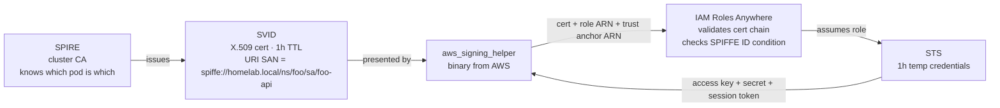
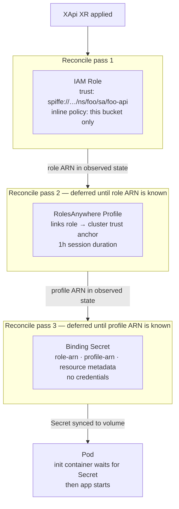
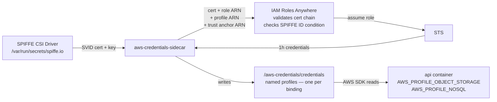

# Workload Identity

## The problem

The naive approach is a Secret containing static AWS keys:

```
access-key-id: REDACTED
secret-access-key: REDACTED
```

Three things are wrong with this:

- **Keys never expire.** A leaked key is a permanent breach until manually rotated.
- **All workloads share one identity.** If the key is compromised, the blast radius is everything that key can touch.
- **The Secret itself is the credential.** Anyone who can read the Secret — another pod, a log line, a bug — has full access.

The goal: every pod gets its own AWS identity, credentials are short-lived, and no credential ever touches a Secret or a config file.

---

## The pieces

Three systems do the work before any Crossplane composition is involved.



**SPIRE** is the certificate authority for the cluster. It knows which pod is running where by checking with the kubelet. When a pod has a registration entry, SPIRE issues it a short-lived X.509 certificate whose URI SAN is the pod's SPIFFE ID — `spiffe://homelab.local/ns/{namespace}/sa/{service-account}`. That URI is the identity.

**IAM Roles Anywhere** is AWS's bridge between certificate-based identity and IAM. You register a trust anchor (the SPIRE CA cert). AWS validates the cert chain and reads the URI SAN as a principal tag. IAM trust policies can then condition on that tag — locking a role to one exact pod identity.

**`aws_signing_helper`** handles the exchange. Give it an SVID cert + key, a role ARN, a profile ARN, and a trust anchor ARN. It calls IAM Roles Anywhere and writes the resulting STS credentials to a named profile in a credentials file.

> **Why IAM Roles Anywhere and not OIDC?**
> OIDC requires AWS to reach the cluster's JWKS endpoint. For an on-prem cluster that means a public URL — unnecessary attack surface. IAM Roles Anywhere is certificate-based; the workload presents its cert directly. No public endpoint.

---

## Provisioning

When an XApi XR with a cloud binding is applied, Crossplane runs a deferred reconcile chain. Each step waits for the previous step's output to appear in observed state.



### IAM Role

The trust policy condition is:

```json
"aws:PrincipalTag/x509SAN/URI": "spiffe://homelab.local/ns/{ns}/sa/{name}"
```

Only a certificate with that exact URI SAN — signed by the cluster's SPIRE CA — can assume this role. Wrong namespace, wrong service account, different cluster: rejected.

> **Choice: one role per binding, not a shared role**
> A shared role means any workload can reach any resource. Per-binding roles mean the object-storage role cannot touch DynamoDB. A compromised pod's blast radius is one resource.

> **Choice: XApi creates the role, not XObjectStorage**
> The trust policy needs the XApi's service account name and namespace. XObjectStorage doesn't know who will consume it. XApi creates the role, locks it to itself, writes the ARN into the binding Secret.

### RolesAnywhere Profile

The profile links the role to the trust anchor and sets session duration. It's created on the second reconcile pass once the role ARN is available in observed state.

> **Smell: the nil UUID hack**
>
> `provider-aws-rolesanywhere` calls `GetProfile` using `spec.forProvider.name` (the human-readable name) as the profileId. Profile IDs are UUIDs assigned by AWS. When the profile doesn't exist yet, AWS returns HTTP 400 ("not a UUID") instead of HTTP 404. Crossplane treats 400 as a terminal error and never calls Create — the profile never gets made.
>
> The fix: set `crossplane.io/external-name` to `"00000000-0000-0000-0000-000000000000"` on first render. AWS returns 404 (valid UUID format, just doesn't exist) → Crossplane calls Create → AWS assigns a real UUID → the template reads it back from observed state on every subsequent reconcile and uses the real UUID. It works. It's not pretty.

> **Choice: one profile per binding, not a shared platform profile**
> A shared profile's `roleArns` list is an exact-match allowlist with no wildcards. Every new binding would need to add its role ARN to the shared profile — a coordination point that doesn't compose. Per-binding profiles let each XApi manage its own identity independently.

### Binding Secret

Once both ARNs exist, the Secret is written:

```
type:         s3
role-arn:     arn:aws:iam::…:role/crossplane/…
profile-arn:  arn:aws:rolesanywhere::…:profile/…
bucket:       platform-{namespace}-{name}
region:       us-east-1
```

> **Choice: ARNs in the Secret, not credentials**
> An ARN without a valid SVID is useless. If this Secret is accidentally logged or read by another pod, nothing is compromised. The SVID is what proves identity; AWS issues credentials at runtime in exchange for it.

> **Note: `trust-anchor-arn` is not in the Secret**
> The trust anchor ARN embeds the AWS account ID. It's injected into the sidecar at runtime from a Crossplane EnvironmentConfig — never committed to git, never in a binding Secret visible to tenants.

> **Note: `platform-` bucket prefix**
> IAM cannot read S3 bucket tags at auth time — conditions must use ARNs. The `platform-{namespace}-{name}` naming convention lets inline policies scope to the exact bucket ARN without wildcards.

### Pod startup

The init container blocks on `[ -f /bindings/{name}/type ]` with a 5s retry. The `type` file is the last key written, so its presence confirms the full Secret is synced to the volume mount.

> **Smell: file polling**
> It is polling. But it's a local `stat()` on a kubelet-synced volume — not a remote API call. The practical upside: `Init:0/4 → Init:1/4` gives a clear provisioning progress signal rather than a `Pending` pod that looks like an error. The alternative (projected secret volume with `optional: false`) blocks the same way but shows worse in the Launchpad UI.

---

## Runtime

The sidecar runs this cycle every 50 minutes while the pod is alive.



The app doesn't know SPIRE exists. The composition injects `AWS_PROFILE_*` env vars. The sidecar handles the exchange.

```go
s3Cfg, _ := config.LoadDefaultConfig(ctx,
    config.WithSharedConfigProfile(os.Getenv("AWS_PROFILE_OBJECT_STORAGE")))
s3Client := s3.NewFromConfig(s3Cfg)

ddbCfg, _ := config.LoadDefaultConfig(ctx,
    config.WithSharedConfigProfile(os.Getenv("AWS_PROFILE_NOSQL")))
ddbClient := dynamodb.NewFromConfig(ddbCfg)
```

```js
const s3 = new S3Client({
  credentials: fromIni({ profile: process.env.AWS_PROFILE_OBJECT_STORAGE }),
});
```

---

## One-way doors

| Decision | Why it's sticky |
|---|---|
| SPIRE trust domain (`homelab.local`) | Baked into every SVID and every IAM trust policy condition. Changing it requires re-registering the trust anchor in AWS and updating every role trust policy. |
| One credential sidecar per XApi | Each sidecar assumes a distinct IAM role scoped to this XApi's SPIFFE ID. A shared sidecar would require merging IAM permissions across workloads, breaking least-privilege. |

---

## Future: declared connection topology

Once every workload has a SPIFFE identity and Linkerd is running, the composition can enforce who is allowed to call whom — not just who can access which AWS resource.

```yaml
apiVersion: policy.linkerd.io/v1alpha1
kind: AuthorizationPolicy
metadata:
  name: foo-db-only-from-foo-api
  namespace: foo
spec:
  targetRef:
    kind: Server
    name: foo-db
  requiredAuthenticationRefs:
    - name: foo-api-identity
      kind: MeshTLSAuthentication
```

If `XApi foo` declares `sqlRef: name: foo-db`, the composition creates this policy automatically. The connection topology is declared in the XR, enforced by Linkerd, and visible in Grafana — no app code involved.
