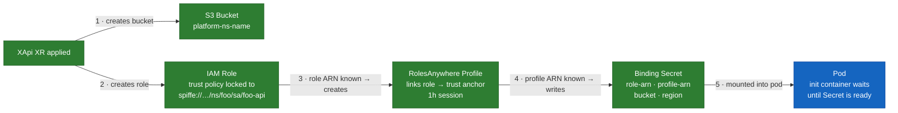

# Workload Identity

An adventure in learning how to give every platform workload an AWS identity — without a single static key.

Each pod gets a short-lived X.509 certificate proving who it is. AWS validates it and issues temporary credentials in exchange. The cert expires in an hour; a sidecar handles the refresh.

It was a deep rabbit hole. The diagram below is the end state.

---

## End-to-end flow

### Provisioning (once — on XR apply)



Crossplane runs this once when an XApi XR with a cloud resource binding (e.g. `objectStorageRefs`, `nosqlRef`) is applied — before the pod starts. Each binding gets its own IAM Role (trust policy locked to the pod's exact SPIFFE ID), a RolesAnywhere Profile linking it to the cluster trust anchor, then a binding Secret containing the ARNs. The init container blocks pod startup until the Secret is fully written.

1. Creates bucket — S3 bucket named `platform-{namespace}-{name}`. The prefix lets IAM scope policies to `arn:aws:s3:::platform-*` — bucket tags can't be read at auth time.
2. Creates role — IAM Role with one trust condition: `aws:PrincipalTag/x509SAN/URI` must exactly match this pod's SPIFFE ID. Inline policy scoped to the one bucket. No other workload can assume it.
3. Role ARN known → creates profile — On the next reconcile pass after the Role exists, Crossplane creates the RolesAnywhere Profile. Links the role to the cluster trust anchor with a 1h session.
4. Profile ARN known → writes Secret — Deferred again. Writes `role-arn`, `profile-arn`, `bucket`, `region`. No credentials — just the ARNs needed to request them.
5. Mounted into pod — The init container polls for the Secret's `type` file before the app starts. Once it exists, the sidecar has everything it needs.

### Runtime (every 50 min — while pod is running)

```mermaid
%%{init: {'flowchart': {'nodeSpacing': 50, 'rankSpacing': 50}}}%%
flowchart LR
    subgraph cluster["Cluster"]
        subgraph identity["Identity — SPIRE"]
            spire["SPIRE Server\nroot CA\nauto-registers app=xapi\nand app=xspa pods"]
            agent["SPIRE Agent\nper node\nverifies via kubelet"]
            csi["SPIFFE CSI Driver\nmounts cert+key\nat /var/run/secrets/spiffe.io/"]
        end

        subgraph pod["XApi pod"]
            sidecar["aws-credentials-sidecar\nreads cert+key + binding Secret\ncalls aws_signing_helper"]
            app["api container\nAWS SDK\nreads named profile"]
        end
    end

    subgraph aws["AWS"]
        ra["IAM Roles Anywhere\nvalidates cert chain\nchecks SPIFFE ID condition"]
        sts["STS\n1h credentials"]
        roles["IAM Role\n(one per binding)"]
    end

    spire  -->|"1 · node attestation"| agent
    agent  -->|"2 · SVID cert+key"| csi
    csi    -->|"3 · mount files"| sidecar
    sidecar -->|"4 · cert + ARNs\nfrom binding Secret"| ra
    ra      -->|"5 · validate + assume"| roles
    roles   --> sts
    sts     -->|"6 · temp credentials"| sidecar
    sidecar -->|"7 · named profiles\nwritten to emptyDir"| app

    classDef spireStyle fill:#512DA8,stroke:#311B92,color:#fff
    classDef sideStyle  fill:#E65100,stroke:#BF360C,color:#fff
    classDef awsStyle   fill:#283593,stroke:#1A237E,color:#fff

    class spire,agent,csi spireStyle
    class sidecar sideStyle
    class ra,sts,roles awsStyle

    style cluster  fill:#263238,stroke:#546E7A
    style identity fill:#1A1A2E,stroke:#512DA8
    style pod      fill:#1A2332,stroke:#37474F
    style aws      fill:#1B2A1B,stroke:#2E7D32
```



1. Node attestation — Each SPIRE Agent bootstraps to the server and proves it's running on a legitimate cluster node. Not service mesh mTLS — this is SPIRE's own internal protocol. Once attested, the server trusts that agent to vouch for workloads on that node.
2. SVID issuance — When an XApi pod schedules, `spire-controller-manager` auto-creates a registration entry. The SPIFFE CSI driver mounts `tls.crt` and `tls.key` into the pod at `/var/run/secrets/spiffe.io/`. Rotated automatically before expiry.
3. Mount files — The SVID is just files on disk. The sidecar reads them directly.
4. Identity exchange — The sidecar calls `aws_signing_helper` with the SVID cert+key, role ARN, profile ARN, and trust anchor ARN. IAM Roles Anywhere validates the cert chain and checks `aws:PrincipalTag/x509SAN/URI` against the pod's exact SPIFFE ID. Wrong namespace, wrong service account, different cluster — rejected.
5. Assume the role — On successful validation, Roles Anywhere calls STS to assume the role.
6. Temporary credentials — STS returns a 1h access key + secret + session token. The sidecar refreshes every 50 minutes so credentials never expire mid-request.
7. Credentials on disk — The sidecar writes named profile sections to `/aws-credentials/credentials` (shared emptyDir). The app reads via `AWS_SHARED_CREDENTIALS_FILE` + `AWS_PROFILE_<BINDING>` env vars injected by the composition.

    ```go
    cfg, _ := config.LoadDefaultConfig(ctx,
        config.WithSharedConfigProfile(os.Getenv("AWS_PROFILE_OBJECT_STORAGE")))
    s3Client := s3.NewFromConfig(cfg)
    ```

    JavaScript (AWS SDK v3):
    ```js
    const { S3Client } = require("@aws-sdk/client-s3");
    const { fromIni } = require("@aws-sdk/credential-providers");

    const s3 = new S3Client({
      credentials: fromIni({ profile: process.env.AWS_PROFILE_OBJECT_STORAGE }),
    });
    ```

If the pod is deleted, the role can't be assumed by anything else — the trust policy condition is scoped to the exact SPIFFE ID.

---

## Why these choices

**IAM Roles Anywhere, not OIDC federation**

OIDC requires AWS to reach your cluster's JWKS endpoint to validate tokens. For an on-prem or private cluster that means a public URL — unnecessary attack surface. IAM Roles Anywhere is certificate-based: the workload presents its cert directly to STS. No inbound connection to the cluster required.

On EKS? [EKS Pod Identity](https://docs.aws.amazon.com/eks/latest/userguide/pod-identities.html) handles multiple IAM roles per pod natively — use that instead. On ROSA? ROSA does not have EKS Pod Identity. IRSA (the ROSA equivalent) binds one IAM role per ServiceAccount, which is limiting when an app needs credentials for multiple Crossplane-provisioned resources (S3 + NoSQL + cache). IAM Roles Anywhere with SPIRE solves that cleanly: one SVID can assume any number of roles, one per binding, each written as a named profile. This is a valid pattern on ROSA for multi-binding internal developer platforms.

**SPIFFE CSI driver, not SPIFFE helper sidecar**

The CSI driver mounts SVID cert+key directly as pod volume files — no extra sidecar needed for the SPIRE side. The two-sidecar alternative (spiffe-helper + aws_signing_helper) adds inter-container coordination with no security benefit. CSI driver is the upstream-recommended pattern.

**Per-workload IAM role, not a shared role**

Each XR instance gets its own role with a trust policy condition locked to `spiffe://homelab.local/ns/{ns}/sa/{sa}`. Only that exact pod can assume that role. A shared role would let any workload with an SVID escalate to all bound resources.

**`platform-` bucket name prefix, not bucket tags**

IAM cannot read S3 bucket tags at auth time — resource conditions must use the ARN. The `platform-{namespace}-{name}` naming convention lets the inline policy scope to the exact bucket ARN without wildcards. Each role's inline policy references the exact ARN: `arn:aws:s3:::platform-{ns}-{name}`.

**Binding Secret carries ARNs, not credentials**

The Secret written by Crossplane contains `role-arn`, `profile-arn`, `bucket`/`table-name`, and `region`. No access key. No secret key. `trust-anchor-arn` is injected directly as an env var on the sidecar from the platform's EnvironmentConfig — it never appears in user-visible Secrets. The `aws-spiffe-helper` sidecar reads the ARNs and handles the STS exchange at runtime. If the Secret is accidentally logged or exposed, it contains no usable credentials — only the ARNs needed to request them, which require a valid SVID to use.

---

## App code

One line per AWS client. No credential details.

```go
// Single AWS binding
cfg, _ := config.LoadDefaultConfig(ctx)
s3Client := s3.NewFromConfig(cfg)

// Multiple AWS bindings — composition injects AWS_PROFILE_<BINDING> env vars
s3Cfg, _  := config.LoadDefaultConfig(ctx,
    config.WithSharedConfigProfile(os.Getenv("AWS_PROFILE_OBJECT_STORAGE")))
s3Client  := s3.NewFromConfig(s3Cfg)

ddbCfg, _ := config.LoadDefaultConfig(ctx,
    config.WithSharedConfigProfile(os.Getenv("AWS_PROFILE_NOSQL")))
ddbClient := dynamodb.NewFromConfig(ddbCfg)
```

The profile name is a platform convention (`object-storage`, `nosql`). If the credential mechanism changes, the env var contract stays stable — no app code changes required.

**How the multi-binding case works:**

For a pod with both `objectStorageRef` and `nosqlRef`, one sidecar runs and handles both bindings via the `AWS_BINDINGS` env var. It calls `aws_signing_helper` once per role and writes each result as a named profile directly into the credentials file:

```ini
[object-storage]
aws_access_key_id = REDACTED
aws_secret_access_key = REDACTED
aws_session_token = REDACTED

[nosql]
aws_access_key_id = REDACTED
aws_secret_access_key = REDACTED
aws_session_token = REDACTED
```

The sidecar reads the ARNs from each binding Secret mounted into the pod, calls IAM Roles Anywhere once per binding, and refreshes all profiles every 50 minutes. The SVID cert and key are the same file for both assumptions — they prove pod identity regardless of which role is being assumed.

The composition also injects env vars so the app knows which profile name maps to which binding:

```
AWS_PROFILE_OBJECT_STORAGE=object-storage
AWS_PROFILE_NOSQL=nosql
```

When the S3 client makes its first call, the SDK looks up the `object-storage` profile, executes the `credential_process` command, which calls IAM Roles Anywhere, which validates the SVID against the trust anchor, checks the role's trust policy condition, and calls STS. Temporary credentials come back and are cached by the SDK. The DynamoDB client does the same independently via the `nosql` profile — different role, different resource scope, same SVID. Neither client can use the other's credentials.

<details>
<summary>ROSA + multi-binding IDP</summary>

SPIRE still runs on ROSA — SVIDs are still issued to every workload for mesh identity (Linkerd mTLS, Phase 8). The AWS credential exchange is the same as the homelab: SPIRE SVID → IAM Roles Anywhere → STS.

ROSA does not have EKS Pod Identity (that's an EKS-specific feature). ROSA's equivalent is IRSA, which binds one IAM role per ServiceAccount. For an internal developer platform where one app pod may need credentials for S3 + NoSQL + cache simultaneously, IRSA's one-role-per-SA limit becomes a problem. IAM Roles Anywhere with SPIRE solves it: one SVID can assume multiple roles, one per Crossplane binding, each written as a named profile.

**What's different from vanilla EKS:**

On EKS you'd use EKS Pod Identity associations — multiple roles per pod, managed by the EKS API. The app code contract is the same (`AWS_PROFILE_<BINDING>` env vars), but the sidecar and RolesAnywhere machinery are replaced by the EKS Pod Identity agent.

**What stays the same:**

- SPIRE runs; SVIDs are still issued to every XApi and XSpa pod
- App code is identical — `config.LoadDefaultConfig(ctx)` works with no arguments; multi-binding still uses `AWS_PROFILE_<BINDING>` env vars
- One role per binding is still the right pattern
- The "no static keys" outcome is the same

**Why homelab uses IAM Roles Anywhere instead of OIDC:**

AWS can't reach `homelab.local` to validate an OIDC token — there's no public JWKS endpoint. IAM Roles Anywhere flips the direction: the workload presents its cert to AWS rather than AWS validating a token against a URL it can reach. On ROSA, RolesAnywhere is also the right call for a multi-binding IDP since ROSA lacks EKS Pod Identity.

</details>

---

## Scope

The target end-state: every platform offering gets a SPIFFE identity. The auth mechanism layered on
top differs by what the offering talks to.

| Offering | Auth mechanism | Changes |
|---|---|---|
| `XObjectStorage` | IAM Roles Anywhere | Replace static key with role ARN + SPIRE sidecar |
| `XNoSql` | IAM Roles Anywhere | Replace static key with role ARN + SPIRE sidecar |
| `XSql` (RDS) | IAM DB Auth + Roles Anywhere | IAM role grants `rds-db:connect`; no password |
| `XSql` (in-cluster Postgres) | Linkerd mTLS | No AWS auth; mesh enforces identity |
| `XCache` (in-cluster Redis) | Linkerd mTLS | No AWS auth; mesh enforces identity |
| `XCache` (ElastiCache) | IAM Roles Anywhere | Replace static key with role ARN + SPIRE sidecar |
| `XSpa` | Linkerd mTLS | Identity for mesh membership only; no app credentials |
| `XTopic` | NATS JWT auth (app) + SPIFFE identity (mesh) | App auth to NATS stays JWT; SPIFFE identity still issued for mesh |
| `XSubscription` | NATS JWT auth (app) + SPIFFE identity (mesh) | App auth to NATS stays JWT; SPIFFE identity still issued for mesh |

---

### Phase 1 — SPIRE: understand the model ✅

**Purpose:** Build the mental model before touching infrastructure. You can't debug attestation you can't explain.

SPIRE has two components. Read these before touching anything.

**Read:**
1. [SPIFFE spec — what an SVID actually is](https://spiffe.io/docs/latest/spiffe-about/spiffe-concepts/) — 15 minutes
2. [SPIRE architecture](https://spiffe.io/docs/latest/spire-about/spire-concepts/) — control plane vs agent, attestation, workload API
3. [Kubernetes workload attestation](https://github.com/spiffe/spire/blob/main/doc/plugin_agent_workloadattestor_k8s.md) — how SPIRE proves a pod is who it claims

**Mental model to confirm:**

```
SPIRE Server  → root CA, registration entries, issues SVIDs on request
SPIRE Agent   → DaemonSet on every node, talks to kubelet API to verify pod identity,
                 serves Workload API socket at /run/spire/agent.sock
Workload API  → Unix socket the app calls to get its X.509 SVID (cert + private key)
Registration  → entry says "pod with serviceaccount X in namespace Y gets SPIFFE ID Z"
```

A registration entry is the binding between a Kubernetes identity (serviceaccount + namespace)
and a SPIFFE ID. Without one, a pod gets nothing from the Workload API.

**Exit criteria:** You can explain the difference between the SPIRE server, the SPIRE agent,
and the workload API to someone else without notes. Draw the diagram. Then proceed.


<details>
<summary>Answers</summary>

```
┌────────────────────────────────────────────────────────────┐
│                        SPIRE Server                        │
│  - Runs as a Deployment (one replica is fine for homelab)  │
│  - Owns the root CA; signs all SVIDs                       │
│  - Holds all registration entries (spiffeID ↔ selectors)   │
│  - Agents bootstrap against it and attest to it            │
└───────────────────────────┬────────────────────────────────┘
                            │ mTLS (agents attest on join)
          ┌─────────────────┼─────────────────┐
          ▼                 ▼                 ▼
┌──────────────────┐ ┌──────────────────┐ ┌──────────────────┐
│   SPIRE Agent    │ │   SPIRE Agent    │ │   SPIRE Agent    │
│   (work-1)       │ │   (work-2)       │ │   (work-3)       │
│                  │ │                  │ │                  │
│ - DaemonSet pod  │ │ - DaemonSet pod  │ │ - DaemonSet pod  │
│ - Talks to local │ │                  │ │                  │
│   kubelet API to │ │                  │ │                  │
│   verify pod ns/ │ │                  │ │                  │
│   serviceaccount │ │                  │ │                  │
│ - Exposes the    │ │                  │ │                  │
│   Workload API   │ │                  │ │                  │
│   Unix socket    │ │                  │ │                  │
└────────┬─────────┘ └──────────────────┘ └──────────────────┘
         │ /run/spire/agent.sock
         │ (Unix socket, host path)
         ▼
┌──────────────────────────────────────────┐
│              Workload API                │
│                                          │
│  The socket the app (or sidecar) calls.  │
│  Agent checks: does this pod's ns +      │
│  serviceaccount match a registration     │
│  entry? If yes → fetch SVID from server  │
│  and hand it back. If no → nothing.      │
└──────────────────────────────────────────┘
         │ X.509 SVID (cert + private key)
         ▼
┌──────────────────────────────────────────┐
│                  App pod                 │
│  Reads SVID. Hands it to                 │
│  aws_signing_helper → STS creds.         │
└──────────────────────────────────────────┘
```

**The key distinction:**

- **SPIRE Server** — the CA and the policy store. It knows what identities exist and signs their certs. There's one, and workloads never talk to it directly.
- **SPIRE Agent** — the node-local proxy. Runs everywhere a workload runs. It's the one that actually verifies pod identity (by asking the kubelet) and serves the socket. Workloads only ever talk to their local agent.
- **Workload API** — not a separate process. It's the interface the agent exposes. The Unix socket at `/run/spire/agent.sock`. The app calls this to get its SVID; it has no idea a server exists.
</details>

---

### Phase 2 — Install SPIRE ✅

**Purpose:** Stand up the identity provider — server plus an agent on every node — and confirm every agent attests.

**Install:**

The ArgoCD Application is at `cluster/argocd/spire.yaml`. Push to git — ArgoCD picks it up automatically.

Key values used (see `cluster/argocd/spire.yaml` for the full config):
- `trustDomain: homelab.local` — appears in every SPIFFE ID
- `storageClass: longhorn-retain` — retains the CA PVC on pod restart
- `logLevel: DEBUG` on agents — turn down to `INFO` once attestation is confirmed working
- SPIKE, CSI driver, OIDC provider, and controller manager are disabled — not needed until later phases

**What to look at after install:**

```bash
# SPIRE server and agents are running (namespace is spire-server)
k get pods -n spire-server

# SPIRE server logs — you'll see it bootstrapping its CA
k logs -n spire-server spire-server-0 | head -50

# Confirm all 4 agents have attested
k exec -n spire-server spire-server-0 -- \
  /opt/spire/bin/spire-server agent list

# The server's bundle (root CA public cert) — treat as sensitive
k exec -n spire-server spire-server-0 -- \
  /opt/spire/bin/spire-server bundle show -format pem
```

Save that CA cert. It is the root of trust for every SVID the cluster issues and is highly
sensitive. Anyone who registers it as a trust anchor in AWS can issue SVIDs that will be accepted as
valid cluster identities. You'll register it in IAM Roles Anywhere in Phase 4.

**Exit criteria:**  `spire-server-0` and all `spire-agent-*` pods are `1/1 Running`, `agent list` shows 4 attested agents, bundle command returns a PEM cert.

---

### Phase 3 — Register a workload ✅

**Purpose:** Bind a Kubernetes identity to a SPIFFE ID and prove a real pod can fetch its own SVID.

Before any app gets an SVID, you register it. This is the step that binds a Kubernetes identity
to a SPIFFE ID.

| Term | What it means |
|---|---|
| SPIFFE ID | A URI: `spiffe://trust-domain/path`. The identity. |
| SVID | The cert (or JWT) that proves the SPIFFE ID. Short-lived. |
| Trust domain | The namespace for SPIFFE IDs in your deployment. `homelab.local`. |
| Workload API | The Unix socket a workload calls to get its SVID. |
| Attestation | How SPIRE proves a workload is who it claims. For Kubernetes: checks pod namespace, service account, labels against the kubelet API. |
| Trust anchor | The CA cert you register in AWS. AWS uses it to validate SVID cert chains. |
| Profile (Roles Anywhere) | Maps a trust anchor to a set of IAM roles and sets session duration. |
| Registration entry | SPIRE's mapping from Kubernetes selectors to a SPIFFE ID. |

**Create a registration entry for `my-vinyl-api`:**

You need one entry per node — each agent's parentID is its own SPIFFE ID. Get all four from the server:

```bash
k exec -n spire-server spire-server-0 -- \
  /opt/spire/bin/spire-server agent list | grep "SPIFFE ID"
```

Create an entry for each node agent (the selectors ensure only the right pod gets the SVID regardless of which node it lands on):

```bash
# Copy the UIDs from the agent list output above, then run:
for uid in \
  "spiffe://homelab.local/spire/agent/k8s_psat/homelab/REPLACE-UID-1" \
  "spiffe://homelab.local/spire/agent/k8s_psat/homelab/REPLACE-UID-2" \
  "spiffe://homelab.local/spire/agent/k8s_psat/homelab/REPLACE-UID-3" \
  "spiffe://homelab.local/spire/agent/k8s_psat/homelab/REPLACE-UID-4"; do
  k exec -n spire-server spire-server-0 -- \
    /opt/spire/bin/spire-server entry create \
      -spiffeID spiffe://homelab.local/ns/my-vinyl/sa/my-vinyl-api \
      -parentID "$uid" \
      -selector k8s:ns:my-vinyl \
      -selector k8s:sa:my-vinyl-api
done
```

The selectors tell SPIRE: "only pods in namespace `my-vinyl` with service account `my-vinyl-api`
can claim this SPIFFE ID." Anything else gets rejected.

Note: Phase 7 (SPIRE Controller Manager) automates this — you won't create entries by hand at scale.

**Verify the workload can fetch its SVID:**

The `spire-agent` image is distroless — no shell or `sleep`. Run the fetch directly as the container command and read it from logs:

```bash
k run spire-test -n my-vinyl \
  --image=ghcr.io/spiffe/spire-agent:1.15.1 \
  --restart=Never \
  --overrides='{
    "spec": {
      "serviceAccountName": "my-vinyl-api",
      "volumes": [{"name":"spire-agent-socket","hostPath":{"path":"/run/spire/agent-sockets/spire-agent.sock","type":"Socket"}}],
      "containers":[{
        "name":"spire-test",
        "image":"ghcr.io/spiffe/spire-agent:1.15.1",
        "command":["/opt/spire/bin/spire-agent","api","fetch","x509","-socketPath","/run/spire/agent.sock"],
        "volumeMounts":[{"name":"spire-agent-socket","mountPath":"/run/spire/agent.sock"}]
      }]
    }
  }'

sleep 10 && k logs spire-test -n my-vinyl -c spire-test

k delete pod spire-test -n my-vinyl
```

You should see output like:

```
Received 1 svid after 576ms

SPIFFE ID:    spiffe://homelab.local/ns/my-vinyl/sa/my-vinyl-api
SVID Valid After:  ...
SVID Valid Until:  ...
CA #1 Valid After: ...
CA #1 Valid Until: ...
```

**Exit criteria:** SVID received, SPIFFE ID matches `spiffe://homelab.local/ns/my-vinyl/sa/my-vinyl-api`.

---

### Phase 4 — IAM Roles Anywhere: trust anchor and role ✅

**Purpose:** Manual proof-of-concept. Prove by hand — one workload, no composition — that a SPIRE SVID exchanges for AWS STS credentials end to end. This de-risks the AWS side of the trust chain before Phase 5 automates it. Everything created here except the trust anchor is throwaway (see Cleanup below).

The trust anchor is the one permanent artifact: AWS needs to trust your SPIRE CA before it will
accept SVIDs. You're registering the CA's public cert as a trust anchor. No private key leaves the
cluster.

**Register the trust anchor:**

```bash
# Get the SPIRE CA bundle
k exec -n spire-server spire-server-0 -- \
  /opt/spire/bin/spire-server bundle show -format pem > ~/Desktop/spire-ca.pem

# Register it in IAM Roles Anywhere
aws rolesanywhere create-trust-anchor \
  --name homelab-spire \
  --source "sourceType=CERTIFICATE_BUNDLE,sourceData={x509CertificateData=$(cat ~/Desktop/spire-ca.pem)}" \
  --tags key=cluster,value=homelab \
  --enabled

# Delete the local copy — it's a public cert (no private key), safe to remove.
# Re-fetch any time with the bundle show command above.
rm ~/Desktop/spire-ca.pem
```

**Create an IAM role for `my-vinyl-api` S3 access:**

The trust policy allows IAM Roles Anywhere to assume it, then locks down to the specific SPIFFE ID
via the URI SAN principal tag.

```json
{
  "Version": "2012-10-17",
  "Statement": [
    {
      "Effect": "Allow",
      "Principal": {
        "Service": "rolesanywhere.amazonaws.com"
      },
      "Action": [
        "sts:AssumeRole",
        "sts:TagSession",
        "sts:SetSourceIdentity"
      ],
      "Condition": {
        "StringEquals": {
          "aws:PrincipalTag/x509SAN/URI": "spiffe://homelab.local/ns/my-vinyl/sa/my-vinyl-api"
        }
      }
    }
  ]
}
```

The condition is the lock. Only a cert with that exact URI SAN — signed by your SPIRE CA —
can assume this role. Every workload gets its own role with its own condition.

**Create a profile:**

A profile maps the trust anchor to the roles it's allowed to assume, and sets the session duration.

```bash
TRUST_ANCHOR_ARN=$(aws rolesanywhere list-trust-anchors \
  --query 'trustAnchors[?name==`homelab-spire`].trustAnchorArn' \
  --output text)

ROLE_ARN=arn:aws:iam::<account>:role/homelab-my-vinyl-api

aws rolesanywhere create-profile \
  --name homelab-my-vinyl-api \
  --role-arns "$ROLE_ARN" \
  --duration-seconds 3600 \
  --enabled
```

**Exit criteria:** Trust anchor shows `enabled: true`. Role trust policy is saved. Profile exists.

**Cleanup — before Phase 5:** The IAM role and profile created here were manual proof-of-concept resources. Once Phase 5 has the composition managing them, delete these:

```bash
# Delete the manual proof-of-concept role and profile (Crossplane will own these going forward)
aws rolesanywhere delete-profile \
  --profile-id $(aws rolesanywhere list-profiles \
    --query 'profiles[?name==`homelab-my-vinyl-api`].profileId' --output text)

# The role has no attached or inline policies — delete directly
aws iam delete-role --role-name homelab-my-vinyl-api
```

The trust anchor (`homelab-spire`) is cluster-wide and permanent — do not delete it.

---

### Phase 5 — Update XObjectStorage composition

**Purpose:** Move the manual exchange from Phase 4 into the platform. The composition owns the IAM role and the credential sidecar; the app stops reading static keys.

**Implementation decisions:**

| Decision | Choice | Why |
|---|---|---|
| SVID delivery to sidecar | SPIRE CSI driver | Mounts SVID cert+key directly as pod volume files — no extra sidecar needed. The two-sidecar alternative (spiffe-helper + aws_signing_helper) adds inter-container coordination with no benefit. CSI driver is the upstream-recommended pattern. |
| `trust-anchor-arn` source | Env var injected from EnvironmentConfig directly into the sidecar | Cluster-wide constant. Kept out of binding Secrets to avoid leaking the AWS account ID to app tenants. Not stored in Git. |
| Credentials delivery to SDK | Named profiles in shared credentials file | One profile per binding written to `/aws-credentials/credentials` by the `aws-credentials-sidecar`; the XApi composition injects `AWS_SHARED_CREDENTIALS_FILE` and `AWS_PROFILE_<BINDING>` env vars directly into the api container. |

**The credential exchange mechanism:**

AWS provides `aws_signing_helper` ([rolesanywhere-credential-helper](https://github.com/aws/rolesanywhere-credential-helper)) accepts an SVID cert+key, calls `rolesanywhere.amazonaws.com`, and returns STS credentials. The platform runs it as a sidecar defined directly in the XApi composition.

Credentials refresh every 50 minutes (IAM Roles Anywhere sessions last 1 hour).

Previously the composition created an IAM user and writes static keys into the binding Secret.
Replace that with:

1. **Create an IAM role** (not a user) with the SPIFFE ID condition in the trust policy
2. **Write the role ARN** (not keys) into the binding Secret under the key `role-arn`
3. **Mount the SPIFFE CSI volume** in `XApi`'s pod spec — the CSI driver writes the SVID cert+key as files at `/var/run/secrets/spiffe.io/`
4. **Add the credentials sidecar** to `XApi` — it calls `aws_signing_helper` with the SVID cert+key and the role ARN, gets STS credentials back, and writes them as named profile sections to `/aws-credentials/credentials` (a shared emptyDir). The app reads via `AWS_SHARED_CREDENTIALS_FILE` + `AWS_PROFILE_<BINDING>` env vars.

The binding Secret format changes from:

```
username   → access key ID       (deleted)
password   → secret access key   (deleted)
role-arn   → arn:aws:iam::...    (new)
```

The app changes from:

```go
// Before
accessKey := os.ReadFile("/bindings/object-storage/username")
secretKey := os.ReadFile("/bindings/object-storage/password")

// After — single AWS binding
cfg, _ := config.LoadDefaultConfig(ctx)
s3Client := s3.NewFromConfig(cfg)

// After — multiple AWS bindings (e.g. objectStorageRef + nosqlRef)
// The composition injects AWS_PROFILE_<BINDING> env vars automatically.
// Each sidecar writes a named profile to the shared AWS config.
s3Cfg, _ := config.LoadDefaultConfig(ctx,
    config.WithSharedConfigProfile(os.Getenv("AWS_PROFILE_OBJECT_STORAGE")))
s3Client := s3.NewFromConfig(s3Cfg)

ddbCfg, _ := config.LoadDefaultConfig(ctx,
    config.WithSharedConfigProfile(os.Getenv("AWS_PROFILE_NOSQL")))
ddbClient := dynamodb.NewFromConfig(ddbCfg)
```

The sidecar handles the SPIRE ↔ STS exchange. The composition injects the profile env vars. The app reads an env var and passes it to the SDK — one line per AWS client, no credential details in app code.

**What was updated:**

- `platform/object-storage/composition.yaml` — ✓ replaced `IAMUser` + `AccessKey` with `IAMRole` + trust policy; binding Secret now contains `role-arn` not keys
- `platform/api/composition.yaml` — ✓ adds `aws-credentials-sidecar`, `spiffe-bundle` CSI volume, `aws-credentials` emptyDir, and `AWS_SHARED_CREDENTIALS_FILE` / `AWS_PROFILE_<BINDING>` env vars into the api container when `objectStorageRef` or `nosqlRef` is set
- EnvironmentConfig — add `trustAnchorArn`; remove `abacPolicyArn`. The XApi composition creates its own Profile per `objectStorageRef` — no shared profile ARN needed.
- AWS — delete the ABAC IAM policy (`abacPolicyArn`) once no XObjectStorage instances reference it

**Exit criteria:** Spin up throwaway XRs, verify the full chain, then delete them.

```bash
# 1. Create a throwaway namespace
kubectl create namespace phase5-test

# 2. Create a throwaway XObjectStorage instance (just the bucket; role/profile/secret created in step 4)
kubectl apply -f - <<'EOF'
apiVersion: platform.local.lab/v1alpha1
kind: XObjectStorage
metadata:
  name: phase5-test
spec:
  parameters:
    namespace: phase5-test
    dataRetention: delete
EOF

# 3. Wait for the S3 bucket to be ready
kubectl get xobjectstorage phase5-test -w
# Once SYNCED=True and READY=True, the bucket exists in AWS

# 4. Create a throwaway XApi that references the XObjectStorage
# This triggers the XApi composition to create the IAM role, RolesAnywhere Profile, and binding Secret
# nginx:alpine: stays running by default (daemon), has sh, ARM64-compatible
kubectl apply -f - <<'EOF'
apiVersion: platform.local.lab/v1alpha1
kind: XApi
metadata:
  name: phase5-test
spec:
  parameters:
    namespace: phase5-test
    image: nginx:alpine
    port: 80
    readinessCheckPath: /
    objectStorageRefs:
      - name: phase5-test
EOF

# 5. Wait for the XApi to reconcile (creates role, profile, binding Secret)
kubectl get xapi phase5-test -w

# 6. Confirm the binding Secret contains role-arn (not access keys)
kubectl get secret phase5-test -n phase5-test -o jsonpath='{.data}' | \
  python3 -c "import sys,json,base64; d=json.load(sys.stdin); [print(k,'=',base64.b64decode(v).decode()) for k,v in d.items()]"
# Expected output: role-arn=arn:aws:iam::...  profile-arn=arn:aws:rolesanywhere:...  bucket=platform-phase5-test-...  region=us-east-1

# 7. Wait for the pod to be running
kubectl get pods -n phase5-test -w
```

Once the pod is up, verify the full SVID → STS chain:

```bash
# The XApi composition added the sidecar — pod should have 3 items: 1 init + 2 containers
kubectl get pod -n phase5-test -o jsonpath='{.items[0].spec.initContainers[*].name} {.items[0].spec.containers[*].name}'
# expected: wait-for-object-storage-binding api aws-credentials-sidecar

# The CSI driver mounted the SVID cert+key
kubectl exec -n phase5-test deploy/phase5-test -c aws-credentials-sidecar -- \
  ls /var/run/secrets/spiffe.io/

# The sidecar wrote the credentials file with the named profile
kubectl exec -n phase5-test deploy/phase5-test -c aws-credentials-sidecar -- \
  cat /aws-credentials/credentials

# The SDK can exchange the SVID for real STS credentials via the named profile
kubectl exec -n phase5-test deploy/phase5-test -c aws-credentials-sidecar -- \
  aws sts get-caller-identity --profile object-storage
```

`get-caller-identity` should return an ARN in the form `arn:aws:sts::<account>:assumed-role/crossplane/platform-phase5-test-*`. No static key anywhere in the process.

If the binding Secret is missing: check Crossplane logs (`kubectl logs -n crossplane-system deploy/crossplane`).
If `/aws-credentials/credentials` is missing: check CSI driver logs (`kubectl logs -n spire-server -l app=spiffe-csi-driver`) and sidecar logs (`kubectl logs -n phase5-test deploy/phase5-test -c aws-credentials-sidecar`).
If `get-caller-identity` fails: check sidecar logs for STS errors (`kubectl logs -n phase5-test deploy/phase5-test -c aws-credentials-sidecar`).

**Cleanup:**

```bash
kubectl delete xapi phase5-test
kubectl delete xobjectstorage phase5-test
kubectl delete namespace phase5-test
```

---

### Phase 6 — Repeat for XNoSql and XSql (RDS)

**Purpose:** Extend the proven Phase 5 pattern to the remaining AWS-backed offerings so every AWS binding uses identity, not keys.

Same pattern as XObjectStorage. Each gets its own IAM role, its own SPIFFE ID condition.

For RDS specifically: IAM database authentication replaces the password. The IAM role gets
`rds-db:connect` permission to a specific DB resource ARN. The app requests a short-lived
token from RDS and connects with it instead of a password. The sidecar can write this token
to `/bindings/sql/password` on a refresh loop — no app change needed.

For in-cluster Postgres: mTLS via Linkerd is sufficient. No IAM auth. The platform enforces
network identity; no credential required.

---

### Phase 7 — Automate registration entries

**Purpose:** Kill the manual SPIRE entry step from Phase 3. Entries are created and destroyed with the XR, so a new workload gets an identity with zero manual steps.

Today you created the SPIRE registration entry by hand in Phase 3. That doesn't scale.

When `XApi` creates a Deployment with service account `foo-api` in namespace `foo`, the
platform should automatically create the corresponding SPIRE registration entry.

Two options:

| | SPIRE Controller Manager | Crossplane go-templating |
|---|---|---|
| **What** | Kubernetes controller that watches ClusterSPIFFEID/SPIFFEIDs CRDs and creates entries | go-template in the composition creates an Entry MR via SPIRE provider |
| **Complexity** | Low — install the controller, create a ClusterSPIFFEID per workload type | Medium — need a Crossplane provider for SPIRE |
| **Fits platform model** | Partially — CRDs are separate from XR | Yes — entry lifecycle tied to XR lifecycle |

**Use SPIRE Controller Manager.** It's already wired up:

- `cluster/argocd/spire.yaml` — `spire-server.controllerManager.enabled: true` runs the
  controller and installs the `ClusterSPIFFEID` CRD. The SPIFFE CSI driver is enabled in the
  same change so workloads can later mount their SVID as files (Phase 5 prerequisite).
- `cluster/spire/cluster-spiffeid.yaml` — a single `ClusterSPIFFEID` selects every pod
  labelled `app in (xapi, spa)` and templates the identity
  `spiffe://homelab.local/ns/{namespace}/sa/{service-account}` — the same format the by-hand
  Phase 3 entry used. One selector covers every XApi and XSpa pod and excludes XWordpress,
  which carries neither label. XTopic and XSubscription run no pods of their own (their
  consumers are XApi), so they're covered too.
- `cluster/argocd/spire-identities.yaml` — an ArgoCD Application that syncs `cluster/spire/`,
  because the SPIRE Helm Application can't carry raw manifests.

No per-workload-type CRD and no composition change needed: pod labels do the matching, so a new
XApi or XSpa gets an identity the moment its pod schedules, and loses it when the pod is gone.

**Why label selection instead of one ClusterSPIFFEID per composition:** the labels already
exist, so a single rule covers the whole fleet. Adding a `ClusterSPIFFEID` per offering would
be three rules doing what one does, and would drift the moment a new offering forgot to add its
own. One selector, no drift.

**Verify (after push + ArgoCD sync):**

```bash
# Controller manager and CSI driver are running
kubectl get pods -n spire-server

# The ClusterSPIFFEID exists and reports how many entries it produced
kubectl get clusterspiffeid homelab-workloads -o wide

# The controller auto-created an entry per matching pod — no by-hand entry create
kubectl exec -n spire-server spire-server-0 -- \
  /opt/spire/bin/spire-server entry show | grep -E "SPIFFE ID|Selector"

# A real workload can fetch its SVID (same test as Phase 3, now backed by an auto entry)
kubectl exec -n my-vinyl deploy/my-vinyl-api -c api -- ls /run/spire 2>/dev/null || true
```

**Exit criteria:** `spire-server entry show` lists one entry per running XApi/XSpa pod with the
expected SPIFFE ID, and none for the XWordpress pod. The manual Phase 3 entry for `my-vinyl-api`
is now redundant — delete it once the auto entry is confirmed:

```bash
# Optional cleanup of the by-hand Phase 3 entries (the controller manager owns entries now)
kubectl exec -n spire-server spire-server-0 -- \
  /opt/spire/bin/spire-server entry show \
  -spiffeID spiffe://homelab.local/ns/my-vinyl/sa/my-vinyl-api
# then: spire-server entry delete -entryID <id> for each manual entry
```

---

### Phase 8 — Declared connection topology (long-term)

**Purpose:** Use the identities for more than AWS auth — enforce *who is allowed to call whom* inside the cluster, declared in the composition.

Once every workload has a SPIFFE identity and Linkerd is running, the platform can enforce
*who is allowed to call whom*.

Today there's nothing stopping service A from calling service B's internal endpoint.
With Linkerd `AuthorizationPolicy`, you declare it:

```yaml
apiVersion: policy.linkerd.io/v1alpha1
kind: AuthorizationPolicy
metadata:
  name: my-vinyl-api-only
  namespace: my-vinyl
spec:
  targetRef:
    group: policy.linkerd.io
    kind: Server
    name: my-vinyl-api
  requiredAuthenticationRefs:
    - name: my-vinyl-spa-identity
      kind: MeshTLSAuthentication
```

The platform composition creates this alongside every binding. If `XApi` `foo` declares
`sqlRef: name: foo-db`, the composition creates an `AuthorizationPolicy` that allows
`foo`'s SPIFFE identity to reach the DB — and nothing else can. The connection topology
is declared, enforced, and visible in Grafana without a line of app code.

That's "platform manages connections." The composition owns both the credential and the
network gate.

---

## One-Way Doors

These decisions are hard to reverse. Make them deliberately.

| Decision | Why it's sticky |
|---|---|
| SPIRE trust domain (`homelab.local`) | Baked into every SVID and every IAM trust policy condition. Changing it requires re-registering trust anchors and updating all role trust policies. |
| One credential sidecar per AWS binding | Each sidecar assumes a distinct IAM role scoped to one resource. Collapsing to a shared sidecar later would require merging IAM permissions across resources, breaking least-privilege, or building role-chaining logic with no security upside. |
