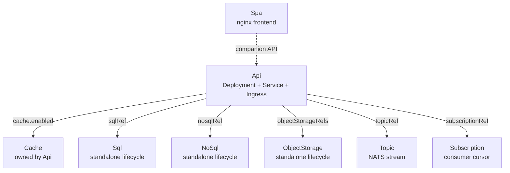
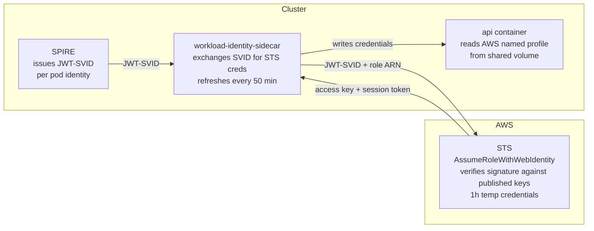

# Platform

Crossplane-based internal developer platform. Declare what your app needs. The platform provisions it, wires it, and delivers credentials directly to the pod - no Terraform, no tickets, no credential management in application code.

## Philosophy

- **Declare resources, not steps.** An `Api` with a `sqlRef` is a statement of intent. The composition figures out IAM roles, init containers, volume mounts, credential rotation - none of that is the app's problem.
- **Credentials reach the pod as files, not env vars.** The [servicebinding.io](https://servicebinding.io) convention makes bindings portable. The app reads `/bindings/sql/host` whether that is Postgres on Longhorn or RDS, so switching backends changes the XR and not the app.
- **Data resources outlive APIs.** `Sql`, `NoSql`, `ObjectStorage` have lifecycles independent of any one `Api`. Create them once, reference them by name.
- **No app holds a static identity credential.** Every AWS and Entra identity is federated from the pod's short-lived SVID. No access keys, no client secrets, nothing to rotate or expire. A third-party API key is a value, not an identity, and lives in a Secret.
- **Nothing is reachable without being declared.** Sitting in the same cluster, or the same namespace, grants nothing on its own.
- **Apps never see Istio.** No Istio kinds, no SPIFFE strings, no Envoy in any workspace file.
- **Nobody invents an `aud`, `iss`, scope, redirect URI, or role GUID.** The platform derives every value for a registration it owns. For one it does not own, the values come from whoever does.

---

## Offerings

| XR | What it provisions | `private-cloud` | `public-cloud` |
|---|---|---|---|
| [`Api`](api/README.md) | Deployment · Service · Ingress · TLS | - | - |
| [`Spa`](spa/README.md) | Static frontend via nginx | - | - |
| [`Sql`](sql/README.md) | Relational database | Postgres on Longhorn | AWS RDS Postgres |
| [`Cache`](cache/README.md) | Cache cluster (owned by Api) | Redis | AWS ElastiCache |
| [`NoSql`](nosql/README.md) | Key-value / document store | ExtendDB *(planned)* | AWS DynamoDB |
| [`ObjectStorage`](object-storage/README.md) | Object store | MinIO *(planned)* | AWS S3 |
| [`Topic`](topic/README.md) | Durable message stream | NATS JetStream | - |
| [`Subscription`](subscription/README.md) | Durable consumer cursor | NATS JetStream | - |
---

## How resources connect



`Cache` is created and destroyed with its `Api`. Everything else is independent - delete an `Api` without touching its database.

---

## Service binding

Credentials reach the pod via `/bindings/`, following the [servicebinding.io](https://servicebinding.io) spec. The composition provisions the resource and writes a Kubernetes Secret in the app namespace; the pod mounts it at `/bindings/`.

```
/bindings/
  sql/              type  host  port  database  username  password  (private-cloud)
  sql/              type  host  port  database  username  role-arn  (public-cloud)
  cache/            type  host  port
  nosql/            type  table-name  region  role-arn
  object-storage/   type  bucket  region  role-arn
```

For non-AWS resources (private-cloud SQL, in-cluster cache, NATS), the app reads credential files directly:

```go
host, _ := os.ReadFile("/bindings/sql/host")
port, _ := os.ReadFile("/bindings/sql/port")
```

For AWS-backed resources (those with `role-arn`), the binding Secret contains an ARN - not credentials. The [`workload-identity-sidecar`](https://github.com/cujarrett/workload-identity-sidecar) sidecar reads those and writes actual STS credentials to a separate volume; the app uses `AWS_PROFILE_*` env vars instead. See [AWS credential binding](#aws-credential-binding) below.

An init container blocks the app from starting until each binding's Secret is fully synced to the volume. Once it exits, every file is there - no retry logic needed in the app.

Reference an existing resource from an `Api` by name:

```yaml
spec:
  parameters:
    sqlRef:
      name: foo-db          # existing Sql
    objectStorageRefs:
      - name: foo-assets    # existing ObjectStorage
```

---

## AWS credential binding

AWS-backed offerings (`ObjectStorage`, `NoSql`, `Sql` with `backend: public-cloud`, `Cache` with `backend: public-cloud`) use workload identity instead of static keys. The binding Secret contains an ARN and resource metadata - no access key, no secret.



Each binding gets its own IAM Role scoped to the pod's exact SPIFFE ID - wrong namespace, wrong service account, different cluster: rejected.

The app uses named AWS profiles injected by the composition. One rule covers every binding: `AWS_PROFILE_<KIND>_<REF>`, uppercased with `-` becoming `_`. So `AWS_PROFILE_OBJECT_STORAGE_FOO_ASSETS`, `AWS_PROFILE_NOSQL_FOO`, `AWS_PROFILE_SQL_FOO`. Cache is the exception at `AWS_PROFILE_CACHE`, because an Api owns at most one and there is no ref name to use.

```go
cfg, _ := config.LoadDefaultConfig(ctx,
    config.WithSharedConfigProfile(os.Getenv("AWS_PROFILE_OBJECT_STORAGE_FOO_ASSETS")))
s3 := s3.NewFromConfig(cfg)
```

For the full design: [Platform Workload Identity](./docs/workload-identity.md)

---

## Environments and feature branches

**The namespace is the environment boundary.** Every XR is namespaced, so a name only has to be unique within its own namespace and `foo-api` can exist in `ns-alice` and `ns-bob` at once. Every AWS resource name embeds both - `crossplane-{ns}-{name}-*` for IAM roles, `platform-{ns}-{name}` for S3 buckets - so the two produce completely separate roles, secrets, and buckets.

### Feature branch pattern

Each engineer or branch gets its own namespace.

```
namespace: foo-alice          namespace: foo-bob
────────────────────          ─────────────────────
Sql    foo-db                Sql    foo-db
NoSql  foo-events            NoSql  foo-events
Api    foo-api               Api    foo-api
```

IAM roles: `crossplane-foo-alice-foo-api-nosql` vs `crossplane-foo-bob-foo-api-nosql`. S3 buckets: `platform-foo-alice-foo-assets` vs `platform-foo-bob-foo-assets`.

### Test / QA / Prod tiers

Use `private-cloud` backends for feature branches and test to avoid AWS cost. Promote to `public-cloud` at QA and above. The `Api` binding is identical - only `backend:` changes in the resource YAML.

| Tier | Namespace pattern | Backend | Notes |
|---|---|---|---|
| Feature branch | `{app}-{branch}` or `{app}-{engineer}` | `private-cloud` | Short-lived; cheap; spun up per-branch |
| Test | `{app}-test` | `private-cloud` | Persistent; no AWS cost |
| QA | `{app}-qa` | `public-cloud` | Real AWS; shared QA dataset |
| Prod | `{app}-prod` | `public-cloud` | Real AWS; production data |

### Sql and shared databases

`Sql` creates the underlying RDS instance. Multiple Apis can share one RDS instance by listing themselves in `consumerServiceAccounts` - each gets its own IAM role and binding secret scoped to its SA, identical to how NoSql and ObjectStorage work.

For feature branches and test, use `backend: private-cloud`. Each branch gets its own in-cluster Postgres at near-zero cost and full isolation. Reserve `public-cloud` Sql for QA and prod.
