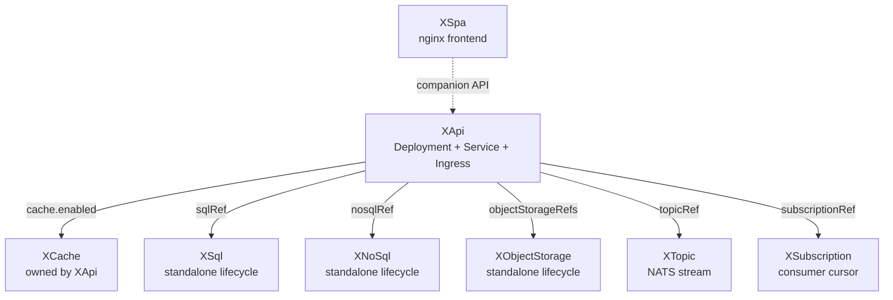
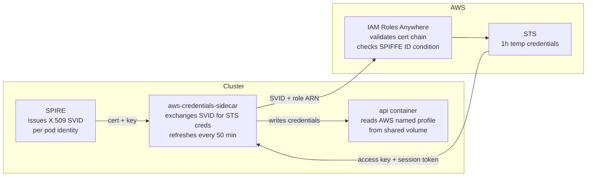

# Platform

Crossplane-based internal developer platform. Declare what your app needs. The platform provisions it, wires it, and delivers credentials directly to the pod — no Terraform, no tickets, no credential management in application code.

## Philosophy

A platform is not infrastructure—it is a contract that turns intent into working systems.

This platform exists to collapse the distance between “I need an app” and a running, connected service. Developers declare what they need—compute, data, identity, and integrations—and the platform handles everything else.

It provisions resources, establishes trust, wires dependencies, and delivers credentials directly into the workload at runtime. No Terraform. No tickets. No hand-built glue. No cloud-specific logic leaking into application code.

Complexity is not removed; it is centralized and standardized inside the platform so it can be automated and reasoned about once. Simplicity is preserved at the application layer, where change actually happens.

The result is a system where applications describe intent, and the platform determines implementation—consistently, safely, and repeatedly across environments.

That means a few things in practice:

- **Declare resources, not steps.** An `XApi` with a `sqlRef` is a statement of intent. The composition figures out IAM roles, init containers, volume mounts, credential rotation — none of that is the app's problem.
- **Credentials reach the pod as files, not env vars.** The [servicebinding.io](https://servicebinding.io) convention makes bindings portable and predictable. The app reads `/bindings/sql/host`. It doesn't care whether that's in-cluster Postgres or RDS.
- **Data resources outlive APIs.** `XSql`, `XNoSql`, `XObjectStorage` have lifecycles independent of any one `XApi`. Create them once, reference them by name, bind them to multiple APIs if needed.
- **Private-cloud first, public-cloud when it matters.** In-cluster Postgres is fast, free, and simple. RDS exists for when durability or managed backups matter. The same `sqlRef` works for both — the app doesn't change.
- **No static credentials for AWS.** Every AWS binding uses workload identity: a short-lived X.509 certificate exchanged for temporary STS credentials via IAM Roles Anywhere. No access keys in Secrets or config files.

---

## Offerings

| XR | What it provisions | Backend |
|---|---|---|
| [`XApi`](api/README.md) | Deployment · Service · Ingress · TLS | — |
| [`XSpa`](spa/README.md) | Static frontend via nginx | — |
| [`XSql`](sql/README.md) | Relational database | `private-cloud` (Postgres) · `public-cloud` (RDS) |
| [`XNoSql`](nosql/README.md) | Key-value / document store | DynamoDB |
| [`XObjectStorage`](object-storage/README.md) | Object store | S3 |
| [`XCache`](cache/README.md) | Cache cluster (owned by XApi) | `private-cloud` (Redis) · `public-cloud` (ElastiCache) |
| [`XTopic`](topic/README.md) | Durable message stream | NATS JetStream |
| [`XSubscription`](subscription/README.md) | Durable consumer cursor | NATS JetStream |
| [`XWordpress`](wordpress/README.md) | Full WordPress stack | in-cluster |

---

## How resources connect



`XCache` is created and destroyed with its `XApi`. Everything else is independent — bind the same `XSql` to multiple APIs, or delete an `XApi` without touching its database.

---

## Service binding

Credentials reach the pod as files under `/bindings/`, following the [servicebinding.io](https://servicebinding.io) spec. The composition provisions the resource, writes a Kubernetes Secret, and mounts it. The app reads files.

```
/bindings/
  sql/              type  host  port  database  username  password
  cache/            type  host  port
  nosql/            type  table-name  region  role-arn  profile-arn
  object-storage/   type  bucket  region  role-arn  profile-arn
```

```go
host, _ := os.ReadFile("/bindings/sql/host")
port, _ := os.ReadFile("/bindings/sql/port")
```

An init container blocks the app from starting until each binding's Secret is fully synced to the volume. Once it exits, every file is there — no retry logic needed in the app.

Reference an existing resource from an `XApi` by name:

```yaml
spec:
  parameters:
    sqlRef:
      name: foo-db          # existing XSql
    objectStorageRefs:
      - name: foo-assets    # existing XObjectStorage
```

---

## AWS credential binding

AWS-backed offerings (`XObjectStorage`, `XNoSql`, `XCache` with `backend: public-cloud`) use workload identity instead of static keys. The binding Secret contains ARNs and resource metadata — no access key, no secret.



Each binding gets its own IAM Role. The trust policy is locked to the pod's exact SPIFFE ID — wrong namespace, wrong service account, different cluster: rejected. If a pod is deleted, the role can't be assumed by anything.

The app uses a named AWS profile injected by the composition:

```go
cfg, _ := config.LoadDefaultConfig(ctx,
    config.WithSharedConfigProfile(os.Getenv("AWS_PROFILE_OBJECT_STORAGE")))
s3 := s3.NewFromConfig(cfg)
```

No credential management in application code. No access keys in git.

For the full design: [`docs/workload-identity.md`](../docs/workload-identity.md)

---

## Backend options

Resources that support multiple backends use the same `XApi` binding regardless of where they run. The app doesn't change when you switch backends.

| XR | `private-cloud` | `public-cloud` |
|---|---|---|
| `XSql` | In-cluster Postgres on Longhorn | AWS RDS Postgres |
| `XCache` | In-cluster Redis | AWS ElastiCache |
| `XNoSql` | — | DynamoDB (always) |
| `XObjectStorage` | — | S3 (always) |

Private-cloud backends are recommended for most workloads — faster provisioning, no AWS cost, simpler debugging. Public-cloud backends exist for managed durability, backups, and scale.
