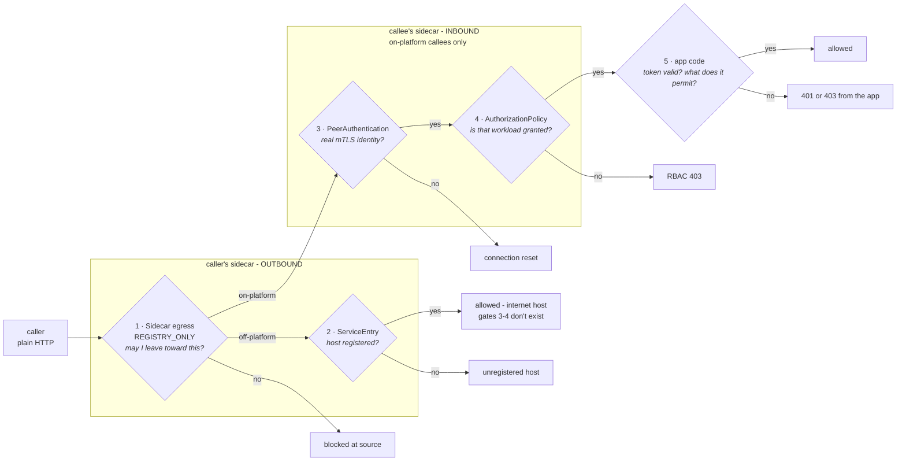

# Platform Connections

> **The one idea (grug):** Kubernetes runs the workloads. Service Mesh decides which calls get through.

Istio puts a proxy beside every pod. Nothing reaches a workload without passing that proxy, and nothing leaves without passing its own.

By default anything in the cluster can call anything else, so *can this app call that app* already has an answer and nobody chose it. A few thousand services across a few hundred teams cannot keep that in someone's head. Declaring it means a breach stops at one app, access is provable from a line in git rather than a claim about private networks, and a team asks the team it wants to call instead of a central queue.

Live walkthrough at [connections.mattjarrett.dev](https://connections.mattjarrett.dev): seven real calls, three refused.

## Requirements

1. Nothing is reachable without being declared. Same cluster or same namespace grants nothing.
2. The team that owns an interface decides who may call it.
3. Third-party egress is declared but not approved. It stays visible and can be shut off centrally.
4. Every workload has an identity of its own that cannot be forged or shared.
5. A refused call is legible. The reason is discoverable, never a silent allow.
6. Apps never see Istio. No Istio kinds, no SPIFFE strings, no Envoy in any workspace file.

What a team writes is in [App Configuration](./app-configuration.md). This is how the mesh enforces it.

## What gets rendered

**Grug:** a call passes five checkpoints. Two leaving the caller, two arriving at the callee, one in the app. Miss any and the call dies.

Each app's composition renders its own `Sidecar` and `AuthorizationPolicy` from that app's `consumes` and `provides`. Nothing aggregates across resources, so no controller writes these objects and Kyverno only rejects a bad declaration at admission. A field that already states a dependency is not asked for twice: a `Spa` naming an `apiProxies` entry, or an `Api` binding a cache, declares nothing further.



Gates 1 and 2 come from the caller's `consumes`. Gates 3 and 4 come from the callee's `provides`.

**The token is the app's business.** The mesh proves which workload is calling and refuses the ones that should not reach you, but it never reads the Entra token. Validating it and deciding what a `roles` or `scp` claim permits both happen in app code, which keeps one boundary instead of two. An app that authorizes on a claim needs the claim anyway, so proxy validation would only leave it trusting a header it cannot verify.

**The symptom tells you the gate.**

| You see | Gate | Meaning |
|---|---|---|
| 502 through nginx | 1 | Destination missing from the caller's `Sidecar` egress, so its own proxy blackholed it |
| Timeout to a public host | 2 | No `ServiceEntry`, so the host was never registered |
| Connection reset | 3 | Caller arrived in plaintext. Unmeshed, or its sidecar never started |
| RBAC 403 | 4 | Caller reached the callee and was refused by name. Not in `allowedCallers` |
| 401 or 403 from the app | 5 | The call passed every mesh gate and the app refused the token. Missing, expired, wrong audience, or lacking the role the route wants |

**Registered is not permitted.** A `ServiceEntry` puts a hostname in the mesh registry so Envoy knows it exists. The `Sidecar` egress entry says *this workload* may send traffic there. `REGISTRY_ONLY` needs both, and the phonebook does not grant permission to dial. That split matters because a `ServiceEntry` is namespace-wide: if registering alone granted reach, every app in the namespace would inherit every host any other app declared.

**A policy can only attach to a pod that exists.** Off-platform hosts have no gates 3 and 4, so the caller-side declaration is the only gate they get. Same for shared in-cluster stores that run no policy of their own.

**Two unmeshed exceptions**, both infrastructure with no identity to match on. Prometheus scrapes the metrics port, Traefik forwards ingress to the app port. The Traefik one applies only when a workload sets `host`, and [Known limits](#known-limits) says what it costs.

**Proxied requests must carry the upstream's name as `Host`.** Envoy routes outbound by `:authority`. Forward the browser's hostname and Envoy finds nothing in the registry, then `REGISTRY_ONLY` blackholes it, so the destination never sees a connection. The `Spa` composition sets `Host` to the upstream service and keeps the original as `X-Forwarded-Host`.

## The identity it rests on

**Grug:** every pod gets a certificate saying who it is, and it cannot be faked. Istio issues each meshed pod an X.509 SVID carrying a SPIFFE URI SAN:

```
spiffe://cluster.local/ns/team-b/sa/orders
         └ trust domain   └ namespace └ service account
```

That string is the workload's principal, the name a rule grants access to. It is bound to a private key that never leaves the pod, so holding the name is not enough to claim it, and it is the only identity that survives an attacker already inside the cluster network.

**Every workload gets its own ServiceAccount.** The moment two apps share one they are the same identity and every grant between them is meaningless.

Entra federates against this same identity, so a pod holds no secret for either system. [Platform Workload Identity](./workload-identity.md) has the rotation and federation detail.

## Known limits

**Grug:** the mesh does its own job, not the layer below it or above it. Below is packets, could a hostile pod send this at all, which is not built. Above is the app deciding what a claim permits, and past that whether a person may see a record, which is out of scope rather than pending.

**The mesh is governance, not containment.** Istio enforces its rules with iptables rules written inside the pod. Traffic is redirected to Envoy, Envoy applies the policy, and code in that pod is on the same side of the fence as the rules deciding what it may do.

The clearest way past them is to run as UID 1337. Istio skips that UID when redirecting, because it is the UID Envoy itself runs as and redirecting Envoy into Envoy would loop forever. Anything else running as 1337 gets the same free pass, and its packets leave without Envoy ever seeing them.

Stopping that takes a rule the pod cannot reach. Every pod is wired to the node by a virtual cable, and the node holds one end of it. A Cilium `NetworkPolicy` is enforced at that end, outside the pod, so nothing running inside can skip it.

**That layer is deliberately not built** and it is not a one-way door. The policy generates from the same `consumes` the mesh already uses, so adding it changes no schema and no app. Two questions decide it: whether off-platform egress uses FQDN or CIDR rules, and whether a compromised pod is in the threat model, since only that case needs it. Cilium's DNS proxy is already on by default, which `toFQDNs` depends on because it learns addresses by watching lookups.

**An app with an Ingress is reachable from the ingress controller** whatever its grants, because Traefik is unmeshed and presents no identity. How far that reaches depends on `tlsIssuer`.

**Nothing tests that an app can reach its backend.** Rendering is checked, behaviour is not. A workload can serve its page, report `2/2`, sync green, and still fail every call to its own API. This has already caused one outage and closing it is the most valuable work left.

**Long-lived apiserver watches do not survive a sidecar.** The proxy severs streaming watch connections, so anything watching the apiserver is outside the design.

**`Api` and `Spa` label pods differently**, `app.kubernetes.io/instance` versus `instance`. A selector copied between them matches nothing and fails silently: the policy renders, ArgoCD reports Synced, enforcement never happens.

**The cost is diagnosis.** A 403, an mTLS reset, and blocked egress used to all be "can it reach the IP". The symptom table above is the map for telling them apart.

## Complications outside HTTP

**UDP has no gates 3 and 4, because it has no principal to check.** The scheme above reads mTLS off an X.509 SAN and authorization off an HTTP route, both TCP and L7 constructs. Envoy passes UDP through, but there is no `Host` header and nothing for an `AuthorizationPolicy` to match. Reachability collapses back to L3/L4, the layer not built. Syslog, RTP, telemetry collectors, DNS, and QUIC all land here.

**A reverse proxy only carries what it terminates.** Cloudflare Tunnel and Traefik speak HTTP or TCP to the origin, which is why every public hostname here exists. A UDP-only service has no HTTP request to terminate, so it cannot get a hostname at all, and Traefik does not listen on UDP anyway.

## Reference

| Concept | Doc | Watch for |
|---|---|---|
| Sidecar injection | [injection](https://istio.io/latest/docs/setup/additional-setup/sidecar-injection/) | meshed pods show 2 containers |
| SPIFFE identity | [identity](https://istio.io/latest/docs/concepts/security/#istio-identity) | the principal string *is* the grant key |
| PeerAuthentication | [mutual TLS](https://istio.io/latest/docs/concepts/security/#peer-authentication) | STRICT has no dry-run |
| AuthorizationPolicy | [ref](https://istio.io/latest/docs/reference/config/security/authorization-policy/) | the first ALLOW makes that workload deny-by-default |
| ServiceEntry | [egress control](https://istio.io/latest/docs/tasks/traffic-management/egress/egress-control/) | registers a host; alone it gates nothing |
| Sidecar + `REGISTRY_ONLY` | [ref](https://istio.io/latest/docs/reference/config/networking/sidecar/) | this is what makes egress default-deny |
| Cilium NetworkPolicy | [policy](https://docs.cilium.io/en/stable/security/policy/) | the containment layer the mesh cannot be |

> **Splitting a requirement widens it.** Istio ORs ALLOW policies and rules together, so two rules are two ways in, not two conditions. Anything that must all hold goes in one rule: `from` + `to` + `when`.
