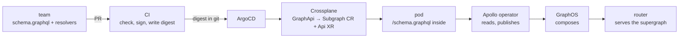
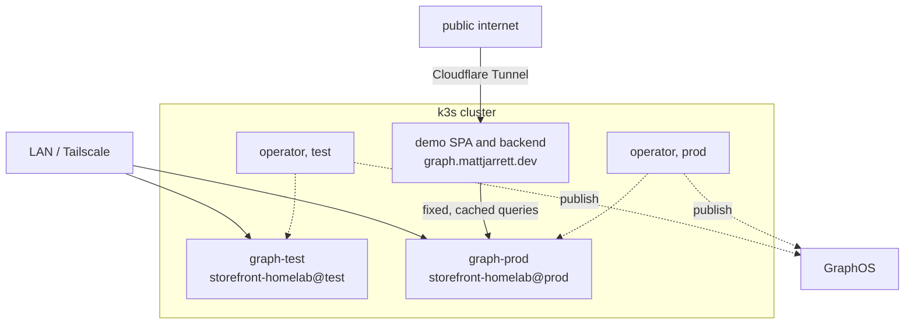

# Platform Graph

Every team ships its own small GraphQL API. A router joins them into one API that clients see as a single schema, and the platform makes joining one YAML file.

[Fortune 100 Internal Developer Platform patterns, learned on a homelab. Nothing novel.](../../docs/nothing-novel.md)

## Index

Start with [Design](#design), then [What a team writes](#what-a-team-writes) and [The lifecycle](#the-lifecycle). Build order is [issue #240](https://github.com/cujarrett/homelab/issues/240).

| Chapter | What's in it |
|---|---|
| [Goals](#goals) | what this is for |
| [Federation in five minutes](#federation-in-five-minutes) | the whole concept, no prior GraphQL needed |
| [Design](#design) | the philosophy, then the four layers that implement it |
| [Decisions](#decisions) | the three choices that shape schema management |
| [The offerings](#the-offerings) | the two platform Kinds |
| [What a team writes](#what-a-team-writes) | one `GraphApi` file |
| [What gets rendered](#what-gets-rendered) | each platform Kind mapped onto the objects it becomes |
| [Topology](#topology) | where everything runs |
| [The lifecycle](#the-lifecycle) | a schema change from a laptop to prod |
| [Protecting the graph](#protecting-the-graph) | one control per threat |
| [What a request costs](#what-a-request-costs) | why the bill stays at zero |
| [The demo](#the-demo) | the chain animated, then real queries, at `graph.mattjarrett.dev` |
| [Foundations to install](#foundations-to-install) | everything before the first subgraph |
| [Known limits](#known-limits) | the deviations and the holes |
| [TODO](#todo) | what waits until the first scope works |
| [Reference](#reference) | one link per concept |

## Goals

- Learn how a Fortune 100 platform team runs federated GraphQL, on a homelab.
- Show how a supergraph takes schema changes from N subgraphs safely. Two here, the same for two hundred.
- A platform `GraphApi` Kind that provisions a subgraph.
- Nobody publishes a schema by hand.
- KRM all the way down, grug simple, [nothing novel](../../docs/nothing-novel.md).

## Federation in five minutes

A GraphQL API publishes a **schema**, a typed description of everything it can answer. Federation is the case where several teams each own part of one product's schema, and clients should not have to know that.

- **Subgraph**: one team's service and its schema.
- **Composition**: merging every subgraph schema into one **supergraph schema**. It fails loudly if two subgraphs disagree, which is the safety property.
- **Router**: the one endpoint clients call. It splits a query into a **query plan**, calls the subgraphs it needs, and stitches one response.
- **Variant**: one environment of a graph in GraphOS, written `storefront-homelab@test`.

Subgraphs link through an **entity**, a type split across services and joined on a key:

```graphql
# records subgraph, owns the type
type Record @key(fields: "id") {
  id: ID!
  title: String!
  artist: String!
}

# reviews subgraph, adds a field to a type it does not own
type Record @key(fields: "id") {
  id: ID!
  reviews: [Review!]!
}
```

A client asks for `title` and `reviews` in one query. The router calls both services and neither service knows the other exists.

## Design

The schema is an agreement between a service and the composer. It lives with the code that serves it, ships inside the image, and reaches the registry only from the image a pod was deployed with. Nobody publishes it by hand.

Everything else follows from that one rule.

| Layer | Owns | Writes |
|---|---|---|
| A team | the schema and the resolvers | one `GraphApi` file, twelve lines |
| Crossplane | the conventions | the Apollo `Subgraph`, the workload, the mesh policy, the labels |
| The Apollo operator | the registry and the router | reads `/schema.graphql` from the deployed image, publishes it, reloads the router |
| GraphOS | composition | refuses two subgraphs that disagree, keeps history, checks a change against real traffic |




## Decisions

Three decisions that shape schema management. Everything else here is a house rule stated where it applies.

| # | Decision | This build |
|---|---|---|
| 1 | [Where the schema file lives](#1-where-the-schema-file-lives) | with the service |
| 2 | [How the schema reaches the registry](#2-how-the-schema-reaches-the-registry) | Apollo operator reads it from the deployed image |
| 3 | [Governance of schema changes](#3-governance-of-schema-changes) | checks plus code owners |

### 1. Where the schema file lives

| Option | For | Against |
|---|---|---|
| **a. With the service** (picked) | one commit moves schema and resolvers, so they cannot drift. Teams own their part | review quality depends on branch protection in every repo |
| b. Central schema repo owned by the graph team | one review venue | schema and resolvers drift. Every change is two PRs with an order that matters |
| c. In the registry only | no files to manage | no git history, no review, nothing ties it to running code |

The graph team still sees every change. CODEOWNERS on `schema.graphql` puts them on every schema PR in every repo, and GitHub gives them one review queue. See [The lifecycle](#the-lifecycle).

The drift in b is concrete. The schema publishes before the deploy lands and a client's query for the new field returns an error. Or the deploy lands first and a resolver serves a field the registry never advertised. Nothing detects either.

### 2. How the schema reaches the registry

| Option | For | Against |
|---|---|---|
| **a. Apollo operator reads it from the deployed image** (picked) | publish follows deploy, so the registry never advertises a field nobody serves. Apollo maintains the router Deployment | needs a paid plan, and the operator's Kinds are still alpha |
| b. CI publishes with `rover subgraph publish` | works for subgraphs outside Kubernetes | publish and deploy can drift, and CI holds a key that can rewrite the graph |
| c. A person runs `rover subgraph publish` | nothing to build | no review, no CI, no tie to the code that serves it, and that person holds Contributor |

Operator 1.4.0 and the router both ship `linux/arm64` images.

### 3. Governance of schema changes

| Option | For | Against |
|---|---|---|
| **a. Checks plus code owners** (picked) | cheap, and review happens where the code already is | the graph team sees changes only where it is a code owner |
| b. Schema proposals for shared types | design agreed before code exists | Standard plan, and a process that pays off only with many teams |
| c. Linting in checks | machines settle naming and style | covers naming and style only |

## The offerings

Two platform Kinds in `platform.local.lab`, both namespaced like every other platform Kind. Teams never apply an `apollographql.com` Kind directly, because the `workloads` AppProject allows `platform.local.lab` kinds and a few core objects, and no Apollo Kinds.

| Kind | Who creates it | What it means |
|---|---|---|
| `GraphApi` | a team | "run this image as a subgraph of that graph" |
| `FederatedGraph` | the platform team, one per environment | "here is the endpoint clients call" |

```yaml
apiVersion: platform.local.lab/v1alpha1
kind: FederatedGraph
metadata:
  name: storefront
  namespace: graph-test
spec:
  parameters:
    graphRef: storefront-homelab@test
    host: graph-test.local.lab
    tlsIssuer: local-lab-ca-issuer
    replicas: 1
```

It lists no subgraphs, so a team joins by merging its own file, never by editing the platform team's.

## What a team writes

```yaml
apiVersion: platform.local.lab/v1alpha1
kind: GraphApi
metadata:
  name: records
  namespace: graph-test
spec:
  parameters:
    graph: storefront
    image: ghcr.io/cujarrett/platform-graph-demo-records@sha256:4f1c...   # digest, written by CI
    size: sm
```

`GraphApi` exposes four `Api` parameters: `graph`, `image`, `size` and `replicas`. `sqlRef`, `cache` and `consumes` are added when a real subgraph needs one.

Fixed by convention, never a field:

| Convention | Value |
|---|---|
| Schema location | `/schema.graphql` inside the image |
| Image reference | a digest, never a tag |
| Port | `8080`, the `Api` default |
| Endpoint | `http://<name>.<namespace>.svc.cluster.local/graphql`, derived from the Service the nested `Api` creates |
| Ingress | none, the router is the only front door |
| Allowed caller | the `FederatedGraph` router in the same namespace |
| Labels | `platform.local.lab/graph: <graph>` and `platform.local.lab/environment: <namespace>`. Apollo's selectors have no namespace field, so the environment label keeps each graph to its own namespace |

## What gets rendered

| Platform Kind | Renders |
|---|---|
| `GraphApi` | an `Api` XR with no `host`, and an Apollo `Subgraph` with `schema.ociImage` pointing at the same image digest, the derived endpoint and both labels |
| `FederatedGraph` | a `SupergraphSchema` selecting both labels with `partial: false` and `deletionPolicy: KeepVariant`, a `Supergraph` reading `schema.resource` with introspection off and a global rate limit, a LAN Ingress, and the mesh objects for the router |

`GraphApi` nests an `Api` the same way `Api` nests a `Cache`. Bindings, sizing, mesh, metrics and identity keep working because they are not reimplemented.

## Topology

One cluster, two operators, two environments. No router is public. The public reaches prod only through the demo's backend.



Each environment is one namespace holding its router and its subgraphs. Prod has its own operator and its own key, so nothing outside `graph-prod` can publish to the prod variant.

## The lifecycle

The schema lives in `schema.graphql` beside the resolvers and ships inside the image, so one digest moves both.

| Stage | CI | KRM |
|---|---|---|
| Local | none. `rover dev --graph-ref storefront-homelab@test` composes the laptop's subgraph with everything test already publishes | none |
| PR opens | `rover subgraph check` against `prod`. Composition, and every operation prod clients sent in the retention window | |
| Review | CODEOWNERS requests the graph team on `schema.graphql`. Branch protection requires the check and the review | |
| Merge to main | build the ARM64 image, cosign sign it by digest, write the digest into `graph-test/records.yaml` in `homelab-workspaces` | ArgoCD syncs. Kyverno admits the signed digest |
| Test | | the operator pulls the same digest the pod runs, reads `/schema.graphql` from it and publishes to `test`. Composition runs. The router reloads |
| Promote | `just promote` checks against `prod` again and opens a PR moving the digest into `graph-prod/records.yaml` | |
| Prod | merging that PR is the release | same flow, variant `prod`, the prod operator |
| Rollback | revert the digest PR | ArgoCD syncs the old digest, the operator republishes |

A composition failure anywhere leaves that router serving its last good supergraph, and shows on the `SupergraphSchema` status.

CI never publishes a schema and never touches the cluster. It writes digests to git.

The check composes the proposed schema against every other subgraph currently published to the variant. A change to a `@key` that another team extends fails on this PR, not theirs.

**Operation checks are only as good as the traffic behind them.** They compare against operations the variant has seen inside the retention window, 7 days on the Developer plan. A graph with no real users has little to compare against, so a green check here is weaker than the same command against real client traffic.

## Protecting the graph

Each control fails closed.

| Threat | Control | Where |
|---|---|---|
| A schema change breaks the graph | the PR check fails, and the router keeps the last good supergraph if composition fails anyway | CI, GraphOS |
| An unreviewed schema merges | branch protection requires the check and a code owner | GitHub |
| A person publishes a schema | no person holds Contributor. Observer runs checks and reads subgraph SDL, which is everything local development needs | GraphOS roles |
| An unreviewed image runs in test or prod | Kyverno admits only pods whose image was cosign-signed by the repo's CI workflow on `main` | Kyverno |
| An unsigned image's schema is published without its pod ever running | the operator pulls the image itself, so Kyverno verifies the same signature on `spec.schema.ociImage.reference` of every `Subgraph` | Kyverno |
| A schema is changed by hand in the cluster | teams can only apply `platform.local.lab` Kinds, and no human holds write on Apollo Kinds | ArgoCD AppProject, RBAC |
| A test compromise publishes to prod | prod has its own operator and key, watching only `graph-prod` | operator install |
| An operator key is stolen | each is readable only by its operator's ServiceAccount. CI holds a check-only key | Parameter Store, RBAC, GitHub |

Subgraphs keep STRICT mTLS from their nested `Api`, so the router is in the mesh. `FederatedGraph` renders its `Sidecar` and the `ServiceEntry` objects for GraphOS. See [Platform Connections](./connections.md).

## What a request costs

The Developer plan bills $5 per million router requests after a $50 signup credit, with no hard spend limit. The design keeps the bill at zero by controlling who can reach a router.

- **LAN only.** Neither router has a public hostname. Only my own traffic reaches them.
- **One public caller.** The demo's backend is an ordinary `Api` with one endpoint per pane. Each runs a fixed query against prod's router and caches the answer for 60 seconds. However much traffic reaches the demo, the router sees a few requests per minute, about 6,000 a day, which is under $1 a month and inside the credit.
- **Backups already in the stack.** The backend's `Api` carries the platform's per-IP rate limit, and every router sets `traffic_shaping.router.global_rate_limit`.

## The demo

`graph.mattjarrett.dev` is [launchpad's how-it-works](https://launchpad.mattjarrett.dev/how-it-works) shape applied to schema management. A map of the cluster and GraphOS, a stepped chain on the right, and a "what the team wrote" panel. Each scene lights the nodes it touches.

| Scene | Lights | What the team wrote |
|---|---|---|
| 01 A schema change | the subgraph repo, the PR | the `schema.graphql` diff |
| 02 The check | GraphOS composing the proposal against every other published subgraph, and replaying prod's operations | |
| 03 Review and merge | CODEOWNERS, the signed image, the digest landing in `homelab-workspaces` | the `GraphApi` file |
| 04 Publish | ArgoCD, Crossplane rendering the `Subgraph` CR, the pod, the operator reading `/schema.graphql`, GraphOS recording it | |
| 05 Serve | the router reloading, one query fanning out to both subgraphs | |

The map shows `records`, `reviews` and a ghosted third subgraph, so the chain reads as N, not two. Every scene names the pattern it is and links to [Nothing novel](../../docs/nothing-novel.md).

Below the map, **Run it**. Three fixed queries, one button each. The response shows the query plan coloured by which subgraph answered each field, and beside it the evidence that this hit the cluster: the pod and node that served each hop, the image digest the pod is running, the supergraph schema hash the router is serving, and the GraphOS publish it came from, linked.

The backend is an `Api` with one endpoint per scene and per query, each a fixed query or API call cached for 60 seconds. Nothing the public sends reaches the router, GitHub or GraphOS.

## Foundations to install

| Foundation | Where |
|---|---|
| GraphOS org on the Developer plan, graph `storefront-homelab`, variants `test` and `prod` | apollographql.com |
| Two operator API keys, test and prod, from `rover api-key create <ORG_ID> operator <NAME>` | Parameter Store, each rendered to its operator's namespace by an `ExternalSecret` |
| Operator Helm chart `registry-1.docker.io/apollograph/operator-chart`, installed twice. The prod install sets `installCRDs: false` and `rbac.create: false`. The chart's CRDs ship empty lists the API server drops, so the Application needs `ignoreDifferences` on them | [apollo-operator.yaml](../../cluster/argocd/apollo-operator.yaml) |
| The operator's namespace in the ESO store `conditions` | [store.yaml](../../cluster/external-secrets/store.yaml) |
| Crossplane RBAC for `apollographql.com` Kinds | [rbac.yaml](../../cluster/crossplane/rbac.yaml) |
| `graph-test` and `graph-prod` in the `workloads` project destinations and both namespace lists of the workspace RBAC policy | [projects.yaml](../../cluster/argocd/projects.yaml), [workspace-rbac.yaml](../../cluster/kyverno/workspace-rbac.yaml) |
| Check-only GraphOS key as a GitHub Actions secret, and a token that can write `homelab-workspaces` | the demo repo |
| Kyverno `ImageValidatingPolicy` verifying `main`-branch cosign signatures on `platform-graph-demo` images in both lanes, for pods and for Apollo `Subgraph` resources | `cluster/kyverno/` |
| `graph.mattjarrett.dev` and `graph-api.mattjarrett.dev` tunnel entries for the demo SPA and its backend, before their certs | `/add-cloudflare-tunnel-hostname` |

## Known limits

- **The operator is a black box the platform depends on.** Its Kinds are `v1alpha2` and `v1alpha4`, so expect breaking upgrades.
- **The test operator's Application owns the CRDs and ClusterRoles prod borrows.** Deleting that Application deletes every `Subgraph` and `Supergraph` in both lanes. Apollo ships no CRDs-only chart, and vendoring 16,000 lines of CRD goes stale, so the dependency stays and the Application keeps its name.
- **An operator that starts before its RoleBindings exist never recovers.** Its watches fail with 403 and stay dead after the bindings land, so its CRs sit with no status. Restart the pod. Happens on every fresh install, because ArgoCD creates the Deployment and the RoleBindings in the same sync.
- **No user authorization yet.** Anyone on the LAN can query any field. See [TODO](#todo).
- **The operator writes a graph API key Secret into each router namespace.** It is controller-generated, like cert-manager TLS, so it stays out of ESO.
- **Operation checks need traffic.** The demo's backend is the only client, so the check protects a handful of fixed queries.

## TODO

Post initial scope. Each builds on a working demo.

- **Branch environments.** A namespace and variant per open PR, claimed and released by CI.
- **User authorization.** JWT authentication on the router with Entra as the issuer, then `@authenticated` and `@requiresScopes` on fields.
- **Schema governance.** Proposals for shared types, `@contact` on every subgraph, linting in checks. Decision [3](#3-governance-of-schema-changes).
- **Router fleet.** Internal, partner and canary routers reading one variant.
- **More clusters.** Each cluster's operator publishes its own subgraphs with `partial: true`.

## Reference

| Concept | Link |
|---|---|
| Federation entities | [apollographql.com/docs/federation/entities](https://www.apollographql.com/docs/federation/entities) |
| Apollo GraphOS Operator | [apollographql.com/docs/apollo-operator](https://www.apollographql.com/docs/apollo-operator) |
| Operator `Subgraph` | [resources/subgraph](https://www.apollographql.com/docs/apollo-operator/resources/subgraph) |
| Operator `SupergraphSchema` | [resources/supergraphschema](https://www.apollographql.com/docs/apollo-operator/resources/supergraphschema) |
| Operator `Supergraph` | [resources/supergraph](https://www.apollographql.com/docs/apollo-operator/resources/supergraph) |
| Rover dev | [rover/commands/dev](https://www.apollographql.com/docs/rover/commands/dev) |
| Schema checks | [schema-management/checks](https://www.apollographql.com/docs/graphos/platform/schema-management/checks) |
| Member roles | [access-management/member-roles](https://www.apollographql.com/docs/graphos/platform/access-management/member-roles) |
| Kyverno image validation | [ImageValidatingPolicy](https://kyverno.io/docs/policy-types/image-validating-policy/) |
| GraphOS pricing | [apollographql.com/pricing](https://www.apollographql.com/pricing) |
| Demo repo pattern | [platform-connections-demo](https://github.com/cujarrett/platform-connections-demo) |
