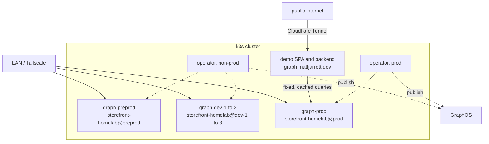

# Platform Graph

Every team ships its own small GraphQL API. A router joins them into one API that clients see as a single schema, and the platform makes joining one YAML file.

[Fortune 100 Internal Developer Platform patterns, learned on a homelab. Nothing novel.](../../docs/nothing-novel.md)

## Decisions

Every platform team building federated GraphQL makes these eleven decisions. Each one below lists the options a company would weigh, and this build's pick.

| # | Decision | This build |
|---|---|---|
| 1 | [Registry and router vendor](#1-registry-and-router-vendor) | Apollo GraphOS |
| 2 | [Where the schema file lives](#2-where-the-schema-file-lives) | with the service, central repo later if governance needs it |
| 3 | [How the schema reaches the registry](#3-how-the-schema-reaches-the-registry) | Apollo operator reads it from the deployed image |
| 4 | [Composition authority](#4-composition-authority) | cluster authoritative |
| 5 | [What a team applies](#5-what-a-team-applies) | platform Kinds wrapping Apollo's |
| 6 | [Environments](#6-environments) | preprod, prod, and branch slots |
| 7 | [Router topology](#7-router-topology) | one router per environment |
| 8 | [Who checks authorization](#8-who-checks-authorization) | the router |
| 9 | [What clients may send](#9-what-clients-may-send) | the public reaches the graph only through a backend with fixed, cached queries |
| 10 | [Governance of schema changes](#10-governance-of-schema-changes) | checks plus code owners |
| 11 | [Supply chain](#11-supply-chain) | signed images pinned by digest |

### 1. Registry and router vendor

Who stores schemas, composes them, and supplies the router.

| Option | For | Against |
|---|---|---|
| **a. Apollo GraphOS** (picked) | managed composition, checks against real client traffic, a Kubernetes operator, the most common choice | billed per request, and the graph's history lives with a vendor |
| b. Self-hosted control plane, such as WunderGraph Cosmo or GraphQL Hive | no per-request bill, no vendor lock-in | you run, upgrade and secure the registry yourself |
| c. No registry, compose in CI and ship the result as a file | cheapest, fewest moving parts | no traffic-aware checks, so removing a field is guesswork |

### 2. Where the schema file lives

| Option | For | Against |
|---|---|---|
| **a. With the service** (picked) | one artifact, the schema cannot drift from its resolvers, teams own their part | review quality depends on branch protection in every repo |
| b. Central schema repo owned by the graph team | one review venue, standards applied in one place | schema and resolvers can disagree, every change is two PRs |
| c. In the registry only | no files to manage | no git history, nothing ties it to running code |

**Revisit** when the graph team needs to see every change in one place. The path from a to b that keeps schemas tied to code: the central repo publishes an approved artifact, each service pins it by digest, and the publish still waits for the deploy.

### 3. How the schema reaches the registry

| Option | For | Against |
|---|---|---|
| **a. Apollo operator reads it from the deployed image** (picked) | publish follows deploy, so the registry never advertises a field nobody serves. Apollo maintains the router Deployment | needs a paid plan, and the operator's Kinds are still alpha |
| b. CI publishes with `rover subgraph publish` | works for subgraphs outside Kubernetes | publish and deploy can drift, and CI holds a key that can rewrite the graph |
| c. Inline in a Kubernetes resource | easy to read | anyone with edit access rewrites the contract |

Operator 1.4.0 and the router both ship `linux/arm64` images.

### 4. Composition authority

Which system decides what subgraphs make up a graph.

| Option | For | Against |
|---|---|---|
| **a. Cluster authoritative** (picked) | the cluster is the whole truth, nothing reaches the graph except what ArgoCD applied | deleting a resource removes that subgraph from the graph, so prune needs guarding |
| b. Hybrid | each cluster contributes its own subgraphs, fits many clusters and clouds | GraphOS and the cluster share the truth, harder to reason about |
| c. Studio authoritative | fits teams that already publish from CI, the operator only runs the router | the cluster no longer knows what the graph contains |

In operator terms, a is a `SupergraphSchema` with `partial: false`, b is `partial: true` in each cluster, and c is a `Supergraph` reading `schema.studio.graphRef`. One cluster makes a the natural pick. Hybrid is the move if a second cluster ever joins.

### 5. What a team applies

| Option | For | Against |
|---|---|---|
| **a. Platform Kinds wrapping Apollo's** (picked) | a team writes one file, the platform owns the conventions and enforces them at admission | a layer the platform team maintains |
| b. Apollo's Kinds directly | nothing to build, vendor docs apply | every team learns Apollo's fields, and conventions become advice |
| c. A shared Helm chart | familiar | values sprawl, no admission-time guarantees |

### 6. Environments

| Option | For | Against |
|---|---|---|
| a. Variant and namespace per environment, branches on laptops | smallest footprint | reviewers cannot try a branch without running it |
| **b. Stable environments plus a fixed pool of branch slots** (picked) | every open branch can run live, the cap bounds cost and Pi capacity, and every name is known in advance | a branch waits when every slot is taken |
| c. Namespace and variant per branch, created on demand | unlimited previews, what large companies with elastic clusters run | the operator's watch list, variants, hostnames and certificates are all created and cleaned up per branch |

This build runs `preprod` for stable integration, `prod` for the public demo, and three branch slots. See [Branch slots](#branch-slots).

A company variant of c shares one baseline: each branch runs only its changed subgraph and routes the rest to preprod. It saves capacity, at the cost of cross-namespace traffic and shared data.

### 7. Router topology

| Option | For | Against |
|---|---|---|
| **a. One router per environment** (picked) | simplest thing that works | one config, one limit and one rollout for every team |
| b. Router fleet per audience, such as internal, partner and canary, reading one variant | a bad router change reaches one audience, and router rollouts can be tried on a canary first | more moving parts |

### 8. Who checks authorization

| Option | For | Against |
|---|---|---|
| **a. The router, with subgraphs trusting the mesh** (picked) | one place to reason about, a refused field never reaches a service | depends on a GraphOS plan that includes the authorization directives |
| b. Each subgraph | no plan dependency | every team reimplements it, and implementations drift |
| c. Both | defense in depth | two rule sets to keep in step |

Built after the first graph, see [User authorization](#user-authorization).

### 9. What clients may send

| Option | For | Against |
|---|---|---|
| **a. No public router, a backend-for-frontend runs fixed queries** (picked for the public demo) | public traffic cannot write a query at all, and caching bounds router traffic whatever arrives | every new screen needs a backend change |
| b. Safelisted persisted queries | only reviewed operations run, and breaking-change analysis becomes exact | every client publishes its operations from CI, and it may need a higher plan |
| c. Open queries with limits on depth and cost | clients stay flexible | any query within the limits runs |
| d. Open and uncapped | easiest for clients | fine on a private network, never in public |

Preprod, the branch slots and prod's router are all LAN-only. The demo's backend is the only public path to the graph. See [What a request costs](#what-a-request-costs).

### 10. Governance of schema changes

| Option | For | Against |
|---|---|---|
| **a. Checks plus code owners** (picked) | cheap, and review happens where the code already is | the graph team sees changes only where it is a code owner |
| b. Schema proposals for shared types | design agreed before code exists | process that pays off only with many teams |
| c. Linting in checks | machines settle naming and style, and the Developer plan includes it | covers naming and style only, so a person still judges the design |

See [Reviewing a schema change](#reviewing-a-schema-change).

### 11. Supply chain

| Option | For | Against |
|---|---|---|
| **a. Signed images pinned by digest, verified at admission** (picked) | the schema published is the one that was reviewed and signed | CI writes digests, which are unfriendly to read |
| b. Tags with a signature check | readable | a tag can be moved after signing, which defeats the check |
| c. Trust the registry | nothing to build | anything that can push an image can change the graph |

CI signs only builds from `main`, and the check applies to preprod and prod. Branch slots run unreviewed PR builds, so a signature there would stop meaning reviewed.

## Index

Start with [Decisions](#decisions), then [Federation in five minutes](#federation-in-five-minutes) and [What a team writes](#what-a-team-writes).

| Chapter | What's in it |
|---|---|
| [Decisions](#decisions) | the eleven choices and this build's picks |
| [Goals](#goals) | what this is for |
| [Federation in five minutes](#federation-in-five-minutes) | the whole concept, no prior GraphQL needed |
| [Topology](#topology) | where everything runs |
| [Who does what](#who-does-what) | Apollo, the operators, the platform, a team |
| [The offerings](#the-offerings) | the two platform Kinds |
| [What a team writes](#what-a-team-writes) | one `GraphApi` file |
| [What gets rendered](#what-gets-rendered) | each platform Kind mapped onto the objects it becomes |
| [The lifecycle](#the-lifecycle) | from a branch to prod |
| [Branch slots](#branch-slots) | how a branch claims and releases a live environment |
| [Developing a subgraph](#developing-a-subgraph) | the inner loop on a laptop |
| [Reviewing a schema change](#reviewing-a-schema-change) | the three gates in front of a graph |
| [Protecting the graph](#protecting-the-graph) | one control per threat |
| [What a request costs](#what-a-request-costs) | why the bill stays at zero |
| [How it meets Connections](#how-it-meets-connections) | the router is a meshed caller like any other |
| [Foundations to install](#foundations-to-install) | everything before the first subgraph |
| [Known limits](#known-limits) | the deviations and the holes |
| [Open questions](#open-questions) | settle these before building |
| [Phases](#phases) | build order |
| [After the first graph](#after-the-first-graph) | governance, user authorization, router fleets, more clusters |
| [Reference](#reference) | one link per concept |

## Goals

- Learn how a Fortune 100 platform team runs federated GraphQL, on a homelab.
- A platform `GraphApi` Kind that provisions a subgraph.
- An easy path for a team to add a subgraph to the federated supergraph.
- Security first, at every step.
- KRM all the way down, grug simple, nothing novel.

## Federation in five minutes

A GraphQL API publishes a **schema**, a typed description of everything it can answer. Federation is the case where several teams each own part of one product's schema, and clients should not have to know that.

- **Subgraph**: one team's service and its schema.
- **Composition**: merging every subgraph schema into one **supergraph schema**. It fails loudly if two subgraphs disagree, which is the safety property.
- **Router**: the one endpoint clients call. It splits a query into a **query plan**, calls the subgraphs it needs, and stitches one response.
- **Variant**: one environment of a graph in GraphOS, written `storefront-homelab@preprod`.

Subgraphs link through an **entity**, a type split across services and joined on a key:

```graphql
# records subgraph, owns the type
type Record @key(fields: "id") {
  id: ID!
  title: String!
  artist: String!
}

# reviews subgraph, adds a field to a type it does not own
type Record @key(fields: "id") {
  id: ID!
  reviews: [Review!]!
}
```

A client asks for `title` and `reviews` in one query. The router calls both services and neither service knows the other exists.

## Topology

One cluster, two operators, five environments. No router is public. The public reaches prod only through the demo's backend.



Each environment is one namespace holding its router and its subgraphs. Prod has its own operator and its own key, so nothing outside `graph-prod` can publish to the prod graph.

## Who does what

| Job | Owner |
|---|---|
| Store schemas with history, compose them, refuse conflicts | Apollo GraphOS |
| Read the schema from the image, publish it, deploy and reload the router | Apollo operator |
| Run the subgraph workload, bind its database, fence it in the mesh, label it for its graph and environment | the platform, via `GraphApi` |
| Expose the router on the LAN, mesh it, pick the variant | the platform, via `FederatedGraph` |
| Check schemas, build the image, sign it on `main`, write its digest, claim and release branch slots | CI |
| Write a schema, resolvers, and one YAML file | the team |

## The offerings

Two platform Kinds in `platform.local.lab`, both namespaced like every other platform Kind. Teams never apply an `apollographql.com` Kind directly, because the `workloads` AppProject allows `platform.local.lab` kinds and a few core objects, and no Apollo Kinds.

| Kind | Who creates it | What it means |
|---|---|---|
| `GraphApi` | a team | "run this image as a subgraph of that graph" |
| `FederatedGraph` | the platform team, one per environment | "here is the endpoint clients call" |

```yaml
apiVersion: platform.local.lab/v1alpha1
kind: FederatedGraph
metadata:
  name: storefront
  namespace: graph-preprod
spec:
  parameters:
    graphRef: storefront-homelab@preprod
    host: graph-preprod.local.lab
    tlsIssuer: local-lab-ca-issuer
    replicas: 1
```

It lists no subgraphs, so a team joins by merging its own file, never by editing the platform team's.

## What a team writes

```yaml
apiVersion: platform.local.lab/v1alpha1
kind: GraphApi
metadata:
  name: records
  namespace: graph-preprod
spec:
  parameters:
    graph: storefront
    image: ghcr.io/cujarrett/platform-graph-demo-records@sha256:4f1c...   # digest, written by CI
    size: sm
    sqlRef:
      name: records-db
```

`GraphApi` exposes a small subset of `Api` parameters: `image`, `size`, `replicas`, `sqlRef`, `cache` and `consumes`. Others are added when a real subgraph needs one.

Fixed by convention, never a field:

| Convention | Value |
|---|---|
| Schema location | `/schema.graphql` inside the image |
| Image reference | a digest, never a tag |
| Port | `8080`, the `Api` default |
| Endpoint | `http://<name>.<namespace>.svc.cluster.local/graphql`, derived from the Service the nested `Api` creates |
| Ingress | none, the router is the only front door |
| Allowed caller | the `FederatedGraph` router in the same namespace |
| Labels | `platform.local.lab/graph: <graph>` and `platform.local.lab/environment: <namespace>`. The non-prod operator watches preprod and every slot, and Apollo's selectors have no namespace field, so the environment label keeps each graph to its own namespace |

## What gets rendered

| Platform Kind | Renders |
|---|---|
| `GraphApi` | an `Api` XR with no `host`, and an Apollo `Subgraph` with `schema.ociImage` pointing at the same image digest, the derived endpoint and both labels |
| `FederatedGraph` | a `SupergraphSchema` selecting both labels with `partial: false` and `deletionPolicy: KeepVariant`, a `Supergraph` reading `schema.resource` with introspection off and a global rate limit, a LAN Ingress, and the mesh objects for the router |

`GraphApi` nests an `Api` the same way `Api` nests a `Cache`. Bindings, sizing, mesh, metrics and identity keep working because they are not reimplemented.

## The lifecycle

The schema lives in `schema.graphql` beside the resolvers and ships inside the image, so one digest moves both.

```
branch     rover dev locally, then open a PR
PR         CI runs just ci and rover subgraph check against preprod, claims a slot, deploys the branch there
review     a code owner approves, the check is green, the slot is tried live
merge      CI builds from main, signs the image, writes its digest into graph-preprod, releases the slot
preprod    ArgoCD syncs, Kyverno admits the signed digest, the operator publishes, the router reloads
promote    just promote opens a PR moving the digest into graph-prod, CI checks against prod
prod       merging that PR is the release, reverting it is the rollback
```

A composition failure anywhere leaves that router serving its last good supergraph, and shows on the `SupergraphSchema` status.

## Branch slots

Three fixed environments, `graph-dev-1` to `graph-dev-3`, each with its own variant and a `graph-dev-N.local.lab` hostname. A branch borrows one while its PR is open. This mirrors the fixed demo slots Launchpad already runs.

- **Claim.** When a PR opens, CI commits a `graph-dev-N/` directory to `homelab-workspaces`: a copy of preprod's files with this branch's digest swapped in, annotated with the PR's URL. Claims run in one GitHub Actions `concurrency` group, so two PRs never take the same slot. No free slot means a PR comment and a wait.
- **Update.** Each push to the branch rewrites the digest in its slot.
- **Release.** When the PR closes, CI deletes the directory and ArgoCD prunes it. A nightly job frees any slot whose PR is already closed.

Every slot is a full copy of the graph, with its own empty database. That keeps slots isolated from preprod and from each other. Everything about a slot is known in advance, so the operator's watch list, the ArgoCD destinations and the certificates never change.

## Developing a subgraph

The dev runs their subgraph locally against everything preprod already publishes.

```bash
rover dev --graph-ref storefront-homelab@preprod --supergraph-config override.yaml
```

`--graph-ref` pulls every published subgraph schema from the variant, and `override.yaml` names the one running on localhost. Nothing is published or deployed. The other subgraphs' URLs resolve only inside the cluster, so a query that reaches one needs a `kubectl port-forward` to it and a matching `routing_url` in `override.yaml`. A branch slot is the next step, for trying it live or showing a reviewer.

## Reviewing a schema change

Three gates, in order.

| Gate | Catches | Cannot catch |
|---|---|---|
| `rover subgraph check` on the PR | a schema that fails to compose with its siblings, and a change that breaks an operation clients actually sent that variant | whether the change is a good idea |
| Human review, with the graph team as a code owner on `schema.graphql` | naming, ownership, a type that belongs to another team, a field that should not be in the graph | a break against live traffic |
| Branch protection requiring both | a merge that skips either gate | nothing downstream re-checks the schema, so turning this off removes both gates |

Promotion runs the check again against `storefront-homelab@prod` before the digest moves.

**Operation checks are only as good as the traffic behind them.** They compare against operations the variant has seen inside the retention window, 7 days on the Developer plan. A graph with no real users has little to compare against, so a green check here is weaker than the same command at work.

## Protecting the graph

Each control fails closed.

| Threat | Control | Where |
|---|---|---|
| A schema change breaks the graph | the PR check fails, and the router keeps the last good supergraph if composition fails anyway | CI, GraphOS |
| An unreviewed schema merges | branch protection requires the check and a code owner | GitHub |
| An unreviewed image runs in preprod or prod | Kyverno admits only pods whose image was cosign-signed by the repo's CI workflow on `main` | Kyverno |
| An unsigned image's schema is published without its pod ever running | a Kyverno `ImageValidatingPolicy` extracts `spec.schema.ociImage.reference` from Apollo `Subgraph` resources and verifies the same signature, because the operator reads that image directly | Kyverno |
| A schema is changed by hand in the cluster | teams can only apply `platform.local.lab` Kinds, and no human holds write on Apollo Kinds | ArgoCD AppProject, RBAC |
| A non-prod compromise publishes to prod | prod has its own operator and key, watching only `graph-prod` | operator install |
| An operator key is stolen | each is readable only by its operator's ServiceAccount. CI holds a check-only key | Parameter Store, RBAC, GitHub |
| A subgraph is deleted and silently leaves the graph | removing it means deleting its file in `homelab-workspaces`, which is a reviewed PR | GitHub |
| A public caller sends its own query | no router is public. The demo's backend runs fixed queries only | `FederatedGraph`, the demo backend |
| A caller maps the whole schema | introspection off | router config |
| A subgraph is called directly, skipping the router | STRICT mTLS, no Ingress, router is the only allowed caller | mesh, `GraphApi` |
| Router config drifts from Git | `routerConfig` comes only from `FederatedGraph`, and ArgoCD self-heals | Crossplane, ArgoCD |

## What a request costs

The Developer plan bills $5 per million router requests after a $50 signup credit, with no hard spend limit. The design keeps the bill at zero by controlling who can reach a router.

- **LAN only.** Preprod, the branch slots and prod's router have no public hostname. Only my own traffic reaches them.
- **One public caller.** The demo's backend is an ordinary `Api` with one endpoint per pane. Each runs a fixed query against prod's router and caches the answer for 60 seconds. However much traffic reaches the demo, the router sees a few requests per minute, about 6,000 a day, which is under $1 a month and inside the credit.
- **Backups already in the stack.** The backend's `Api` carries the platform's per-IP rate limit, and every router sets `traffic_shaping.router.global_rate_limit`.

## How it meets Connections

Subgraphs keep STRICT mTLS from their nested `Api`, so each router must be in the mesh. `FederatedGraph` renders the router's `Sidecar` with egress to its own namespace's subgraphs, and `ServiceEntry` objects for the GraphOS endpoints the router calls. See [Platform Connections](./connections.md).

## Foundations to install

| Foundation | Where |
|---|---|
| GraphOS org on the Developer plan, graph `storefront-homelab`, variants `preprod`, `dev-1` to `dev-3` and `prod` | apollographql.com |
| Two operator API keys, non-prod and prod, from `rover api-key create <ORG_ID> operator <NAME>` | Parameter Store, each rendered to its operator's namespace by an `ExternalSecret` |
| Operator Helm chart `oci://registry-1.docker.io/apollograph/operator-chart`, installed twice. The prod install sets `installCRDs: false` and `rbac.create: false` | ArgoCD Applications, registry added to the `cluster` AppProject `sourceRepos` |
| Crossplane RBAC for `apollographql.com` Kinds | [rbac.yaml](../../cluster/crossplane/rbac.yaml) |
| `graph-preprod`, `graph-dev-1` to `graph-dev-3` and `graph-prod` in the `workloads` project destinations and both namespace lists of the workspace RBAC policy | [projects.yaml](../../cluster/argocd/projects.yaml), [workspace-rbac.yaml](../../cluster/kyverno/workspace-rbac.yaml) |
| Check-only GraphOS key as a GitHub Actions secret, and a token that can write `homelab-workspaces` | the demo repo |
| Kyverno `ImageValidatingPolicy` verifying `main`-branch cosign signatures on `platform-graph-demo` images in `graph-preprod` and `graph-prod`, for pods and for Apollo `Subgraph` resources. Kyverno 1.19 already runs here | `cluster/kyverno/` |
| `graph.mattjarrett.dev` and `graph-api.mattjarrett.dev` tunnel entries for the demo SPA and its backend, before their certs | `/add-cloudflare-tunnel-hostname` |

## Known limits

- **The operator is a black box the platform depends on.** Its Kinds are `v1alpha2` and `v1alpha4`, so expect breaking upgrades.
- **No user authorization yet.** Anyone on the LAN can query any field until [User authorization](#user-authorization) exists.
- **The schema loader image defaults to `busybox:latest`.** Pin `config.controllers.supergraph.loaderImage` by digest in both installs.
- **The operator writes a graph API key Secret into each router namespace.** It is controller-generated, like cert-manager TLS, so it stays out of ESO.
- **Three slots is a guess.** Each is a full copy of the graph on four Pis.

## Open questions

- Does the router call any Apollo host beyond `uplink.api.apollographql.com` and `usage-reporting.api.apollographql.com`? Read its egress while building by hand, before writing the `ServiceEntry` list.
- Which key can CI hold that runs checks and cannot publish? Subgraph API keys need the Standard plan.

## Phases

In order. Each ends somewhere it is safe to stop.

| Phase | Builds | Done when | Cluster |
|---|---|---|---|
| Local | two subgraphs in `platform-graph-demo`, composed with `rover dev` | one local query reaches both | no |
| Operator | the non-prod operator via ArgoCD, key from ESO, watching `graph-preprod` and the three slots, loader image pinned | the operator pod is ready | yes |
| By hand | hand-written Apollo `Subgraph`, `SupergraphSchema` and `Supergraph` in `graph-preprod` beside two hand-written `Api` XRs | the router answers a query that reached both | yes |
| FederatedGraph | XRD, composition and README | the hand-written router objects are deleted and nothing changes | yes |
| GraphApi | XRD, composition and README | both demo subgraphs are one `GraphApi` file each | yes |
| CI and signing | cosign signing, `just check`, the Kyverno policy, deploy to preprod on merge | a merge ships a schema with nobody editing YAML, and a breaking change or an unsigned image is refused | yes |
| Branch slots | the three slots, and the claim, update and release workflows | opening a PR puts the branch live, closing it frees the slot | yes |
| Prod demo | prod operator and key, `graph-prod`, `just promote`, the demo backend with cached fixed queries, the SPA walkthrough at `graph.mattjarrett.dev` | the router has no public path except the backend, and the breaking-change pane refuses a schema live | yes |

The two platform Kinds come after building by hand on purpose. They copy objects that already work instead of guessing at them.

## After the first graph

Each item builds on a working prod demo.

### Schema governance

Decisions [2](#2-where-the-schema-file-lives) and [10](#10-governance-of-schema-changes) grow here when many teams share the graph.

- **Proposals.** A change to a shared type needs an approved schema proposal, and checks fail without one. Needs the Standard plan.
- **Ownership in the schema.** `@contact` on every subgraph, so a composed type always names who to ask.
- **Linting.** Naming and style move from review into the check. The Developer plan includes it.
- **Central schema repo.** Only if the graph team needs one review venue, and only with publish still waiting for deploy.

### User authorization

Decision [8](#8-who-checks-authorization), built.

- **JWT authentication** on the router, with Entra as the issuer the platform already uses.
- **`@authenticated` and `@requiresScopes`** on fields, so the router refuses a field before any subgraph sees the request.

### Router fleet

Decision [7](#7-router-topology), option b. Internal, partner and canary routers reading one variant, on separate hostnames.

### More clusters

Decision [4](#4-composition-authority), option b. Each cluster's operator publishes its own subgraphs with `partial: true`.

## Reference

| Concept | Link |
|---|---|
| Federation entities | [apollographql.com/docs/federation/entities](https://www.apollographql.com/docs/federation/entities) |
| Apollo GraphOS Operator | [apollographql.com/docs/apollo-operator](https://www.apollographql.com/docs/apollo-operator) |
| Operator install | [install-operator](https://www.apollographql.com/docs/apollo-operator/get-started/install-operator) |
| Operator `Subgraph` | [resources/subgraph](https://www.apollographql.com/docs/apollo-operator/resources/subgraph) |
| Operator `SupergraphSchema` | [resources/supergraphschema](https://www.apollographql.com/docs/apollo-operator/resources/supergraphschema) |
| Operator `Supergraph` | [resources/supergraph](https://www.apollographql.com/docs/apollo-operator/resources/supergraph) |
| Composition strategies | [workflows](https://www.apollographql.com/docs/apollo-operator/workflows) |
| Rover dev | [rover/commands/dev](https://www.apollographql.com/docs/rover/commands/dev) |
| Schema checks | [schema-management/checks](https://www.apollographql.com/docs/graphos/platform/schema-management/checks) |
| Schema proposals | [schema-management/proposals](https://www.apollographql.com/docs/graphos/platform/schema-management/proposals) |
| Persisted queries | [security/persisted-queries](https://www.apollographql.com/docs/graphos/platform/security/persisted-queries) |
| Authorization directives | [routing/security/authorization](https://www.apollographql.com/docs/graphos/routing/security/authorization) |
| Router rate limits | [performance/traffic-shaping](https://www.apollographql.com/docs/graphos/routing/performance/traffic-shaping) |
| Kyverno image validation | [ImageValidatingPolicy](https://kyverno.io/docs/policy-types/image-validating-policy/) |
| GraphOS pricing | [apollographql.com/pricing](https://www.apollographql.com/pricing) |
| Existing platform offerings | [platform/](../) |
| Demo repo pattern | [platform-connections-demo](https://github.com/cujarrett/platform-connections-demo) |
